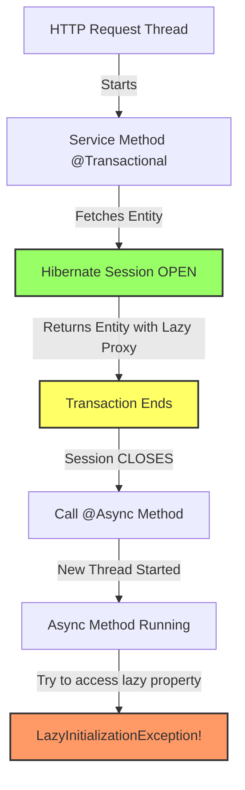

# Lazy Loading & Real-Time Status Tracking: Technical Deep Dive

## Part 1: Understanding Lazy Loading Issues

### What is Lazy Loading?

**Lazy Loading** is a design pattern in Hibernate/JPA where associated entities or collections are **not loaded immediately** when the parent entity is fetched. Instead, they are loaded **on-demand** when first accessed.

```java
@ManyToOne(fetch = FetchType.LAZY)
@JoinColumn(name = "student_attempt_id")
private StudentAttempt studentAttempt;  // Not loaded initially

@OneToMany(mappedBy = "question", fetch = FetchType.LAZY)
private List<Option> options;  // Not loaded initially
```

### How Lazy Loading Works

1. **Initial Query**: When you fetch an entity, Hibernate returns a **proxy** (placeholder) for lazy associations
2. **On Access**: When you try to access the lazy property (e.g., `question.getOptions()`), Hibernate:
   - Checks if a session is open
   - Fires a SQL query to fetch the data
   - Replaces the proxy with real data

### The Problem in Async Contexts



**The Issue**: When `@Async` methods run in separate threads, the original Hibernate session is **closed**, making lazy-loaded data inaccessible.

---

## Part 2: The LazyInitializationException Errors We Fixed

### Error #1: StudentAttempt Lazy Loading

**Stack Trace Location**:

```
Failed to process PDF for attempt 62054599-e950-46c3-befd-e22ffd8d781f:
could not initialize proxy [StudentAttempt#...] - no Session
```

**Entity Configuration** ([`AiEvaluationProcess.java:23`](file:///Users/priyanshu/vacademy/vacademy_platform/assessment_service/src/main/java/vacademy/io/assessment_service/features/assessment/entity/AiEvaluationProcess.java#L23)):

```java
@ManyToOne(fetch = FetchType.LAZY)
@JoinColumn(name = "attempt_id", nullable = false)
private StudentAttempt studentAttempt;
```

**Code Flow**:

1. `evaluateAttemptAsync` (async method) starts
2. Calls `fetchAttemptDataWithTransaction(processId)`
3. Inside transaction: `aiEvaluationProcessRepository.findById(processId)`
4. Returns `AiEvaluationProcess` with **lazy StudentAttempt proxy**
5. Transaction ends → **Session closes**
6. Try to access: `proc.getStudentAttempt().getAttemptData()` → **💥 Exception**

---

### Error #2: Question.options Lazy Loading

**Stack Trace**:

```
org.hibernate.LazyInitializationException:
failed to lazily initialize collection Question.options - no Session
    at AiEvaluationAsyncService.buildQuestionContext(line 1135)
```

**Entity Configuration** ([`Question.java:88-89`](file:///Users/priyanshu/vacademy/vacademy_platform/assessment_service/src/main/java/vacademy/io/assessment_service/features/question_core/entity/Question.java#L88-L89)):

```java
@OneToMany(mappedBy = "question", fetch = FetchType.LAZY)
private List<Option> options = new ArrayList<>();
```

**Code Flow**:

1. Fetch questions: `questionWiseMarksRepository.findByStudentAttemptId(attemptId)`
2. Returns `QuestionWiseMarks` with **lazy Question.options**
3. Loop through questions in async context
4. Call `buildQuestionContext(question)`
5. Try to check: `question.getOptions().isEmpty()` → **💥 Exception**

---

## Part 3: Why Custom Queries with JOIN FETCH?

### The Problem with Default Queries

Spring Data JPA's default behavior:

```java
// Generated by Spring Data JPA
List<QuestionWiseMarks> findByStudentAttemptId(String attemptId);

// Translates to SQL:
SELECT * FROM question_wise_marks WHERE attempt_id = ?;
```

This **only fetches `QuestionWiseMarks`**, leaving `Question` and `options` as lazy proxies.

### Solution: JOIN FETCH

**JOIN FETCH** tells Hibernate to eagerly load associations **in the same query**:

```java
@Query("SELECT DISTINCT qwm FROM QuestionWiseMarks qwm " +
       "LEFT JOIN FETCH qwm.question q " +        // Eagerly load Question
       "LEFT JOIN FETCH q.options " +            // Eagerly load Options
       "WHERE qwm.studentAttempt.id = :attemptId")
List<QuestionWiseMarks> findByStudentAttemptIdWithQuestionDetails(@Param("attemptId") String attemptId);
```

**Generated SQL**:

```sql
SELECT qwm.*, q.*, o.*
FROM question_wise_marks qwm
LEFT JOIN question q ON qwm.question_id = q.id
LEFT JOIN option o ON q.id = o.question_id
WHERE qwm.attempt_id = ?;
```

✅ **Single Query** loads everything → No lazy loading needed → Safe for async!

### Why DISTINCT?

When fetching collections with `JOIN FETCH`, you may get **duplicate parent entities** in the result:

```
Question 1 → Option A
Question 1 → Option B
Question 1 → Option C
```

Without `DISTINCT`, you'd get 3 `Question` objects (duplicates).  
With `DISTINCT`, Hibernate deduplicates them → 1 `Question` with 3 `Options`.

---

## Part 4: Real-Time Status Tracking Implementation

### Architecture Overview

The AI evaluation service implements **granular status tracking** at two levels:

```mermaid
graph LR
    A[AiEvaluationProcess] -->|Overall Status| B[STARTED → PROCESSING → EXTRACTING → EVALUATING → COMPLETED/FAILED]
    A -->|Progress| C[Questions: 3/10 = 30%]
    A -->|Has Many| D[AiQuestionEvaluation]
    D -->|Per-Question| E[PENDING → EVALUATING → COMPLETED → FAILED]
```



### 1. Process-Level Tracking

**Entity**: [`AiEvaluationProcess`](file:///Users/priyanshu/vacademy/vacademy_platform/assessment_service/src/main/java/vacademy/io/assessment_service/features/assessment/entity/AiEvaluationProcess.java)

**Key Fields**:
| Field | Purpose | Example Values |
|-------|---------|----------------|
| `status` | Overall evaluation status | `STARTED`, `PROCESSING`, `EXTRACTING`, `EVALUATING`, `COMPLETED`, `FAILED` |
| `currentStep` | Human-readable current activity | `"PROCESSING"`, `"EXTRACTION"`, `"GRADING"` |
| `questionsCompleted` | Number of questions evaluated | `3` |
| `questionsTotal` | Total questions to evaluate | `10` |
| `currentQuestionIndex` | Current question being processed | `2` |
| `totalQuestions` | Total question count | `10` |
| `evaluationJson` | Final complete results | JSON blob |
| `errorMessage` | Error details if failed | Exception message |

### 2. Question-Level Tracking

**Entity**: [`AiQuestionEvaluation`](file:///Users/priyanshu/vacademy/vacademy_platform/assessment_service/src/main/java/vacademy/io/assessment_service/features/assessment/entity/AiQuestionEvaluation.java)

**Key Fields**:
| Field | Purpose | Example |
|-------|---------|---------|
| `status` | Individual question status | `PENDING`, `EVALUATING`, `COMPLETED`, `FAILED` |
| `questionNumber` | Sequence number | `1`, `2`, `3` |
| `marksAwarded` | Marks given by AI | `7.5` |
| `maxMarks` | Maximum possible marks | `10.0` |
| `feedback` | AI-generated feedback | "Good analysis..." |
| `extractedAnswer` | Student's answer | HTML/Text |
| `evaluationResultJson` | Detailed criteria breakdown | JSON |

### 3. Status Update Methods

#### `updateProcessStatus` - Overall Phase Tracking

**Implementation** ([`AiEvaluationAsyncService.java:1312`](file:///Users/priyanshu/vacademy/vacademy_platform/assessment_service/src/main/java/vacademy/io/assessment_service/features/assessment/service/evaluation_ai/AiEvaluationAsyncService.java#L1312)):

```java
@Transactional(propagation = Propagation.REQUIRES_NEW)
private void updateProcessStatus(String processId, String status, String currentStep) {
    aiEvaluationProcessRepository.findById(processId).ifPresent(process -> {
        process.setStatus(status);
        if (currentStep != null) {
            process.setCurrentStep(currentStep);
        }
        aiEvaluationProcessRepository.save(process);
        log.info("🔄 Process status: {} - {}", status, currentStep != null ? currentStep : "");
    });
}
```

**Why `REQUIRES_NEW`?**  
Creates a **new transaction** independent of the parent async method, ensuring status updates are **committed immediately** even if the parent transaction fails later.

**Usage in Code**:

```java
updateProcessStatus(processId, AiEvaluationStatusEnum.STARTED.name(), null);
updateProcessStatus(processId, AiEvaluationStatusEnum.PROCESSING.name(), "PROCESSING");
updateProcessStatus(processId, AiEvaluationStatusEnum.EXTRACTING.name(), "EXTRACTION");
updateProcessStatus(processId, AiEvaluationStatusEnum.EVALUATING.name(), "GRADING");
```

#### `updateProcessProgress` - Numeric Progress Tracking

**Implementation** ([`AiEvaluationAsyncService.java:1327`](file:///Users/priyanshu/vacademy/vacademy_platform/assessment_service/src/main/java/vacademy/io/assessment_service/features/assessment/service/evaluation_ai/AiEvaluationAsyncService.java#L1327)):

```java
@Transactional(propagation = Propagation.REQUIRES_NEW)
private void updateProcessProgress(String processId, int completed, int total) {
    aiEvaluationProcessRepository.findById(processId).ifPresent(process -> {
        process.setQuestionsCompleted(completed);
        process.setQuestionsTotal(total);
        aiEvaluationProcessRepository.save(process);

        double percentage = (double) completed / total * 100;
        log.info("📊 Progress: {}/{} questions ({}%)", completed, total,
                 String.format("%.1f", percentage));
    });
}
```

**Usage**:

```java
// Initialize progress
updateProcessProgress(processId, 0, marksList.size());

// Update after each question
processedCount++;
updateProcessProgress(processId, processedCount, marksList.size());
```

### 4. Evaluation Flow with Status Updates

```mermaid
sequenceDiagram
    participant C as Client
    participant S as Service
    participant DB as Database
    participant AI as AI API

    C->>S: Start Evaluation
    S->>DB: Create AiEvaluationProcess (status=PENDING)
    S->>S: evaluateAttemptAsync() [@Async]

    S->>DB: Update status → STARTED
    S->>DB: Update status → PROCESSING, step=PROCESSING
    S->>S: Process PDF

    S->>DB: Update status → EXTRACTING, step=EXTRACTION
    S->>AI: Batch extract all answers

    S->>DB: Update status → EVALUATING, step=GRADING
    S->>DB: Create AiQuestionEvaluation records

    loop For Each Question
        S->>DB: Update question status → EVALUATING
        S->>AI: Grade question
        S->>DB: Save question result
        S->>DB: Update question status → COMPLETED
        S->>DB: Update progress (3/10)
    end

    S->>DB: Save final evaluation JSON
    S->>DB: Update status → COMPLETED
```



### 5. Benefits of This Architecture

✅ **Real-Time Visibility**: Frontend can poll and show live progress  
✅ **Granular Debugging**: Know exactly which question failed  
✅ **Resilience**: If process crashes, status shows last successful step  
✅ **Independent Transactions**: Status updates persist even if main transaction rolls back  
✅ **Progress Indicators**: Show percentage completion to users

### 6. Frontend Integration Points

**Polling Endpoint** (hypothetical):

```typescript
GET /api/ai-evaluation/status/{processId}

Response:
{
  "status": "EVALUATING",
  "currentStep": "GRADING",
  "progress": {
    "completed": 3,
    "total": 10,
    "percentage": 30.0
  },
  "questions": [
    { "questionNumber": 1, "status": "COMPLETED", "marksAwarded": 8.5 },
    { "questionNumber": 2, "status": "COMPLETED", "marksAwarded": 7.0 },
    { "questionNumber": 3, "status": "EVALUATING" },
    { "questionNumber": 4, "status": "PENDING" }
  ]
}
```

---

## Summary: Key Takeaways

### Lazy Loading Lessons

1. **Async + Lazy Loading = Problems**: Session closes when switching threads
2. **JOIN FETCH is the Solution**: Eagerly load all needed data upfront
3. **Use DISTINCT for Collections**: Avoid duplicate parent entities
4. **Custom Queries Required**: Spring Data defaults don't eagerly fetch associations

### Status Tracking Best Practices

1. **Use `Propagation.REQUIRES_NEW`**: Status updates commit immediately
2. **Two-Level Tracking**: Overall process + per-item granularity
3. **Human-Readable Steps**: `currentStep` helps debugging
4. **Comprehensive Logging**: Emoji logs (🔄, 📊, ✅) improve readability
5. **Error Handling**: Capture errors at both process and question levels
