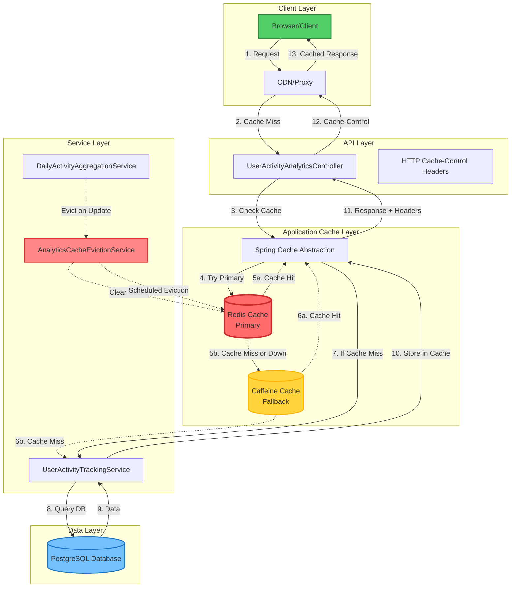

# Analytics Caching Architecture

## Request Flow

### Cache Hit (Fast Path)
1. **Client** sends request
2. **CDN/Browser** returns cached response (if within TTL)
3. Response time: < 10ms

### Cache Miss (Primary Path)
1. **Client** sends request
2. Request reaches **Controller**
3. **Spring Cache** checks **Redis**
4. If Redis has data → Return cached response
5. Response time: ~50-100ms

### Cache Miss + DB Query (Slow Path)
1. **Client** sends request
2. Request reaches **Controller**
3. **Spring Cache** checks **Redis** (miss)
4. **Spring Cache** checks **Caffeine** (miss or Redis down)
5. **Service Layer** queries **Database**
6. Data stored in **Redis** and **Caffeine**
7. Response with Cache-Control headers
8. Response time: ~200-500ms (first request only)

## Cache Layers

### Layer 1: Client-Side Cache (Browser/CDN)
- **TTL**: 30s - 15min (endpoint-specific)
- **Scope**: Per client/CDN location
- **Eviction**: TTL expiration
- **Benefit**: Zero network cost for cached requests

### Layer 2: Application Cache (Redis)
- **TTL**: 30s - 15min (endpoint-specific)
- **Scope**: Shared across all service instances
- **Eviction**: TTL + Scheduled + On-demand
- **Benefit**: Reduced database load

### Layer 3: Fallback Cache (Caffeine)
- **TTL**: 5 minutes (all caches)
- **Scope**: Per service instance
- **Eviction**: TTL + Size limit (1000 entries)
- **Benefit**: High availability when Redis is down

## Cache Eviction Strategy

### Automatic Eviction

```
Schedule               Action                          Reason
─────────────────────────────────────────────────────────────────
Every 5 minutes   →    Clear real-time caches    →    Prevent stale data
Every hour        →    Clear today's cache       →    Hourly data refresh
Daily at 1 AM     →    Aggregate data            →    New daily summary
Daily at midnight →    Clear all caches          →    Fresh daily start
```

### Event-Driven Eviction

```
Event                                  Action
───────────────────────────────────────────────────────────
Daily summary created/updated    →    Evict institute cache
Data aggregation completed       →    Evict all caches
```

## Cache Key Strategy

```
Cache Name                         Key Format
─────────────────────────────────────────────────────────────
analytics                    →    {instituteId}
analytics:realtime          →    {instituteId}
analytics:active-users      →    {instituteId}
analytics:today             →    {instituteId}
analytics:service-usage     →    {instituteId}
analytics:trends            →    {instituteId}
analytics:most-active-users →    {instituteId}:{limit}
analytics:currently-active  →    {instituteId}
```

## Performance Comparison

```
Scenario                     Response Time    Database Queries
────────────────────────────────────────────────────────────────
Client-side cache hit        < 10ms           0
Redis cache hit              50-100ms         0
Caffeine cache hit           10-20ms          0
Cache miss (DB query)        200-500ms        1-5

Cache hit rate > 90%         Avg: ~30ms       < 0.1/request
No caching                   Avg: ~400ms      5/request
```

## Monitoring Points

1. **Redis Metrics**
   - Cache hit/miss ratio
   - Memory usage
   - Connection pool stats
   - Eviction count

2. **Application Metrics**
   - Cache hit rate per endpoint
   - Average response time
   - Cache size
   - Eviction events

3. **Client Metrics**
   - CDN cache hit rate
   - Bandwidth saved
   - Client-side cache effectiveness

## Configuration

### Redis Configuration
```properties
spring.cache.type=redis
spring.data.redis.host=redis-service
spring.data.redis.port=6379
spring.cache.redis.enable-statistics=true
```

### Cache TTL Configuration
```java
ANALYTICS_REALTIME_CACHE          → 30 seconds
ANALYTICS_CURRENTLY_ACTIVE_CACHE  → 30 seconds
ANALYTICS_ACTIVE_USERS_CACHE      → 1 minute
ANALYTICS_TODAY_CACHE             → 2 minutes
ANALYTICS_CACHE                   → 5 minutes
ANALYTICS_MOST_ACTIVE_USERS_CACHE → 10 minutes
ANALYTICS_SERVICE_USAGE_CACHE     → 10 minutes
ANALYTICS_TRENDS_CACHE            → 15 minutes
```

## Failure Scenarios

### Redis Unavailable
```
1. Spring Cache detects Redis failure
2. Automatically falls back to Caffeine (in-memory)
3. Each service instance maintains its own cache
4. Service continues operating normally
5. When Redis recovers, cache is rebuilt gradually
```

### Cache Stampede Prevention
```
1. Spring Cache uses synchronization per cache key
2. Only one thread queries DB per cache key
3. Other threads wait for the first result
4. Result is cached and shared with waiting threads
```

### Stale Data Prevention
```
1. TTL ensures data expires automatically
2. Scheduled eviction clears stale entries
3. Event-driven eviction on data updates
4. Manual eviction API for urgent cases
```
