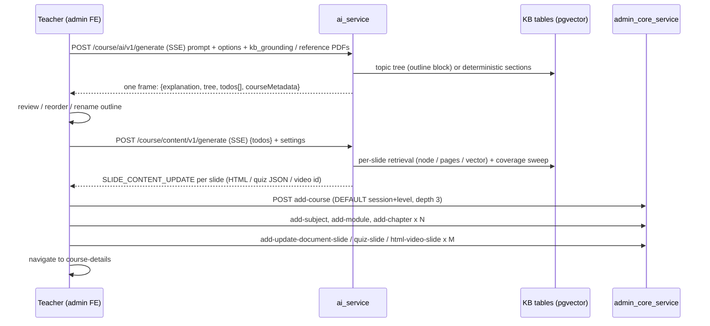

# AI Course Creation and the Knowledge Base

> **Scope:** the AI course-creation journey from the admin "AI Course Creator" page to a persisted course, and the Knowledge Base (KB) subsystem that grounds it. Covers `frontend-admin-dashboard` (the copilot UI), `ai_service` (FastAPI: outline, content, KB, credits), and the parts of `admin_core_service` / `assessment_service` that store the result.
> **Written:** 2026-09-03 from the code on `origin/main` at that date (last KB/course-generation commits landed 2026-08-19 and 2026-08-26; `ai_service` deploys from `main`). Every claim was checked against source. Paths are repo-relative. Companion document for the underlying course model: `docs/lms/LMS_COURSE_ARCHITECTURE.md`.

---

## Table of contents

1. [The big picture](#1-the-big-picture)
2. [The teacher's journey, screen by screen](#2-the-teachers-journey-screen-by-screen)
3. [Outline generation (`/course/ai/v1/generate`)](#3-outline-generation)
4. [Content generation (`/course/content/v1/generate`)](#4-content-generation)
5. [Persisting the course into admin_core](#5-persisting-the-course-into-admin_core)
6. [Knowledge Base: data model](#6-knowledge-base-data-model)
7. [Knowledge Base: ingestion pipeline](#7-knowledge-base-ingestion-pipeline)
8. [Knowledge Base: retrieval, Ask, topic tree](#8-knowledge-base-retrieval-ask-topic-tree)
9. [Grounding a course in a Knowledge Base](#9-grounding-a-course-in-a-knowledge-base)
10. [Reference PDFs (the non-KB grounding path)](#10-reference-pdfs)
11. [KB Library (marketplace) and question papers](#11-kb-library-and-question-papers)
12. [Models, providers, keys, institute prompt](#12-models-providers-keys-institute-prompt)
13. [Credits and metering](#13-credits-and-metering)
14. [Authentication between the three parties](#14-authentication)
15. [What is persisted where](#15-what-is-persisted-where)
16. [Known gaps, traps, and dead code](#16-known-gaps-traps-and-dead-code)
17. [File index](#17-file-index)

---

## 1. The big picture

Three parties, one database.

| Party | Role in AI course creation |
|---|---|
| **Admin frontend** (`/study-library/ai-copilot`) | Collects the brief, calls ai_service twice (outline, then per-slide content), lets the teacher review and edit, and then **persists the course itself** by calling the ordinary admin_core course/subject/module/chapter/slide endpoints. |
| **ai_service** (FastAPI, base path `/ai-service`) | Generates. Outline is one LLM call; content is one SSE stream with a 5-way worker pool. Owns the Knowledge Base (ingest, embeddings, retrieval, grounding), credits pre-flight and post-paid billing. **Persists no course data.** |
| **admin_core_service** (Spring) | Stores the course exactly as a hand-built one. Also owns, via Flyway, the tables ai_service uses: `ai_models`, `ai_tool_pricing`, `ai_token_usage`, `institute_credits`, `credit_transactions`, and the whole KB schema. |

`ai_service` has **no database of its own**: it connects to the admin_core Postgres (`ai_service/app/config.py`, `ADMIN_CORE_SERVICE_DB_URL` / `build_sqlalchemy_url()`). KB tables are created by admin_core migrations V435, V443, V445, V446 and queried with raw SQL from Python.



Two facts that shape everything downstream:

- **The outline is never stored server-side.** It lives in React state and `sessionStorage` until the browser writes the finished course. A refresh mid-run loses it (§15).
- **AI courses are always depth 3** (Course → Chapter → Slide). The live outline call hard-codes `course_depth: 3`; the persisted structure is one subject named after the course and one module named "Module 1" (§5.3).

---

## 2. The teacher's journey, screen by screen

Only two screens are live. `course-outline`, `generating/processing`, and `generating/viewer` still exist in the router but nothing navigates to them except each other (§16).

### 2.1 `/study-library/ai-copilot` — the brief

`frontend-admin-dashboard/src/routes/study-library/ai-copilot/index.lazy.tsx`

- **Course goal** textarea plus example prompts.
- **Course settings pills:** skill level (institute levels), AI model (`GET /ai-service/models/v2/list?category=general`, default `auto`), number of chapters, course length in minutes, slides per chapter.
- **Knowledge Base card** (`shared/components/KbGroundingCard.tsx`): pick a KB (`GET /knowledge-base/v1/bases`), tick topics from `GET /bases/{id}/topics` (all leaves ticked by default), choose **Strict / Blended**, **Structure = Replicate / Adapt**, **Coverage = Full / Highlights**. Selecting topics suggests chapter and slide counts, applied only if the teacher has not chosen counts. Hidden when the institute has no KBs. Arriving with `?kb=<id>` (the "Create course" button on a KB page) pre-selects that KB.
- **Additional options dialogs:** content options (diagrams, code snippets + language, practice problems, YouTube video, AI video, AI slides, AI storybook, quizzes, homework, solutions), structure (subjects/modules, only when institute default depth > 3 — but see §16, this is not sent), references (PDF/DOC/DOCX/CSV/XLS drop zone, up to 5 files, plus URLs scraped through `POST /ai-service/utils/scrape-url`), API keys (bring-your-own OpenAI/Gemini keys).
- **AI video settings card** (`AiVideoSettingsCard.tsx`): model, language, voice gender, TTS tier, voice id (from `GET /external/video/v1/tts/voices`), target duration, quality tier.
- **Document content chips:** `notes` (default), `why_it_matters`, `high_yield`, `visual_process`, `application`, `flashcards`, `quiz`, `summary`, `practical_examples`, `interactive_games`, plus a "Standard learning flow" preset.
- **Course structure chips:** quiz placement `PER_TOPIC | CHAPTER | BOTH | NONE`; chapter deliverables (assignment auto / assignment + solution / none); chapter video toggle; reduce-repetition second pass; figures policy `PREFER | REQUIRE | GENERATED_ONLY`.
- **Confirm dialog:** shows a "Source material" panel (green when KB or PDFs are attached, amber warning that the AI will write from general knowledge otherwise) and a `ToolCostBadge` for `course_outline`. Only `application/pdf` references are uploaded (media_service `useFileUpload`) and become `referenceDocumentFileIds`; scraped URL text is appended to the prompt.

On confirm the whole config is written to `sessionStorage.courseConfig` and the page navigates to `/generating`.

### 2.2 `/study-library/ai-copilot/course-outline/generating` — three phases in one route

`.../generating/index.tsx` (3.6k lines) runs the rest of the journey:

1. **Outline loader.** Reads `courseConfig`, builds `user_prompt`, POSTs to `/ai-service/course/ai/v1/generate?institute_id&user_id&model`, shows a countdown (`chapters × slidesPerChapter × 10 s`). On the final SSE frame it sets `courseMetadata`, keeps the raw `todos`, and turns the tree into UI `slides` (§3.7). It then writes the handoff keys `courseLanguage`, `courseVideoSettings`, `courseFiguresPolicy`, `courseDedupeRepetition`, `courseDocumentContentTypes`, `courseSelectedModel`, `courseReferenceDocIds`, `courseKbGrounding` to `sessionStorage` (write-or-remove so a previous run cannot leak) and deletes `courseConfig`.
2. **Outline review.** Chapters and slides as sortable lists (dnd-kit): reorder, rename, delete, add chapter, metadata dialog (name, description, tags, read-only thumbnail). "Regenerate slide", "Add slide with AI" and "Regenerate chapter" dialogs exist but are **simulations** that animate a progress bar (`// TODO: Call API`).
3. **Content generation split view.** "Generate Page Content" opens a cost dialog (counts document / assessment / video slides × their tool rates; AI-video-family slides are listed as "billed by actual usage") and then streams `/ai-service/course/content/v1/generate`. Left panel: chapter tree with per-slide status; right panel: HTML preview/editor for documents, Monaco for code, quiz player for assessments, YouTube embed for videos. A leave-guard dialog warns that spent credits are not returned; "Save to Drafts" writes `localStorage.aiCourseDraft`.
4. **Create course.** The header button runs `createCourseWithContent` (§5) with a progress label, then navigates to `/study-library/courses/course-details?courseId=…`. Teachers (role TEACHER without ADMIN) create as `DRAFT` and the hook calls `submitForReview`.

---

## 3. Outline generation

Router `ai_service/app/routers/course_outline.py` (prefix `/course`), service `ai_service/app/services/course_outline_service.py` (`CourseOutlineGenerationService`), prompt `ai_service/app/services/prompt_builder.py`, parser `ai_service/app/services/parser.py`, LLM transport `ai_service/app/adapters/openrouter_llm_client.py`.

### 3.1 Endpoints

| Method | Path | Notes |
|---|---|---|
| `POST` | `/ai-service/course/ai/v1/generate?institute_id&model&user_id` | **SSE**; the one the frontend uses. `institute_id` is a required query param. |
| `POST` | `/ai-service/course/outline/v1/generate` | JSON, non-streaming, older; same service. Lacks the KB-locked check. |
| `POST` | `/ai-service/course/assist/v1/text`, `/image` | Not outline refinement: per-field "generate with AI" for the manual Add Course form (flat 1 / 5 credits, JWT-authenticated). |

Neither outline endpoint declares an auth dependency: `institute_id` and `user_id` are taken from the request as-is (§14.4).

### 3.2 Request schema (`ai_service/app/schemas/course_outline.py`)

```python
class CourseUserPromptRequest(BaseModel):
    user_prompt: str
    course_tree: Optional[str]            # previous outline as a JSON string (refinement)
    course_depth: Optional[int]           # 2-5; the FE always sends 3
    generation_options: Optional[GenerationOptions]
    model: Optional[str]
    reference_document_file_ids: Optional[List[str]]
    kb_grounding: Optional[KbGrounding]

class GenerationOptions(BaseModel):
    num_slides, num_chapters, course_timing: Optional[int]
    generate_images: bool = False
    quiz_placement: Optional[Literal["PER_TOPIC","CHAPTER","BOTH","NONE"]]
    include_assignment: Optional[bool]    # None = keyword detection
    include_chapter_video: bool = False
    image_style: Optional[str] = "professional"
    language: Optional[str] = "English"
    ai_video_target_audience / ai_video_target_duration   # declared, never read

class KbGrounding(BaseModel):
    knowledge_base_id: str
    node_ids: List[str] = []              # empty = whole KB
    mode: Literal["STRICT","BLENDED"] = "STRICT"
    fidelity: Literal["REPLICATE","ADAPT"] = "REPLICATE"
    coverage: Literal["FULL","HIGHLIGHTS"] = "FULL"
```

### 3.3 Response schema

```python
class CourseOutlineResponse(BaseModel):
    explanation: str                      # HTML fragment, first person
    tree: List[CourseNode]                # COURSE → SUBJECT → MODULE → CHAPTER → SLIDE nodes
    todos: List[Todo]                     # one per slide; the thing the content pass consumes
    course_metadata: CourseMetadata       # course_name, about/why/who HTML, tags, course_depth, image urls

class Todo(BaseModel):
    name, title, type, path: str          # path = "C1.CH2.SL3" (dotted); type in
                                          # DOCUMENT | ASSESSMENT | VIDEO | VIDEO_CODE | AI_VIDEO | AI_VIDEO_CODE | AI_SLIDES | AI_STORYBOOK
    keyword: Optional[str]                # YouTube search term for VIDEO
    model: Optional[str]                  # outline-suggested per-slide model
    action_type: str                      # ADD | UPDATE
    prompt: str                           # the per-slide brief the content pass expands
    order: Optional[int]
    subject_name / module_name / chapter_name: Optional[str]
    metadata: dict                        # language, node_id, kb_page_start/end, content_types, figures_policy, video settings…
```

`Todo.path` is the primary key for everything downstream. Two path styles coexist (`C1.CH1.SL1` on todos, `COURSE/chapter-1/slide-1` on tree nodes from the deterministic KB path).

### 3.4 What happens on a request (streaming path)

1. **Emit the request id first** as a fenced frame `` ```json {"requestId": "<uuid>"}``` `` so a proxy does not time out during PDF ingestion.
2. Capture `original_user_prompt` before grounding mutates it (homework detection must not see textbook text).
3. **Deterministic KB shortcut** (`_deterministic_outline_from_kb`): only when `kb_grounding` is present with `fidelity=REPLICATE` and `coverage=FULL`. **No LLM runs.** `course_grounding.deterministic_sections()` returns the selected slice of the topic tree in source order; topics → chapters, subtopics → slides, all `DOCUMENT`, with `metadata {node_id, kb_page_start, kb_page_end}` stamped on each todo for whole-section grounding later. `course_depth` fixed at 3. Since the frontend defaults to REPLICATE + FULL, **a KB-grounded course normally takes this path**.
4. Otherwise **`_apply_reference_grounding`**: KB block first (`_apply_kb_grounding` appends `outline_grounding_block()` to `user_prompt`, §9.2) and, if that returned true, the PDF path is skipped; else `course_document_ingest.ingest_documents` (§10) appends a `SOURCE DOCUMENT` block capped at 60,000 chars, bounded by a 150 s timeout that proceeds ungrounded on expiry.
5. Load admin_core course metadata if `course_id` is set (loaded but not used by the prompt builder).
6. Read the institute's `AI_COURSE_PROMPT` from `institutes.setting_json → setting.AI_settings`.
7. **Build the prompt** (§3.5) and resolve keys and model (§12).
8. **One OpenRouter call**: `{model, messages:[{role:"user", content: prompt}], temperature: 0.3}`. No system message, no JSON mode, no `max_tokens`, 1200 s timeout. HTTP 402 raises `PaymentRequiredError` and is never retried.
9. Bill `course_outline` (§13).
10. Emit two cosmetic frames (`[Thinking...]`, `[Generating...]`) — they are sent after the call returns.
11. **Parse** (§3.6), then `_add_homework_slides_if_needed`, `_apply_structure_options`, optional images, and emit the final JSON frame.

The outline is therefore **one non-streaming LLM call** wrapped in SSE; there are no partial outlines.

### 3.5 The prompt

`prompt_builder.py` `build_prompt` renders a single ~690-line user message from nine variables: `userPrompt`, `existingCourse`, `courseDepth` (`"auto"` if none), `generationRequirements`, `instituteAICoursePrompt`, `courseTiming`, `language`, plus two always-empty merkle slots. Key blocks in order:

- Language rule ("Generate ALL course content … in {language}").
- Depth acknowledgement and the path grammar per depth: 2 `C1.SL1`, 3 `C1.CH1.SL1`, 4 `C1.M1.CH1.SL1`, 5 `C1.S1.M1.CH1.SL1`, with hierarchical names denormalised onto every todo. "VIOLATION: if ANY path doesn't match the required depth format, the output is INVALID."
- Count analysis: parse "3 slides", "2 chapters with 4 slides each"; with `course_timing`, derive counts using DOCUMENT 3–5 min, VIDEO/AI_VIDEO 2–3 min, ASSESSMENT 10–15 min, VIDEO_CODE 4–6 min; default "typically 8–12 slides".
- Slide-type keyword triggers (AI_VIDEO, AI_SLIDES, AI_STORYBOOK, VIDEO_CODE) and "do NOT add ASSESSMENT for homework — homework/solution slides are added automatically after generation".
- `GENERATION CONFIGURATION` (exact slide count, chapters, timing, images yes/no).
- STEP 1–4 worked examples for depth 4 and 5.
- The literal output JSON exemplar (`explanation`, `todos[]`, nested `tree`, camelCase `courseMetadata` with `courseName`, `aboutTheCourseHtml`, `whyLearnHtml`, `whoShouldLearnHtml`, `tags`, `courseDepth`, media ids).
- Todo spec: allowed types, `keyword` semantics, a hard-coded per-type model suggestion (`google/gemini-2.5-pro` for DOCUMENT/ASSESSMENT/AI_*, a flash model for VIDEO), per-type prompt requirements, mermaid trigger, "DOCUMENT word count 50–100 words".
- A `Modifications` ADD/UPDATE/DELETE spec that the parser **never reads**.
- Final checklist, then `📘 EXISTING COURSE`, `🧾 USER PROMPT`, `🏫 INSTITUTE AI COURSE PROMPT`.

`{userPrompt}` is interpolated three times, so grounding text appended to it is sent three times (§16).

### 3.6 Parsing and post-processing

- `CourseOutlineParser._extract_final_json` scans the raw text backwards for the last balanced `{…}` containing `"explanation"` and `"todos"`. Any failure silently yields a fallback outline with `course_name = "Error"`, empty tree and todos, depth 3; `"Error"` is the sentinel that suppresses image generation.
- `_add_homework_slides_if_needed`: triggered by `include_assignment=True` or by keywords in the **original** prompt (practice problems, homework, exercises, assignments, solutions). It (a) drops LLM-authored homework/solution todos, (b) **re-numbers duplicate `path`s** to the next free `SLn` (a duplicate path meant the second slide never received content), (c) **renames duplicate titles within a chapter** to "… (part 2)" (the frontend matches generated content to slides by title, so duplicates left slides empty forever), and (d) appends `Assignment - {chapter}` and `Assignment Solutions - {chapter}` DOCUMENT todos per chapter that has at least one document slide. The pair is later generated sequentially so the solution can read the assignment.
- `_apply_structure_options`: `quiz_placement CHAPTER|BOTH` appends `Chapter Quiz — {chapter}` (ASSESSMENT, 8–10 MCQs) and `include_chapter_video` appends `Chapter Video — {chapter}` (AI_VIDEO) per chapter, as todos only.
- **Images** (`generation_options.generate_images`, the FE sends `true`): `ImageGenerationService` asks an LLM for a keyword, then generates banner, preview and media images in parallel (60 s each) with `google/gemini-3.1-flash-image` via OpenRouter and uploads to S3. Failures are swallowed.

### 3.7 SSE frames and how the frontend consumes them

Frames, in order: fenced `requestId`; optional `[Generating...]` lines; `[Thinking...]`; `[Generating...]`; the single JSON outline; error variants `{"type":"ERROR","code":402,...}` / `{"type":"ERROR",...}` / `[Error] …`. Keepalive comment lines every 15 s.

The frontend (`generating/index.tsx`, inline parser) treats lines starting with `[Generating...]` as progress, parses `{` lines as JSON, throws on `type: 'ERROR'`, and on the outline frame builds UI slides via `transformApiResponseToSlides`: group todos by `chapter_name`, sort by `order`, `sessionId = 'session-N'`, type map `DOCUMENT→doc`, `VIDEO→video`, `AI_VIDEO→ai-video`, `AI_SLIDES→ai-slides`, `AI_STORYBOOK→ai-storybook`, `VIDEO_CODE→video-code`, `AI_VIDEO_CODE→ai-video-code`, `QUIZ|ASSESSMENT→quiz`; `status:'pending'`, `content` seeded with the todo's prompt.

---

## 4. Content generation

Router `ai_service/app/routers/content_generation.py` (`POST /ai-service/course/content/v1/generate`, SSE, no auth dependency), orchestration in `CourseOutlineGenerationService.generate_content_from_coursetree` (`course_outline_service.py` ~839–1349), generators in `ai_service/app/services/content_generation_service.py`, prompts in `ai_service/app/services/content_prompts.py`, post-processing in `ai_service/app/services/document_postprocess.py`.

### 4.1 Request

```python
class ContentGenerationRequest(BaseModel):
    course_tree: dict                     # full outline response or {"todos":[...]}; only todos are used
    institute_id, user_id: Optional[str]
    language: Optional[str] = "English"
    generation_run_id: Optional[str]      # client-minted UUID; keys per-slide billing idempotency
    video_settings: Optional[dict]        # model, voice_gender, voice_id, tts_provider, quality_tier, target_duration, language
    model: Optional[str]                  # course-level model pick ("auto" = ignore)
    document_settings: Optional[dict]     # content_types, model, figures_policy, dedupe_repetition
    reference_document_file_ids: Optional[list]
    kb_grounding: Optional[dict]          # passthrough of KbGrounding
```

The frontend (`useContentGeneration.ts`) sends only todos whose slide still exists: it matches todos to live slides in three passes (exact title + chapter, case-insensitive, fuzzy substring) and **silently drops todos the teacher deleted**. Matched slides flip to `generating` and are mirrored into `localStorage.generatedSlides`.

### 4.2 The plan

1. Emit the `requestId` frame; extract and parse todos; unparseable or unknown types are skipped.
2. Reset per-run maps: `_document_figures_by_path`, `_kb_grounding_by_path`, `_kb_citations_by_path`, `_kb_unsupported_paths`.
3. **Grounding:** `_ground_slides_from_kb` (§9.3), then reference-PDF ingest with `assign_figures_to_slides` (§10); figures from both sources are **merged** into `_document_figures_by_path`.
4. **Metadata injection:** course model, language, `sibling_titles` (up to 12 chapter-mates per DOCUMENT), video settings onto the four video-family types, `content_types` / `figures_policy` / model onto DOCUMENT todos.
5. **Split:** `CONCURRENCY = 5`. A homework todo is paired with the immediately following solutions todo; everything else is independent. Log line: `Content generation plan: N independent todos (concurrency=5), M dependent homework→solution pairs (sequential)`.
6. **Phase 1:** one `asyncio.Task` per independent todo behind a `Semaphore(5)`, events pushed to a queue and yielded **in completion order**. A per-task exception becomes `SLIDE_CONTENT_ERROR`, never a stream abort. On client disconnect, non-video tasks are cancelled; video-family workers that already started are left running (cancelling mid-pipeline leaves `ai_gen_video` rows stuck and blocks the loop).
7. **Phase 2:** homework → solution pairs, sequentially.
8. **Phase 3 (opt-in `dedupe_repetition`):** pure-text repetition detection across slides (`content_dedupe.py`: sentence threshold 3, question threshold 2, max 6 regenerations per course); flagged slides regenerate with an "ALREADY COVERED ELSEWHERE" block, framed by `CONTENT_POSTPASS STARTED/DONE` events. A failed rewrite re-emits the original.

Every generator first gets the KB block appended to `todo.prompt` in the dispatcher (`generate_content_for_todo`), guarded by the marker `===== COURSE MATERIAL` so it cannot be appended twice.

### 4.3 Model choice per slide

`_model_for(todo)`: `todo.metadata.model` / `todo.model` → request-level `model` → per-type default. Defaults: DOCUMENT `HTML_DOC_MODEL` env or `anthropic/claude-sonnet-5`; other content `google/gemini-2.5-flash`. `_generate_with_model_fallback`: empty completion → retry once → fall back to the content default; HTTP 402 is re-raised. Transport is the same OpenRouter client (temperature 0.3, 1200 s).

### 4.4 Generators by type

| `type` | Generator | Output |
|---|---|---|
| **DOCUMENT** | `generate_document_content` → `build_document_prompt` (or `build_homework_prompt` / `build_solution_prompt` chosen by title) | A **full standalone HTML document** (`<!DOCTYPE html>…<style>…</style>…</body></html>`), 300–600 words, all CSS inline in one `<style>`, design-safety rules (normal flow, no absolute-positioned text, no internal scrolling), mermaid only if the CDN script is included, images as ``, code as `<pre data-language><code>`, `content_types` presentation formats (notes, summary, flashcards with a strict flip contract, interactive quiz posting `vacademy:complete` to the parent window, …), a figures block listing exact URLs to embed, and the chapter sibling titles ("stay strictly on THIS slide's subject"). |
| **ASSESSMENT** | `generate_assessment_content` → `build_assessment_prompt` | Strict JSON `{questions:[{question_number, question{type:HTML,content}, options[{preview_id,content}], correct_options[], ans, exp, question_type MCQS|MCQM|ONE_WORD|LONG_ANSWER, tags, level}], title, tags, difficulty, …}`. Image placeholders in questions are never filled. |
| **VIDEO** | `generate_video_content` → `YouTubeService.search_video` | YouTube Data API v3 search (`videoEmbeddable=true`, 1 result, availability verified): `{videoId, title, url, embedUrl, description}`. No LLM. |
| **VIDEO_CODE** | YouTube leg + `build_code_prompt` | `{video, code:{content (markdown with runnable fenced code), language}, layout}`; billed once after both legs. |
| **AI_VIDEO / AI_SLIDES / AI_STORYBOOK** | in-process `VideoGenerationService.generate_till_stage(...)` | See §4.6. |
| **AI_VIDEO_CODE** | consumes all AI_VIDEO events, then generates code | Same as AI_VIDEO plus `code`. |

Assignments and solutions are plain DOCUMENT slides distinguished by title. Flashcards are a `content_types` format inside a document, not a slide type. No numeric question type exists on this path.

### 4.5 Document post-processing

In order: `strip_wrapping_fence` (unwrap a whole-payload ```` ```html ```` fence) → `normalize_code_blocks` (every `<pre><code>` becomes `<pre data-code="<base64 utf-8>" data-language="x"><code class="language-x">`, the editor's lossless form) → `illustrate_document` (up to `MAX_DOC_IMAGES = 2` placeholders generated via OpenRouter chat-completions with `modalities:["image"]`, model `google/gemini-3.1-flash-image`, 16:9, 90 s, uploaded to S3 `ai-course-docs/{uuid}.png`; leftovers are stripped). Each generated image records a separate `image` usage row.

### 4.6 AI video handoff

No HTTP hop: `ContentGenerationService` constructs `VideoGenerationService` and calls `generate_till_stage` directly with the todo's voice/tier settings.

| Type | `video_id` prefix | content_type | foreground stage | background leg |
|---|---|---|---|---|
| AI_VIDEO | `video-{path}-{uuid8}` | VIDEO | SCRIPT | HTML timeline + audio (`continue_html_generation`) |
| AI_SLIDES | `slides-…` | SLIDES | HTML (no TTS) | none |
| AI_STORYBOOK | `storybook-…` | STORYBOOK | SCRIPT | HTML (`continue_storybook_html`) |

Events: a `started` update (`contentData {videoId, status:"GENERATING", currentStage:"INITIALIZING", progress:0}`), one update per pipeline stage, then a final `SLIDE_CONTENT_UPDATE` with `status:"COMPLETED"`, `scriptUrl`/`htmlUrl`, `backgroundGeneration:true` and the message "Script generated. HTML timeline and audio are being generated in the background. Use /video/urls/{videoId} to check status." A pipeline error or FAILED/CANCELLED status becomes `SLIDE_CONTENT_ERROR` and no background leg is spawned.

The slide is persisted later as an HTML_VIDEO slide carrying `ai_gen_video_id = videoId` (§5.4); the learner-facing preview fetches `GET /ai-service/video/urls/{id}` once per open (404 or `IN_PROGRESS` renders "still generating"). There is no re-attach step. The full render pipeline is documented separately under `docs/ai_content/`.

### 4.7 SSE protocol

One JSON object per `data:` line; keepalive comment `: keepalive` every 15 s (AI-video SCRIPT stages can go minutes without output and gateways were idling the socket).

| `type` | Payload |
|---|---|
| raw first frame | `` ```json {"requestId":"…"}``` `` |
| `INFO` | `{message}` (no todos) |
| `SLIDE_CONTENT_UPDATE` | `{path, status:true, actionType, slideType, title?, contentData, metadata?}` |
| `SLIDE_CONTENT_ERROR` | `{path, status:false, actionType, slideType, errorMessage, contentData}` |
| `CONTENT_POSTPASS` | `{status:"STARTED", paths[]}` then `{status:"DONE"}` |
| `ERROR` | `{code:402?, message}` |

There is **no terminal `done` event**; the stream just ends. **No resume**: on abort/network/timeout the frontend retries the whole run up to twice (1 s, 2 s backoff) reusing `generationRunId`, so already-billed slides are not re-billed but are regenerated.

Frontend transport (`contentGenerationService.ts`): 30 s timeout for the first byte only, then a 5-minute **inactivity** timer racing each `reader.read()`, 1 MB line buffer, `reader.cancel()` in `finally` so an abandoned run stops billing. Per-type normalisation on receipt: DOCUMENT unwrapped verbatim if fenced else `markdownToHtml`; ASSESSMENT parsed to JSON; VIDEO rendered to a small HTML card; AI_* stored as JSON and marked complete only when `status === 'COMPLETED'`.

---

## 5. Persisting the course into admin_core

`frontend-admin-dashboard/src/routes/study-library/ai-copilot/course-outline/generating/services/courseCreationService.ts` (`createCourseWithContent`) and `hooks/useCourseCreation.ts`. ai_service writes nothing; every call below is the browser using the user's JWT against admin_core.

### 5.1 Ordered calls

1. **`POST /admin-core-service/course/v1/add-course/{instituteId}`** with `new_course: true`, **`force_new_course: true`** (AI names are deterministic; without it admin_core merges into an existing course of the same name and appends chapters there), the metadata mapped from `courseMetadata` (`about_the_course_html`, `why_learn_html`, `who_should_learn_html`, `course_html_description`, media ids, tags), `course_depth: courseMetadata.course_depth || 2` (the LLM echoes 3), `status: isAdmin ? 'ACTIVE' : 'DRAFT'`, `is_course_published_to_catalaouge: true`, and exactly one session/level: `sessions:[{id:'DEFAULT', session_name:'DEFAULT', levels:[{id:'DEFAULT', level_name:'DEFAULT', group:{id:'DEFAULT',…}, add_faculty_to_course:[current user]}]}]`. HTTP 511 bodies are inspected for a disguised backend error.
2. Sleep 1.5 s, then **`GET /admin-core-service/course/v1/{courseId}/batches`** → `packageSessionIds` (fallback: institute details filtered by package id, with one retry).
3. **`POST /admin-core-service/subject/v1/add-subject?commaSeparatedPackageSessionIds=…`** — one subject, `subject_name = courseName`, `subject_code` = first three letters upper-cased.
4. **`POST /admin-core-service/subject/v1/add-module?subjectId&packageSessionId`** — one module, `module_name: 'Module 1'`.
5. Per chapter (sequential): **`POST /admin-core-service/chapter/v1/add-chapter?subjectId&moduleId&commaSeparatedPackageSessionIds`** with `chapter_order = index`; chapters whose slides are all placeholders are skipped; a failed chapter is logged and skipped.
6. Per chapter, all slides in parallel (`Promise.allSettled`), each failure logged and swallowed. Every slide's `description` is a breadcrumb `"{chapter} > {slide} > {kind}"`.

### 5.2 Slide routing

| UI `slideType` | admin_core endpoint | Payload highlights |
|---|---|---|
| `doc`, `objectives`, unknown (includes assignments/solutions) | `POST /admin-core-service/slide/v1/add-update-document-slide?chapterId&moduleId&subjectId&packageSessionId&instituteId` | `document_slide.type = 'HTML'` (not the legacy Yoopta `DOC`, whose deserializer mangled inline `<style>`/`<script>`), `data` and `published_data` = the HTML **verbatim** when it already looks like HTML (`looksLikeHtml` regex), else `markdownToHtml`; `status:'PUBLISHED'`, `new_slide:true`, `total_pages:1`. |
| `quiz`, `assessment` | `POST /admin-core-service/slide/quiz-slide/add-or-update` | `quiz_slide.questions[]` built from the assessment JSON: rich-text `text/text_data`, options, `question_type:'MCQS'`, `question_response_type:'OPTION'`, `evaluation_type:'AUTO'`, `auto_evaluation_json:'{"correctAnswers":[idx]}'` where `idx` comes from `correct_options[0]`; a DOM fallback scrapes `<h3>`/`<ol>`/"Correct Answer:" from legacy HTML. **No assessment_service call.** |
| `video`, `video-code` | `POST /admin-core-service/slide/video-slide/add-or-update` | 11-char YouTube id extracted from the content; `url` = `published_url`; `source_type:'VIDEO'`, `embedded_type:'YOUTUBE'` (or `'CODE'` with a `splitScreenData` blob for video-code). Titles truncated to 250 chars (varchar 255). |
| `ai-video`, `ai-slides`, `ai-storybook`, `ai-video-code` | `POST /admin-core-service/slide/html-video-slide/add-or-update` | `html_video_slide { url: videoId, ai_gen_video_id: videoId, video_length_in_millis: 0 }` where `videoId = aiVideoData.videoId || scriptUrl || 'pending'`; `ai-video-code` adds `code_editor_config {enabled, layout, language, initial_code:'', theme}`. |

`ADD_UPDATE_ASSIGNMENT_SLIDE` and `ADD_UPDATE_ASSESSMENT_SLIDE` exist in `urls.ts` but are never called from this flow.

### 5.3 What the resulting course looks like in the database

- `package.course_depth = 3`, one ACTIVE batch on `DEFAULT`/`DEFAULT`, plus the usual INVITED sentinel batch and auto-created default enroll invite (see the LMS doc).
- One `subject` **named after the course**, one `modules` row **"Module 1"**, N chapters, slides in `chapter_to_slides` with `status='PUBLISHED'`.
- Document slides are `document_slide.type='HTML'` with identical `data` and `published_data`.

**Cross-app mismatch worth knowing:** depth 3 means "subject and module hidden", but both frontends only collapse a level whose single entry is named `default` (the wizard seeds `DEFAULT`, the copilot does not). The admin course-details page branches on `courseStructure === 3` and collapses regardless of name; the learner app's `isPlaceholderName` check fails for "Physics Basics" / "Module 1", so learners see the subject and module levels on AI-created courses (`frontend-learner-dashboard-app/.../course-structure-details.tsx` ~682–699).

### 5.4 AI video slides after creation

The slide row holds `ai_gen_video_id`; nothing in the frontend attaches the finished video later. Rendering is on demand: the learner and admin previews call `GET /ai-service/video/urls/{ai_gen_video_id}`; a `'pending'` id (video failed before its started event) spins forever. `ai_video_sweeper.py` refunds and marks `ai_gen_video` rows stuck PENDING/IN_PROGRESS for over 6 h as FAILED.

---

## 6. Knowledge Base: data model

Migrations in `admin_core_service/src/main/resources/db/migration/`: **V435** (corpus model, the design document of the feature), **V443** (topic tree), **V445** (library), **V446** (generation history; header says V444), V441 (paper pricing), V449 (model defaults). Legacy: V168 (`content_embeddings`), V170 (`knowledge_base_items`). Raw SQL access from `ai_service/app/services/kb/repository.py` (no ORM models).

| Table | Purpose and key columns |
|---|---|
| `kb_embedding_model` | Dimension registry: `model_id PK` (`google/gemini-embedding-001`), `dim` (768), `vector_column` (`embedding_768`), `provider`, `is_default` (partial unique index). Adding a new embedder = new row + new vector column + partial index. |
| `knowledge_base` | `institute_id`, `name`, `description`, `purpose ∈ general|teaching|question_bank|institute_info`, `language_hint`, `owner_type ∈ INSTITUTE|PLATFORM`, `embedding_model`, `embedding_dim`, `status ∈ ACTIVE|ARCHIVED`, `stats_json`. Partial unique index: one `institute_info` KB per institute. |
| `knowledge_base_source` | `source_kind ∈ PDF|URL|YOUTUBE|TEXT`, `title`, `file_id`, `source_url`, `raw_text`, `content_hash` (sha256 dedup), `status ∈ PENDING|PROCESSING|READY|PARTIAL|FAILED`, `progress 0-100`, `stage ∈ parsing|figures|chunking|embedding|summarizing`, `is_active`, `page_count`, `pages_low_confidence`, `chunk_count`, `figure_count`, `detected_languages[]`, `parser ∈ pymupdf|mathpix|mixed|scrape|youtube|text`, `ocr_pages`, `credits_charged`, `ai_task_id`, `error_message`, `meta_json`. |
| `knowledge_base_page` | per page: `page_number`, `text_chars`, `confidence 0..1`, `parser`, `needs_review`, `preview_url`. Unique `(source_id, page_number)`. |
| `knowledge_base_figure` | `page_number`, `kind ∈ figure|table|equation|chart`, `image_url` (our S3, never the vendor CDN), `caption`, `alt_text`, `table_html`, `ordinal`. |
| `knowledge_base_node` | Two trees in one table: per-source summary tree `level ∈ book|chapter|section|page` (`source_id` set) and cross-source topic tree `level ∈ topic|subtopic` (`source_id NULL`); `parent_id`, `title`, `summary`, `keywords[]`, `page_start`, `page_end`, `ordinal`. |
| `kb_chunk` | `content_text`, `chunk_index`, `page_start`, `page_end`, `node_id` (narrowest containing section/subtopic), `figure_ids[]`, `lang`, `embedding_model`, `embedding_dim`, `embedding_768 vector(768)`, `meta_data`. CHECK ties `embedding_dim` to the populated column; **partial HNSW** `USING hnsw (embedding_768 vector_cosine_ops) WHERE embedding_768 IS NOT NULL`. |
| `knowledge_base_listing` | Marketplace merchandising, separate from the KB: `title`, `summary`, `description`, cover, facets `subject/level/board/language`, `tags`, `status ∈ DRAFT|PUBLISHED|UNLISTED`, `sort_weight`, `published_at/by`. |
| `knowledge_base_entitlement` | `(knowledge_base_id, institute_id)` **UNIQUE** (structural anti-double-charge), `source ∈ PURCHASE|GRANT`, `credits_charged`. |
| `knowledge_base_generation` | History of artifacts made from a KB: `artifact_type ∈ QUESTION_PAPER|COURSE|PRESENTATION|QUIZ|ASSESSMENT|NOTES|SUMMARY|LESSON_PLAN|WORKSHEET`, `status ∈ DRAFT|GENERATING|READY|SAVED|FAILED`, `progress`, `input_json`, `result_json`, `external_id/type`, `ai_task_id`, `credits_charged`. **Course generation does not write to it yet.** |

V435 also expanded the `ai_token_usage.request_type` CHECK with `'knowledge_base'`, seeded `ai_model_defaults` for `knowledge_base_summary`, `knowledge_base_qa`, `knowledge_base_figure`, and folded the legacy `knowledge_base_items` into one `institute_info` KB per institute by copying vectors in pure SQL.

---

## 7. Knowledge Base: ingestion pipeline

`ai_service/app/services/kb/ingest.py` (`ingest_source`), `parsing.py`, `chunking.py`, `summary_index.py`, `topics.py`, `ai_service/app/services/embedding_service.py`.

### 7.1 Adding a source

`POST /ai-service/knowledge-base/v1/bases/{kb_id}/sources` (202) with `{source_kind, title?, file_id?, source_url?, raw_text?, expected_pages?}`. PDFs are probed once (`probe_pdf` → page count + sha256 from one download); a matching `content_hash` returns the existing source with `deduplicated: true` and no charge; `MAX_PAGES_PER_SOURCE = 1200` is enforced on the server-side count; `kb_ingest_page` is pre-flighted. The router creates an `ai_task` of type `KB_INGEST_SOURCE` and schedules the job; **progress is reported on `knowledge_base_source.progress/stage`**, polled by `GET /sources/{source_id}` every 4 s in the UI. `POST /sources/{id}/reindex` re-runs everything (derivatives cleared first) and is free because the charge is idempotent.

### 7.2 Stages

`clear_source_derivatives` → **parsing (5 %)** → **figures (35 %)** → **chunking (45 %)** → **embedding (55–80 %)** → **summarizing (82 %)** → topic tree (94 %) → bill → finalize (100 %).

**Parsing** (`parsing.py`): all PyMuPDF work runs in a thread (`_extract_sync`). Per-page router: a page with ≥ `MIN_DIGITAL_CHARS = 180` extractable chars and garble ratio ≤ 0.12 is kept as `pymupdf`, confidence 1.0; otherwise it is isolated into a single-page PDF and sent to **MathPix one page at a time** (`mathpix_pdf_service.submit_bytes`, 6 concurrent) because MathPix's multi-page markdown has no page delimiters and page attribution is what citations depend on. OCR confidence is inferred from yield (≥180 chars → 0.9; else 0.5 or 0.0 with `needs_review`). Markdown is stored **verbatim** so LaTeX and pipe tables survive; tables are extracted separately into `table_html`. URL sources go through the SSRF-validated scraper (20,000-char clip); YouTube uses `youtube-transcript-api` (datacenter-IP blocking is a known, unresolved risk); TEXT is one page.

**Figures:** embedded rasters ≥ 120×120 from digital pages, hashed with SHA-1; an image appearing on ≥ `max(3, 25 % of content pages)` is dropped as a watermark or logo (the case that produced "Diagrams & tables: 35" on a 33-page question bank). MathPix figures are downloaded and **re-hosted** to `s3://…/ai-knowledge-base/figures/{uuid}.{ext}` because `cdn.mathpix.com` purges assets. Cap `MAX_FIGURES_PER_SOURCE = 400`.

**Chunking** (`chunking.py`): `CHUNK_SIZE = 2000`, `CHUNK_OVERLAP = 200`, `MIN_CHUNK_CHARS = 80`; page-aware (each chunk records `page_start/page_end` and the figure ids on those pages), split on blank lines then sentence boundaries (including `।` and `॥`), overlap re-seeded as a 200-char tail, final flush without overlap. `lang` from unicode-range script detection.

**Embedding:** OpenRouter `/api/v1/embeddings`, `google/gemini-embedding-001`, 768 dims, `search_document` task type, batches of 64, retries with `Retry-After`. Chunks without an embedding are skipped (a NULL vector would violate the CHECK); zero embedded chunks fails the ingest loudly.

**Summary tree** (`summary_index.py`): only for sources with ≥ 3 pages or ≥ 6,000 chars (`MIN_CHARS_FOR_INDEX`); otherwise a single `book` node with no LLM call. Windows of ≥ 4 pages sized so at most 60 section calls happen (`MAX_SECTION_CALLS`), chapter starts detected from headings in several scripts, `book` / `chapter` / `section` nodes written with summaries and keywords; the book-level call also returns `coverage_gaps` surfaced as warnings. Model use case `knowledge_base_summary`.

**Topic tree** (`topics.py`): rebuilt across the whole KB after every ingest. Single-source KBs under 200,000 chars use the **heading tree** strategy where the LLM is "demoted from architect to quoter": every heading it returns must be a literal substring of the corpus (min 4 survivors), and the tree is assembled mechanically. Otherwise an LLM merge over section summaries, capped at 24 topics × 12 subtopics. Then `link_chunks_to_nodes` assigns each chunk the **narrowest containing node, preferring subtopic over section** (section-only linkage had made every chunk invisible to node-scoped slide grounding on two client audits).

**Billing:** `kb_ingest_page` (0.5/page on pages actually parsed) or `kb_ingest_url` (flat 2), once at the end, idempotency key `kb_ingest:{source_id}`; TEXT is free; failed ingests are not billed. Final status `PARTIAL` if any review pages or warnings, else `READY`.

---

## 8. Knowledge Base: retrieval, Ask, topic tree

`ai_service/app/services/kb/retrieval.py` (`KbRetrievalService`), `repository.py`.

### 8.1 Search

`KbRepository.search_chunks`:

```sql
SELECT c.id, c.content_text, c.page_start, c.page_end, c.figure_ids, c.lang, c.meta_data,
       c.source_id, s.title AS source_title,
       1 - (c.embedding_768 <=> CAST(:query_vec AS vector)) AS similarity
FROM kb_chunk c JOIN knowledge_base_source s ON s.id = c.source_id
WHERE c.knowledge_base_id = :kb_id AND c.institute_id = :institute_id
  AND c.embedding_dim = :embedding_dim AND c.embedding_768 IS NOT NULL
  AND s.is_active = TRUE
  AND 1 - (c.embedding_768 <=> CAST(:query_vec AS vector)) > :threshold
ORDER BY c.embedding_768 <=> CAST(:query_vec AS vector)
LIMIT :top_k
```

Defaults `top_k = 8`, threshold `0.25`. Query embeddings use `search_query` task type with a 256-entry LRU. **Zero-norm guard**: a zero query vector makes pgvector's cosine distance NaN, which Postgres sorts above every number, so `similarity > threshold` would admit the entire corpus with confident-looking citations; `if not any(embedding): return []` in both `search` and `search_institute`. Search is scoped by the **KB's** institute (a PLATFORM library's rows live under the publisher), read access having been authorised by `get_kb`. Full chunk text is returned (the legacy `rag_service` truncated hits to 1,000 chars while chunking at 2,000). Figures are hydrated in one query per search.

Other repository reads used by grounding: `get_chunks_for_node` (all chunks of a node, similarity fixed at 1.0 — membership is the relevance claim), `get_chunks_for_pages`, `get_all_chunk_summaries` (coverage census, limit 400). `search_institute_wide` adds a `purposes` filter; the student/lead chatbot calls it with `purposes=["institute_info"]` so a fee question never answers out of a textbook.

### 8.2 Ask

`POST /bases/{id}/ask {question, history?, answer_language?, top_k ≤ 25}` → retrieval → context blocks `[n] {source_title}, page {p}` (24,000-char cap) → model from `resolve_models(db, "knowledge_base_qa")` → strict JSON `{answer, used_excerpts, confident, follow_up_questions}` with "use ONLY the excerpts… cite excerpt numbers… if excerpts disagree, say that". No hits → canned "could not find" answer with `grounded: false`, **not billed**; grounded answers bill `kb_ask` (flat 1). Citations carry labels like "NCERT Class 9 Science, p. 214-215".

### 8.3 Topic tree endpoints

`GET /bases/{id}/topics` returns `[{id, title, summary, keywords, page_start, page_end, ordinal, subtopics:[…]}]` — note the child key is **`subtopics`**, not `children` (a bug was shipped once by assuming `children`). It is deliberately **not** paywalled (it is the agreed library preview); `GET /bases/{id}/outline` (section summaries) and `/search`, `/ask` are gated by `require_usable` → **402 `LIBRARY_LOCKED`**.

---

## 9. Grounding a course in a Knowledge Base

`ai_service/app/services/kb/course_grounding.py` (532 lines) plus the callers in `course_outline_service.py`.

### 9.1 Constants

```python
MAX_SLIDE_GROUNDING_CHARS = 12_000
MAX_SLIDE_GROUNDING_CHARS_FAITHFUL = 28_000
SLIDE_TOP_K = 6
SLIDE_TOP_K_FAITHFUL = 14
SLIDE_MIN_SIMILARITY = 0.35        # BLENDED uses 0.27
MAX_SWEEP_CHUNKS = 400
SUPPLEMENT_CHARS_PER_SLIDE = 8_000
```

Rationale recorded in the file: real chunks average ~1.7k chars, so a 12k budget admits ~7 passages; a 26-page chapter indexes to ~50 chunks, so top-6 was ~12 % of it per slide. `faithful = coverage == "FULL" or fidelity == "REPLICATE"` widens both.

### 9.2 Outline side

Topic selection rule (shared by `outline_grounding_block` and `deterministic_sections`): a ticked parent implies all its subtopics; empty `node_ids` means the whole KB.

- **REPLICATE + FULL** (the default): the deterministic builder in `course_outline_service._deterministic_outline_from_kb` maps topics → chapters and subtopics → slides **without an LLM**, stamping `node_id` and page span on every todo (§3.4 step 3).
- Otherwise `outline_grounding_block()` renders the selected sections as a numbered list in source order with page spans and 220-char summaries inside `===== COURSE MATERIAL: {kb} ===== … ===== END COURSE MATERIAL =====`, followed by three rules: `rule` (STRICT "build ONLY from these sections… anything else is noise" / BLENDED allows connective material), `coverage_rule` (FULL "every numbered section must map to at least one slide… in the order listed" / HIGHLIGHTS may condense), `fidelity_rule` (REPLICATE "reuse the material's OWN heading wording… preserve stated chapter identity… TITLES MUST BE UNIQUE — slides are matched to their content by title" / ADAPT plain titles with the original name in brackets).

Both functions re-check `repo.is_usable(kb, institute_id)` even though the router already did ("reading the shop window is not the right to take the goods").

### 9.3 Content side (`_ground_slides_from_kb`)

Runs before generation for every todo, concurrently under `Semaphore(4)` with **one `db_session()` per slide** (a shared Session under `gather` raises `ProtocolViolation`). Query text = `chapter_name + title`.

`ground_slide` retrieval ladder:

1. `metadata.node_id` → `get_chunks_for_node` (whole section, up to 40 chunks).
2. else `kb_page_start/kb_page_end` → `get_chunks_for_pages`.
3. else vector search with `top_k = 14 if faithful else 6`, threshold `0.35` (STRICT) or `0.27` (BLENDED).

Returns `SlideGrounding {passages (blocks "[{source}, p. N]\n{text}" truncated to budget), figures, citations [{source_title, page_start, page_end, similarity}], chunk_ids, supported, top_similarity}`. One slide failing to retrieve never aborts the course.

Then the **coverage sweep** (faithful only): census up to 400 chunk summaries, diff against every slide's `chunk_ids`, and `assign_uncovered_chunks` hands each orphan to the page-nearest supported slide, appended through `supplement_block` as `===== ADDITIONAL COURSE MATERIAL (coverage) =====` (8k chars per slide). This exists because a client audit found sections such as "Physical inactivity" invisible to every slide under pure top-k.

Results feed `_kb_grounding_by_path` (the per-slide prompt block), `_kb_citations_by_path`, `_document_figures_by_path` (merged with PDF figures), `_kb_unsupported_paths`. Citations and the unsupported list are **logged but never emitted or persisted** (§16).

### 9.4 The per-slide prompt block

`slide_prompt_block(grounding, mode)` wraps passages as `===== COURSE MATERIAL — the pages this slide teaches =====`. STRICT: "Write this slide ONLY from the passages above… NEVER introduce specifics the passages do not state: no named tests, scales, instruments, acronyms, cut-off values, statistics, dates, citations or invented case studies… teach the material's OWN terms; do NOT merge, relabel or 'correct' the material's version." BLENDED: "primarily from the passages… you may add brief connective explanation, but never contradict them." When a slide is unsupported, STRICT still emits a block saying the material does not cover it ("keep it SHORT and general, do not invent specifics"); BLENDED emits nothing. The dispatcher appends this to every slide type's prompt, guarded by the `===== COURSE MATERIAL` marker.

### 9.5 Entitlement

`KbRepository.is_usable`: own KB → true; another institute's INSTITUTE KB → false; PLATFORM KB → requires a `knowledge_base_entitlement` row. The streaming outline router returns a structured 402 `{"message": "Unlock '<name>' to build courses from it", "knowledge_base_id", "reason": "LIBRARY_LOCKED"}` so the UI can show a price instead of silently producing an ungrounded course.

---

## 10. Reference PDFs

`ai_service/app/services/course_document_ingest.py` — the older grounding path, used only when no KB is selected.

- Media `fileId` → `pdf_questions_service` → **MathPix** whole-document conversion (cached in `file_conversion`; dedupe ladder: completed conversion by fileId → fresh in-flight job by vendor `pdfId` (≤ 30 min old) → resubmit). Text via BeautifulSoup `get_text`.
- Caps: `MAX_GROUNDING_CHARS_OUTLINE = 60_000` (≈ 20–25 pages, so a 300-page book contributes its preface), `MAX_GROUNDING_CHARS_SLIDE = 12_000`, `MAX_FIGURES = 40`. Both passes wrap ingestion in `asyncio.wait_for(…, 150)` and proceed ungrounded on timeout.
- Figures: absolute-URL `` tags with captions from `alt` or nearby "Fig./Table/Chart" text, re-hosted to `ai-course-docs/figures/{uuid}.{ext}` (outline pass skips re-hosting). `assign_figures_to_slides(figures, slides, max_per_slide=3)` gives each figure to its single best slide by caption/title keyword overlap (fixes the "same image on every slide" bug); assignment slides are excluded.
- Only PDFs are used; the UI drop zone accepts DOC/DOCX/CSV/XLS but silently ignores them (toast).

Unlike the KB path, PDF grounding has no per-slide retrieval: the content pass uses the ingest result for **figures only** and relies on the outline having been written from the 60k-char dump.

---

## 11. KB Library and question papers

### 11.1 Library (`ai_service/app/routers/kb_library.py`, `services/kb/library.py`)

Vacademy publishes libraries from one internal institute (`KB_PUBLISHER_INSTITUTE_ID`, default `6b600940-2134-40ec-93ed-b61e403c5a87`); `_require_publisher` 403s everyone else on publishing endpoints. Endpoints under `/ai-service/knowledge-base/v1/library`: `GET /catalogue?subject&level&board&language&q`, `GET /facets`, `GET /{kb_id}`, `PUT /{kb_id}/listing`, `POST /{kb_id}/listing/status`, `POST /{kb_id}/unlock`, `GET /publisher/listings`.

Rules that matter:
- Listing status moves `owner_type` with it: DRAFT ⇒ `INSTITUTE`, PUBLISHED/UNLISTED ⇒ `PLATFORM`. **Returning to DRAFT is refused when entitlements exist** (it would revoke paid access); use UNLISTED (withdrawn from sale, still usable by buyers).
- Publish requires title, summary, subject, level.
- Unlock: listing PUBLISHED and KB ACTIVE; already entitled → `{unlocked:true, credits_charged:0, already_owned:true}`; pre-flight `kb_library_unlock` (flat 50); **entitlement row inserted first**, billed only if the insert won the unique constraint, idempotency key `kb_unlock:{kb_id}:{institute}`; a billing failure keeps the access and logs.
- `list_kbs` returns own KBs plus **entitled** libraries only, so a locked library never appears inside the paper builder or course card.

UI: `frontend-admin-dashboard/src/routes/knowledge-base/{library/$kbId, publish}.lazy.tsx`, `-components/library/*`, `-services/library-service.ts`.

### 11.2 Question papers from a KB (`kb_paper.py`, `services/kb/paper.py`)

`POST /bases/{id}/paper/blueprint {spec, selected_node_ids?, current_blueprint?, instruction?}` (same call plans and refines; every planner row carries validated `node_ids`, rows with none are dropped so nothing generates ungrounded) → `POST /bases/{id}/paper/generate {blueprint, grade?}` (202, `ai_task` type `KB_PAPER_GENERATE`, poll `GET /paper-jobs/{task_id}`) → per row: retrieval `top_k=6`, threshold 0.2, **own `db_session()` per row**, passages as `[P1] page 14` and figures as opaque `[FIG1]` tags substituted afterwards in question and options; `QUESTIONS_PER_CALL = 6`, concurrency 3, `MAX_QUESTIONS_PER_PAPER = 120`, types `MCQS, MCQM, TRUE_FALSE, ONE_WORD, LONG_ANSWER, NUMERIC`. `validate_paper` (free, no LLM) checks options, answers, explanations, stray placeholders, duplicates, marks totals. Output questions carry `source_type = "KNOWLEDGE_BASE"` and `source_meta` provenance, persisted by assessment_service (`V42__question_source_and_institute.sql`) when the UI saves to the question bank via `POST /assessment-service/question-paper/manage/v1/add`. Tool keys: `kb_paper_blueprint` (2), `kb_paper_questions` (5 + 1.5/question), `kb_paper_regenerate` (2). `POST /bases/{id}/paper/section` serves the assessment builder's "Create from Knowledge Base" step.

---

## 12. Models, providers, keys, institute prompt

- **Transport:** everything text goes through OpenRouter (`settings.llm_base_url`, default `https://openrouter.ai/api/v1/chat/completions`). Images via OpenRouter chat-completions with `modalities:["image"]` (`google/gemini-3.1-flash-image`). Embeddings via OpenRouter `google/gemini-embedding-001`. Direct Google Generative Language calls were retired in July 2026.
- **Registry** (`ai_models`, `ai_model_defaults`, `ai_model_stage_assignments`, `ai_platform_settings`; V101 and later): `AIModelsService.get_models_for_use_case("outline")` returns the defaults row plus models whose `recommended_for` contains the use case, ordered by quality then speed. V449 repointed every text use case to `openai/gpt-5.6-luna` with `google/gemini-2.5-flash` fallback. `GET /ai-service/models/v2/list?tier&provider&use_case&is_free` feeds the UI (`ai_service/docs/MODELS_API_README.md`).
- **Outline model resolution:** router computes `model_query or payload.model or default_for("outline")`; the service then runs `ApiKeyResolver.resolve_keys(institute_id, user_id, request_model)`: env defaults → user-level `ai_api_keys` row → institute-level row → the explicit request model wins unless it is `"auto"`. `settings.llm_default_model` defaults to `google/gemini-3.1-pro-preview`. Because the router always passes a concrete model, the adapter's model-chain fallback never engages.
- **Content models:** DOCUMENT `HTML_DOC_MODEL` or `anthropic/claude-sonnet-5`; other types `google/gemini-2.5-flash`; per-todo overrides from the outline; course-level `model` from the UI's AI Model pill. Course assist: `COURSE_ASSIST_TEXT_MODEL` / `COURSE_ASSIST_IMAGE_MODEL`.
- **KB models:** `knowledge_base_summary`, `knowledge_base_qa`, `knowledge_base_figure` use cases (all `google/gemini-2.5-flash` at seed).
- **Institute customisation:** `institutes.setting_json → setting.AI_settings.AI_COURSE_PROMPT` is appended to every outline prompt; `AI_COPILOT_SETTING.course_creator_name` renames the product in the UI.
- **Bring-your-own keys:** `POST/GET /ai-service/api-keys/v1/user/{userId}` store per-user OpenAI/Gemini keys consulted by the resolver.

---

## 13. Credits and metering

Design: **estimate → 402 pre-flight → do the work → post-paid charge = max(parametric, actual tokens) → refund only on pipeline failure.** There is no reservation or hold. Details in `ai_service/docs/AI_CREDITS_PRICING.md` and `CREDITS_API_README.md`.

### 13.1 Tables (all admin_core migrations)

| Table | Role |
|---|---|
| `institute_credits` | balance per institute (`total_credits`, `used_credits`, `current_balance`, `low_balance_threshold`); V100 granted 200 to every institute |
| `credit_transactions` | ledger: `transaction_type ∈ INITIAL_GRANT|ADMIN_GRANT|USAGE_DEDUCTION|REFUND|PURCHASE`, `amount` (negative for spend), `balance_after`, `reference_id → ai_token_usage.id`, `request_type`, `model_name`, `batch_id` (V189), `external_reference_id` (V243, **partial unique index = idempotency**), user attribution (V323) |
| `ai_token_usage` | one row per LLM/image/TTS call: provider, model, tokens, `request_type` (CHECK-constrained; expanded eight times — a Python `RequestType` value missing from the CHECK makes the charge silently fail), `credits_used`, `request_id`, `metadata` |
| `ai_tool_pricing` | parametric per-tool rates: `tool_key PK`, `request_type`, `flat_base_credits`, `per_unit_credits`, `unit_field ∈ questions|audio_minutes|chars|flat|pages`, `params_json`, `is_active` |
| `credit_pricing`, `model_pricing`, `credit_rate_config` | token-denominated rates, model multipliers, and the USD→credit ratio (`usd_to_credits × (1 + margin_pct/100)`, seeded 100 × 1.5) |
| `credit_pack`, `credit_pack_price` | purchasable packs (BASIC 500, PRO 2500, BUSINESS 6100, ENTERPRISE 10000, TEST 50) |

### 13.2 Tool keys used by this journey

| tool_key | request_type | rate | charged when |
|---|---|---|---|
| `course_outline` | outline | flat 2 | after the outline call, key `course_outline:{request_id}` |
| `course_slide_document` | content | flat 1 | per DOCUMENT slide, key `course_slide:{generation_run_id}:{path}` |
| `course_slide_assessment` | content | flat 1 | per ASSESSMENT slide |
| `course_slide_video` | content | flat 1 | per VIDEO / VIDEO_CODE slide (after both legs) |
| (document illustrations) | image | per image | direct `TokenUsageService` row, `feature: document_illustration` |
| AI_VIDEO family | video / tts / image / stock | actual usage | metered inside the video pipeline with refund-on-failure; excluded from the content pre-flight |
| `kb_ingest_page` / `kb_ingest_url` / `kb_ask` / `kb_library_unlock` | knowledge_base | 0.5/page / 2 / 1 / 50 | §7.2, §8.2, §11.1 |
| `kb_paper_blueprint` / `kb_paper_questions` / `kb_paper_regenerate` | assessment | 2 / 5 + 1.5 per question / 2 | §11.2 |
| course assist text / image | content / image | flat 1 / 5 (hard-coded in Python, not in `ai_tool_pricing`) | after success |

### 13.3 Lifecycle in code

- **Estimate:** `ToolCostEstimator.get_tool_pricing()` merges active `ai_tool_pricing` rows over `DEFAULT_TOOL_PRICING` (DB wins per key); `estimate()` applies the unit formula and ceilings to a whole credit. Exposed read-only at `GET /ai-service/credits/v1/tool-pricing` and `POST /ai-service/credits/v1/estimate-tool`.
- **Pre-flight:** `ai_billing.preflight_tool_credits` → HTTP 402 when `sufficient is False`; `None` (no wallet row) allows. The content endpoint counts todos by type and multiplies before starting the stream.
- **Charge:** `ai_billing.charge_tool` → `TokenUsageService.record_usage_and_deduct_credits(precomputed_credits=max(parametric, actual×markup), idempotency_key, allow_negative=True)`: writes `ai_token_usage`, updates `institute_credits` (negative allowed, post-paid), inserts the ledger row with `external_reference_id = key`, back-fills `credits_used`, raises low-balance alerts. `record_tool_billing` runs on a fresh session and swallows errors ("the work has already happened") — which is why the CHECK trap is silent; dropped charges log `[credits] DROPPED CHARGE`.
- **Idempotency:** fast path `SELECT … WHERE external_reference_id = :k` → no-op; race path relies on the unique index and rolls back the balance update.
- **Refund:** `CreditService.refund_credits(institute, amount, description, batch_id)` writes a positive `REFUND` row; used per shot by the AI-video ledger and by `refund_video_credits`. Refunds carry no idempotency key.

### 13.4 Three places every rate lives

1. `ai_service/app/services/tool_cost_estimator.py` `DEFAULT_TOOL_PRICING` (code fallback).
2. The SQL seed in `ai_tool_pricing` (V321, V365, V370–V372, V384, V435, V441, V445) — authoritative while `is_active`.
3. `frontend-admin-dashboard/src/services/ai-credits/get-ai-credits.ts` `computeToolCredits` — a local mirror so cost badges update without a round trip (`ToolKey` union and `ToolUnitField` incl. `pages`).

The UI cost badge is advisory: the Generate buttons are never disabled on insufficient credits; the backend 402 is the gate.

---

## 14. Authentication

Four schemes coexist (`ai_service/AI_SERVICE_AUTH_GUIDE.md`, `ai_service/app/core/security.py`, `ai_service/app/dependencies.py`, `common_service/.../InternalAuthFilter.java`).

1. **Browser → ai_service: JWT + `clientId` header.** `get_current_user` decodes the HS256 token (secret base64-decoded to bytes, mirroring Java), then verifies against `auth-service/v1/internal/user` with `clientName` + `Signature`; institute id = the `clientId` header. `get_pinned_principal` is the hardened variant that reads roles only from the token's per-institute authorities map under that key — the KB routers use it because `get_current_user` trusts `clientId` verbatim ("a member of institute A could pass clientId=B and spend B's credits on B's corpus"). KB routers accept `X-Institute-Key` or `X-Internal-Service-Token` or Bearer (`get_caller`), and the credential's institute always wins over the body.
2. **ai_service → Spring internal endpoints: `clientName` + `Signature`.** `InternalAuthFilter` gates any URI containing the substring `internal`. `internal_auth.py` reuses the **`admin_core_service`** secret from `client_secret_key` when no `CLIENT_SECRET` env is set, so ai_service calls Spring with full admin_core trust; per-institute scoping is entirely in `get_pinned_principal` and each internal endpoint's own checks.
3. **Service ↔ service: `X-Internal-Service-Token`** (`hmac.compare_digest`; 503 if the server has no token). Used by admin_core's `CreditClient`, transcription and recording-assessment services, and by assessment_service for copy-check callbacks.
4. **Capability token in the query string** for worker callbacks that cannot set headers (`/live-sessions/transcription/callback?token=`).

**The outline, content, course-assist-less routes carry no auth:** `POST /course/ai/v1/generate`, `/course/outline/v1/generate` and `/course/content/v1/generate` declare no auth dependency; `institute_id` and `user_id` are read from the query/body and billed as given. Course assist (`/course/assist/v1/*`) and all KB routes are authenticated. `POST /ai-service/content/embed*` (legacy) is also unauthenticated.

---

## 15. What is persisted where

| Data | Where | Notes |
|---|---|---|
| Course brief (`courseConfig`) | `sessionStorage` | deleted when the outline succeeds |
| Handoff keys (`courseKbGrounding`, `courseVideoSettings`, `courseReferenceDocIds`, `courseDocumentContentTypes`, `courseFiguresPolicy`, `courseDedupeRepetition`, `courseLanguage`, `courseSelectedModel`) | `sessionStorage` | write-or-remove each run; **without `courseKbGrounding` the content pass silently writes from model knowledge** |
| Outline (`tree`, `todos`, `courseMetadata`) and slides | React state; mirrored to `localStorage.generatedSlides` during generation | **not** rehydrated on refresh |
| Drafts | `localStorage.aiCourseDraft` | manual "Save to Drafts"; resumable from the prompt page |
| KB pick | `localStorage.aiCourseKbGrounding` | survives reload of the prompt page |
| Server-side course generation state | **none** | no `course_generation` table; `knowledge_base_generation` supports `artifact_type='COURSE'` but is unused |
| Billing | `ai_token_usage`, `credit_transactions`, `institute_credits` | one usage row per outline call, per image, per slide |
| MathPix conversions | `file_conversion` | cache keyed by fileId and vendor pdfId |
| Re-hosted figures and generated images | S3 `ai-course-docs/…`, `ai-knowledge-base/figures/…` | never vendor CDN URLs |
| AI video jobs | `ai_gen_video`, `ai_task` | owned by ai_service; slides reference `ai_gen_video_id` |
| The finished course | admin_core `package`, `package_session`, `subject`, `modules`, `chapter`, `slide` + type tables | identical to a hand-built course |
| KB corpus | `knowledge_base*`, `kb_chunk` (pgvector) | admin_core DB, written only by ai_service |

---

## 16. Known gaps, traps, and dead code

**Security / tenancy**
- Outline and content endpoints have no authentication; any caller can generate and bill against any `institute_id` (§14).
- ai_service authenticates to Spring internal endpoints as `admin_core_service`.
- `media_file_client.get_file_url` does no ownership check, so a leaked media fileId is readable by any caller (pre-existing platform posture).

**Generation quality**
- Grounding text is sent **three times** per outline prompt (`{userPrompt}` interpolated thrice in `prompt_builder.py`).
- No JSON mode, no `max_tokens`, no repair pass; a malformed outline degrades silently to `course_name = "Error"`.
- The `Modifications` section of the prompt is never parsed; outline refinement works only by re-prompting with the full tree.
- KB citations (`_kb_citations_by_path`) and the unsupported-slide list are computed but never reach the client or a table, so a teacher cannot yet verify a slide against its page.
- Post-generation verification that claims trace to retrieved passages does not exist (the client audit that found invented LEFS/MCID/TUG values would not be caught).
- Assessment image placeholders are never filled; presentation slides are not part of this flow.
- `ai_video_target_audience` / `ai_video_target_duration` in `GenerationOptions` are accepted and ignored; the working path is `ContentGenerationRequest.video_settings`.

**Frontend**
- The live outline request hard-codes `course_depth: 3` and never sends subjects/modules, although the brief page collects them (`buildApiPayload.ts`, which honours them, is only used by the unused `useCourseGeneration` hook).
- AI courses persist a subject named after the course and a module "Module 1" at depth 3; the learner app shows both levels because they are not named `default` (§5.3).
- Refreshing `/generating` loses the run (`slides` not rehydrated; `courseConfig` already deleted) and re-bills if the outline had not finished.
- "Regenerate slide", "Add slide", "Regenerate chapter" are progress-bar simulations.
- The retry path in `contentGenerationService.ts` drops `figuresPolicy` and `dedupeRepetition`.
- Todos whose slide was deleted or renamed beyond fuzzy match are silently excluded from the content request.
- AI video slides can be persisted with `ai_gen_video_id = 'pending'` and spin forever; there is no attach or poll step.
- Assignments/homework/solutions and flashcards never use `ADD_UPDATE_ASSIGNMENT_SLIDE` / `ADD_UPDATE_ASSESSMENT_SLIDE`; they are document slides.
- Malformed delete-key URL on the prompt page (`` `${AI_SERVICE_BASE_URL} /api-keys/v1 / user / ${userId}/delete` ``).
- Dead routes still registered: `ai-copilot/course-outline`, `generating/processing`, `generating/viewer`; `localStorage.courseDrafts` is written by two of them and read by nobody.
- The AI copilot tab ships **hidden** for both admins and teachers (`OPT_IN_TAB_IDS` in display-settings defaults); the Knowledge Base tab is visible by default.

**Billing**
- Non-streaming outline billing mints a fresh idempotency key per call (not cross-request idempotent).
- `ai_token_usage.api_provider` CHECK (`openai`, `gemini`) predates `google_tts` in the Python enum; such rows would fail the CHECK and be silently unbilled.
- admin_core's Java `RequestType` enum has 17 of the 29 Python values.
- Refunds have no idempotency key.
- Reference-PDF ingestion is not credit-metered although MathPix bills per page.

**Knowledge base**
- No automated tests for the KB subsystem (pure, offline-testable functions such as `assign_uncovered_chunks`, `build_chunks`, `extract_markdown_tables`, `validate_paper` are untested).
- YouTube caption fetching from datacenter IPs may be blocked; the fallback would be the in-house Whisper transcription.
- `parse_url` clips at 20,000 chars silently; figure captioning is deliberately non-LLM in v1.
- Legacy `content_embeddings` / `rag_service` still back the chatbot's `semantic_search_content` tool and truncate hits to 1,000 chars; the unauthenticated `/content/embed*` endpoints remain.

**Stale notes elsewhere:** the memory/design notes from July–August 2026 that describe KB grounding, the library, and the doc-slide overhaul as "built, not deployed" are outdated — those commits are on `origin/main` (merged 2026-08-19 and 2026-08-26).

---

## 17. File index

**ai_service — course generation**
`app/routers/course_outline.py`, `app/routers/content_generation.py`, `app/routers/course_assist.py`, `app/services/course_outline_service.py`, `app/services/content_generation_service.py`, `app/services/content_prompts.py`, `app/services/prompt_builder.py`, `app/services/parser.py`, `app/services/document_postprocess.py`, `app/services/content_dedupe.py`, `app/services/course_document_ingest.py`, `app/services/image_service.py`, `app/services/youtube_service.py`, `app/services/video_generation_service.py` (handoff only), `app/adapters/openrouter_llm_client.py`, `app/schemas/course_outline.py`, `app/schemas/content_generation.py`, `app/app_factory.py` (router mounting), `app/config.py`

**ai_service — knowledge base**
`app/routers/knowledge_base.py`, `app/routers/kb_library.py`, `app/routers/kb_paper.py`, `app/services/kb/{ingest,parsing,chunking,summary_index,topics,retrieval,repository,course_grounding,library,paper,generations}.py`, `app/services/embedding_service.py`, `app/services/mathpix_pdf_service.py`, `app/services/rag_service.py` (legacy)

**ai_service — models, credits, auth**
`app/services/ai_models_service.py`, `app/services/model_selection.py`, `app/services/api_key_resolver.py`, `app/services/tool_cost_estimator.py`, `app/services/ai_billing.py`, `app/services/credit_service.py`, `app/services/token_usage_service.py`, `app/services/credit_rate_service.py`, `app/routers/credits.py`, `app/routers/ai_models.py`, `app/core/security.py`, `app/dependencies.py`, `app/services/internal_auth.py`, `AI_SERVICE_AUTH_GUIDE.md`, `docs/{AI_CREDITS_PRICING,CREDITS_API_README,MODELS_API_README}.md`

**admin_core migrations**
V70 (`ai_api_keys`), V71/V80/V100/V102 (`ai_token_usage`), V100 (credits), V101 (`ai_models`), V190/V252 (rates), V315 (`ai_task`), V321/V365/V370–V372/V384/V435/V441/V445 (`ai_tool_pricing` rows), V168/V170 (legacy KB), V435/V443/V445/V446 (KB corpus, topics, library, generations), V449 (model defaults), V493 (`ai_platform_settings`)

**Admin frontend**
`src/routes/study-library/ai-copilot/index.lazy.tsx`, `.../course-outline/generating/index.tsx`, `.../generating/hooks/{useContentGeneration,useCourseCreation}.ts`, `.../generating/services/{contentGenerationService,courseCreationService,courseApiService}.ts`, `.../generating/utils/{transformApiResponse,buildApiPayload,assessmentToHtml,sessionUtils,slideUtils}.ts`, `.../generating/components/{SplitViewLayout,ContentHierarchyPanel,ContentEditorPanel,SortableSlideItem}.tsx`, `.../ai-copilot/shared/components/{KbGroundingCard,AiVideoSettingsCard,DocumentWithMermaid,MermaidDiagram}.tsx`, `.../ai-copilot/shared/utils/{markdownToHtml,mermaidExtractor,mermaidSanitizer}.ts`, `src/routes/knowledge-base/**` (`index`, `$kbId`, `paper/$kbId`, `library/$kbId`, `publish`, `-services/{knowledge-base-service,library-service,paper-service}.ts`, `-components/*`), `src/services/ai-credits/get-ai-credits.ts`, `src/services/aiCourseApi.ts`, `src/constants/urls.ts`, `src/constants/display-settings/{admin-defaults,teacher-defaults}.ts`
