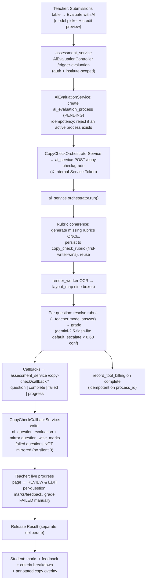

# AI Evaluation (Copy-Check) — Engineering & Product Reference

> Grades students' handwritten / uploaded answer sheets with an LLM, per question,
> against a rubric — producing marks, feedback, a criteria breakdown, and
> line-anchored annotations. Positioned as **"AI drafts, the teacher approves"**.
>
> This document reflects the **current** system (the "copy-check" pipeline) and
> the phased hardening built on top of it. The older
> [`ai_evaluation_agent.md`](./ai_evaluation_agent.md) describes the retired
> **Gen-1** in-Java pipeline and is kept only for historical reference.

---

## 1. TL;DR

- **Wedge:** LLM grading of *free-form handwritten answer sheets* with
  student-readable, line-anchored explanations — for high-volume Indian coaching
  institutes and schools. No mainstream competitor (Gradescope, EssayGrader,
  CoGrader) serves this.
- **Shape:** teacher triggers evaluation per attempt → AI drafts per-question
  marks/feedback/criteria/annotations → teacher **reviews & edits** → teacher
  **releases** → student sees marks, feedback, criteria, and an annotated copy.
- **Two gates before a student sees anything:** (1) the review/edit step,
  (2) the explicit **Release Result** action.
- **Metered:** every completed copy charges institute credits (per graded
  question, with real-token overage for premium models).

---

## 2. Services & ownership

| Concern | Service | Language |
|---|---|---|
| Trigger, lifecycle, marks, review, release, learner report | `assessment_service` | Java / Spring Boot |
| OCR orchestration, rubric resolution, LLM grading, billing | `ai_service` | Python / FastAPI |
| Handwriting OCR + layout map | `ai_service/render_worker` | Python |
| Teacher UI (trigger, review, dashboard) | `frontend-admin-dashboard` | React / TS |
| Student UI (results, feedback, annotated copy) | `frontend-learner-dashboard-app` | React / TS |

The **default** pipeline is gated by `assessment.ai-evaluation.use-ai-service`
(defaults **true**). The Gen-1 in-Java pipeline below that flag is unreachable
fallback code.

---

## 3. End-to-end flow

---

## 4. Data model

### `ai_evaluation_process` (one per triggered attempt)
`status`, `questions_completed/total`, `current_step`, `ai_service_job_id`,
`error_message`, `retry_count`, `started_at`, `completed_at`.
Non-terminal statuses: `PENDING, PROCESSING, DISPATCHED, STARTED, EXTRACTING,
EVALUATING, GRADING, IN_PROGRESS`. Terminal: `COMPLETED, FAILED, CANCELLED`.

### `ai_question_evaluation` (one per question per process — the AI *draft*)
`marks_awarded`, `max_marks`, `feedback`, `extracted_answer`,
`evaluation_result_json` (full verdict incl. `annotations` + `criteria_breakdown`),
`rubric_version`, `status` (`COMPLETED | FAILED | CANCELLED | PENDING`), and the
review-provenance columns added in **V22**: `is_edited`, `edited_by`, `edited_at`.

### `question_wise_marks` (the *authoritative* per-question mark the rest of the app reads)
AI paths write `marks`, `ai_evaluated_at`, `ai_evaluation_details_json`, and
(**V22**) `marks_source` ∈ `AI | AI_REVIEWED | MANUAL | AUTO`. A teacher edit sets
`evaluator_feedback` (the learner-visible remark) + `marks_source = AI_REVIEWED`.

### `copy_check_layout` (OCR layout map)
`evaluation_process_id`, `attempt_id`, `layout_json` (per-page line/region boxes).
Served to the admin and (via a learner endpoint) used to overlay annotations.

### `copy_check_rubric` / `copy_check_question_answer` (ai_service DB)
Per-assessment fixed rubric (`rubric_json` = `{question_id: rubric}`) + per-question
`model_answer` / `step_rubric_json`. AI-generated rubrics are now **persisted here**
so every student is graded against the same criteria.

### Migration
`assessment_service/.../db/migration/V22__ai_evaluation_review.sql`:
adds `ai_question_evaluation.{is_edited, edited_by, edited_at}` and
`question_wise_marks.marks_source`.
**Deploy watch-item:** `question_wise_marks` may be postgres-owned → the `ALTER`
can hit Flyway `42501`; apply the per-object `OWNER TO` recipe if so.

---

## 5. API surface (AI-evaluation)

All admin endpoints require JWT and are **institute-scoped** (see §6).

| Method | Path | Purpose |
|---|---|---|
| POST | `/assessment/evaluation-ai/trigger-evaluation` | Start evaluation for attempt(s); idempotent |
| GET | `/assessment/evaluation-ai/progress/{processId}` | Live progress + per-question drafts |
| GET | `/assessment/evaluation-ai/completed-questions/{processId}` | Partial results |
| POST | `/assessment/evaluation-ai/stop/{processId}` | Cancel a run |
| PUT | `/assessment/evaluation-ai/review/{processId}/question/{questionId}` | **Teacher override** of marks/feedback |
| GET | `/assessment/evaluation-ai/processes?assessmentId=` | **Evaluations dashboard** list |
| GET | `/assessment/learner/report/annotated-copy?assessmentId&attemptId` | **Learner** layout + annotations |
| POST | `/copy-check/callback/{progress,question,complete,failed}` | ai_service → Java (token-gated) |
| POST | `/copy-check/grade` (ai_service) | Java → ai_service (internal token) |

---

## 6. Security model

- The JWT filter builds `CustomUserDetails` scoped to the **`clientId` header**
  institute: a user only receives authorities for that institute.
- `EvaluationAccessValidator` enforces, per request: caller authenticated +
  **non-empty authorities** (proves membership in the clientId institute) +
  **resource institute == clientId** (`attempt.registration.instituteId`).
- The evaluation-ai and evaluation-criteria paths were **removed from
  `permitAll`** (they were open to the internet). The `/copy-check/callback/**`
  path stays open but is guarded by a constant-time `X-Internal-Service-Token`.
- Learner endpoints reuse `LearnerReportService.validateOwnershipAndAccess`.

**Residual:** template-table tenant scoping and a hard server-side release gate
are still open (see §10).

---

## 7. What was built (phased changelog)

### Phase 0 — Stop the bleeding
- **Auth + tenant scoping** on all evaluation-ai / evaluation-criteria endpoints
  (`EvaluationAccessValidator`, `ApplicationSecurityConfig`, controller principals).
- **Trigger idempotency** — `AiEvaluationService` rejects/returns an existing
  active process instead of spawning a duplicate concurrent (full-cost) run.
- One-liners: JSON-retry pins the selected model; cancel no longer recorded as
  FAILED; marks clamped to `[0, max]`; missing max-marks fails loudly;
  exception text stripped from student-visible feedback; CODING prompt no longer
  references sandbox results it can't see; extraction is verbatim.

### Phase 1 — The trust release (teacher)
- **Review & approve workspace** (`AiEvaluationReviewService.overrideQuestion` +
  `PUT …/review/{processId}/question/{questionId}`; admin progress page now has
  inline edit of marks/feedback per question). Recomputes attempt totals from
  the graded rows; stamps `is_edited` provenance.
- **Failed ≠ zero (end to end):** ai_service now sends the per-question `status`;
  `CopyCheckCallbackService.onQuestionDone` honors `FAILED` (not mirrored → no
  silent 0), `onComplete` recomputes totals from `COMPLETED` rows only. FAILED
  questions surface as **"Needs review"** with an inline "grade manually" editor
  and a red banner.
- **Marks provenance** (`marks_source`) + a guard so a late/retried AI callback
  never clobbers a human edit (`is_edited`).
- **Findable evaluations dashboard** (`GET …/processes`, real route replacing the
  stub, status chips, retry on FAILED) + **killed the localStorage dependency**
  (progress page reads `assessment_id` from the API, derives sections).
- **Stale-job sweeper** (`AiEvaluationStaleJobSweeper`, `@Scheduled` every 5 min):
  non-terminal processes older than 30 min → `FAILED` ("timed out, please
  retry"). Plus an `isReaped` callback guard so a straggler can't resurrect a
  swept/cancelled run and race a retry.
- **Rubric coherence:** generate each missing rubric **once**, persist to
  `copy_check_rubric` **first-writer-wins** (concurrency-safe), reuse for every
  student; feed the teacher's **model answer** into the grading prompt (it was
  stored but never read). Pre-flight note in the trigger dialog.
- **Credit metering:** `record_tool_billing` per completed copy (tool_key
  `copy_check_evaluation`, priced per graded question with real-token overage),
  **idempotent on `process_id`**; FE shows an estimated-credits preview + balance
  and disables Start on insufficient credits.

### Phase 2 — The student release
- **Students see the AI output:** `StudentReportAnswerReviewDto` gained
  `aiFeedback`, `aiCriteriaBreakdown`, `evaluationSource`; the learner Answer
  Review now shows per-question feedback + a criteria breakdown table + an
  **"AI-assisted / AI-assisted, teacher-reviewed"** disclosure badge, and is
  **un-hidden for MANUAL attempts** (the population AI grades).
- **Annotated-copy overlay:** `GET …/annotated-copy` returns the layout map +
  flattened annotations; the learner app renders ticks/crosses/circles/margin
  notes over the student's own submitted PDF (overlay ported from the admin
  progress page — same `@react-pdf-viewer` DOM + scale logic).

---

## 8. Credit metering details

- Tool key **`copy_check_evaluation`** (`ai_service/app/services/tool_cost_estimator.py`),
  `unit_field: questions`, `per_unit: 1` **(placeholder — ops should calibrate via
  the `ai_tool_pricing` table)**.
- Charge = `max(parametric = num_questions × rate, actual token cost)`. Flash-lite
  copies pay the flat rate; premium models add overage.
- Charged **once on successful complete** (cancelled/failed copies are not
  charged), attributed to `institute_id`, `idempotency_key = process_id` (honored
  down through `token_usage_service` / `credit_service`).
- Preview: FE `useToolCostPreview('copy_check_evaluation', {num_questions})`.

---

## 9. Models & determinism (ai_service copy-check)

- Grading default `google/gemini-2.5-flash-lite`; escalation to
  `google/gemini-2.5-flash` when self-reported confidence `< 0.60` (max 2/copy).
  Teacher can pick a premium model per run (Claude Opus / Gemini Pro / GPT).
- Grading temp `0.1`; JSON-retry `0.0` and **pins the same model**.
- Per-copy token budget: warn 80k / hard-fail 250k. No prompt caching yet
  (rubric block re-sent per question — a COGS item).

---

## 10. Remaining work / known gaps

- **Hard server-side release gate** — the release endpoint is generic/shared;
  today the review only *advises* (banner) that questions need review.
- **Unreleased marks are still fetchable via the learner API** (UI hides them) —
  a fairness + security fix.
- **AI-evaluating status chip in the Submissions table itself** (the dashboard
  has it; the table doesn't).
- **Template-table tenant scoping** (`evaluation_criteria_template` is global).
- **Golden-set calibration** (agreement vs human graders), **prompt caching**,
  **Hindi/regional-language** grading, **per-user billing attribution**.
- **Learner "Request re-check"** appeal path; **rich-text/LaTeX feedback
  renderer** (feedback shows as plain text); wire the already-built **push/in-app
  release notification** (email-only today).

---

## 11. Deploy & QA checklist

- [ ] **V22 migration** applies cleanly (watch for Flyway `42501` on
      `question_wise_marks` — postgres ownership).
- [ ] `INTERNAL_SERVICE_TOKEN` set on assessment_service (callbacks 401 silently
      without it).
- [ ] Confirm `clientId` header flows on all admin evaluation calls (auth depends
      on it).
- [ ] **Browser-QA the annotated overlay** — pixel positioning at various zooms
      is not unit-testable; verify annotations land on the right lines.
- [ ] Verify a full loop on staging (=prod): trigger → edit a mark → grade a
      FAILED question → release → student sees feedback + criteria + annotated copy.
- [ ] Confirm a credit charge lands (and only once) per completed copy.
- [ ] Calibrate the `copy_check_evaluation` per-question rate vs real COGS.

---

## 12. Key source files

**assessment_service** — `features/assessment/service/evaluation_ai/` (`AiEvaluationService`,
`CopyCheckCallbackService`, `CopyCheckOrchestratorService`, `AiEvaluationProgressService`,
`AiEvaluationReviewService`, `AiEvaluationStaleJobSweeper`, `EvaluationAccessValidator`),
`controller/evaluation_ai/AiEvaluationController`, `manager/AssessmentParticipantsManager`,
`learner_assessment/{service/LearnerReportService,controller/LearnerReportController}`,
`db/migration/V22__ai_evaluation_review.sql`.

**ai_service** — `services/copy_check/{orchestrator,grader,rubric,prompt_builder,callbacks}.py`,
`services/tool_cost_estimator.py`, `repositories/copy_check_rubric_repository.py`.

**frontend-admin-dashboard** — `routes/assessment/evaluation-ai/` (dashboard + progress page),
`…/-components/assessment-submissions-dropdown-individual/student-attempt-dropdown.tsx`,
`…/-services/ai-evaluation-services.ts`.

**frontend-learner-dashboard-app** —
`components/common/student-test-records/{comparison-dashboard,annotated-copy-dialog}.tsx`,
`…/student-test-records/annotation-overlay/*`.

---

## 13. Review findings (2026-07-17 adversarial review)

6-dimension multi-agent review, each finding independently refuted before being
kept. **9 confirmed, 2 refuted. No P0s** — the auth model, core marks integrity,
failed-≠-zero, and student data exposure all held up. Confirmed issues, grouped:

### A. Stale-job sweeper is too aggressive & uncoordinated (the dominant theme)
- **[P2] Reaps still-alive / queued long runs.** Staleness is measured from
  `started_at` (wall-clock from trigger), not progress — a legit run >30 min is
  flipped to FAILED while ai_service is still grading. `isReaped` then drops that
  run's real callbacks → **lost evaluation**.
- **[P1] Swept copy is still billed → double-charge on retry.** The sweeper only
  updates Java rows; it never cancels the ai_service job, which keeps grading and
  bills on complete. The teacher's retry is a *new* `process_id` → the institute
  is charged twice.
- **[P2] No optimistic lock on the sweep write.** `load` → unconditional
  `setStatus("FAILED")` → `saveAll` can clobber a process that COMPLETED between
  the SELECT and the save, back to FAILED.
- **Fix (combined):** sweep on a real heartbeat (`updated_at` via
  `@UpdateTimestamp`, which the per-question/progress callbacks already touch) with
  a higher threshold; use a **guarded bulk update** (`… WHERE id IN (:ids) AND
  status IN (:nonTerminal)`); on sweep, **forward a cancel to ai_service** and move
  (or status-guard) the credit charge into the Java complete-callback path (already
  `isReaped`-guarded) so a reaped job is never billed.

### B. Authorization / concurrency
- **[P2] `/processes` lets any learner enumerate the class roster.**
  `requireInstituteMembership` only checks *non-empty authorities* — a STUDENT role
  qualifies. A learner can list every participant + grading status for their
  assessment. **Fix:** require a staff/evaluator authority, not merely membership.
- **[P2] Trigger idempotency is a check-then-act race.** SELECT-then-INSERT with
  no lock / unique constraint → a genuine double-trigger spawns two concurrent
  runs (double charge + interleaved marks). **Fix:** partial unique index on
  `attempt_id WHERE status IN (active)`, catch the violation and return the
  existing process.
- **[P1] `merge_generated_rubrics` is not race-safe on the UPDATE path.** The
  `IntegrityError` retry only covers the INSERT (PK collision); the
  read-modify-write UPDATE branch has no lock/version, so concurrent jobs adding
  different questions to an existing row lost-update → two students can still get
  different rubrics. **Fix:** `SELECT … FOR UPDATE` (or a retry loop) on the UPDATE
  branch too.

### C. Consistency & ops
- **[P2] Override leaves a stale AI verdict in `ai_evaluation_details_json`.** The
  teacher edit updates `marks` + `evaluator_feedback` but not the stored AI JSON,
  which the learner report now reads for `ai_feedback` / `ai_criteria_breakdown`
  → the student sees criteria/feedback that contradict the reviewed mark.
  **Fix:** on override, refresh (or null) the JSON, or have the learner report
  suppress AI criteria/feedback when `marks_source = AI_REVIEWED` and prefer
  `evaluator_feedback`.
- **[P2] Up-front rubric generation pins a pooled DB connection** across all
  criteria LLM calls (regresses the "close the session before long calls"
  optimization). **Fix:** close after `load_snapshot`, reopen a short-lived
  session only for the merge/persist.

_Refuted (2): a claimed learner data-leak via the annotated-copy endpoint (ownership
is enforced) and a claimed NPE in the report builder (guarded)._
