# Vacademy LMS — Course Architecture, Structure, Enrollment and Tracking

> **Scope:** `admin_core_service` (Spring Boot + Flyway), the shared entities in `common_service`, and the two React apps (`frontend-admin-dashboard`, `frontend-learner-dashboard-app`).
> **Written:** 2026-09-03, from the code as it exists on that date. Every claim below was checked against source; file paths are repo-relative. Where older docs in the repo disagree with the code, the code wins and the drift is called out in §13.

---

## Table of contents

1. [Vocabulary and mental model](#1-vocabulary-and-mental-model)
2. [Data model overview](#2-data-model-overview)
3. [Course tables: package, session, level, package_session](#3-course-tables)
4. [The `DEFAULT` and `INVITED` sentinels](#4-the-default-and-invited-sentinels)
5. [Course creation, update, delete, approval](#5-course-creation-update-delete-approval)
6. [Course depth (2 / 3 / 4 / 5)](#6-course-depth)
7. [Content hierarchy: subject → module → chapter → slide](#7-content-hierarchy)
8. [Sharing content across batches and courses](#8-sharing-content-across-batches-and-courses)
9. [Slides: types, draft/publish, copy/move](#9-slides)
10. [Enrollment: invites, payment options, plans, SSIGM](#10-enrollment)
11. [Admin frontend: how a course is managed](#11-admin-frontend)
12. [Learner frontend: how a course is consumed](#12-learner-frontend)
13. [Student activity tracking and progress](#13-student-activity-tracking)
14. [Cross-cutting features on the course tree](#14-cross-cutting-features)
15. [Known gaps, traps, and stale docs](#15-known-gaps-traps-and-stale-docs)
16. [File index](#16-file-index)

---

## 1. Vocabulary and mental model

The product UI says "Course", "Batch", "Session", "Level". The database says `package`, `package_session`, `session`, `level`. The mapping, and what each thing *is*:

| UI term (default label) | Table | What it is |
|---|---|---|
| **Course** | `package` | The marketed product: name, description, banners, tags, **depth**, catalogue flag. Nothing is enrolled into a course directly. |
| **Session** | `session` | A time window / cohort term ("Jan 2026 Batch", "2025-26"). Shared across courses inside an institute and deduplicated by name. |
| **Level** | `level` | A rung inside a course ("Class 10", "Beginner"). Also deduplicated by name per institute. |
| **Batch** | `package_session` | The materialised triple **(package, session, level)**. **This is the unit everything else hangs off**: learners enroll into it, content is mapped to it, faculty are assigned to it, invites point to it, inventory (seats) lives on it. |
| **Subgroup** | `package_session` with `parent_id` | A child batch under a parent batch, same (package, session, level), distinct `name`. |
| Subject / Module / Chapter / Slide | `subject`, `modules`, `chapter`, `slide` | The content tree. Linked to batches by mapping tables, so the same content rows can be visible in many batches. |
| **Invite link** | `enroll_invite` | A code-addressed public enrollment page. Fans out to one or many batches, each paired with a payment option. |
| **Enrollment** | `student_session_institute_group_mapping` (SSIGM) | The row that says "user X is in batch Y with status S until date D". |
| Progress | `learner_operation` | One row per (user, level of the tree, metric), e.g. `PERCENTAGE_CHAPTER_COMPLETED`. |
| Activity | `activity_log` + `*_tracked` | Raw per-session breadcrumbs (which pages, which video seconds, which answers). |

Institutes can rename every one of these labels through `NAMING_SETTING` (`ContentTerms`: Course, Level, Session, Subject, Module, Chapter, Slide, LiveSession, Batch, Package, PopularTag — see `frontend-admin-dashboard/src/routes/settings/-components/NamingSettings.tsx`). The backend never depends on the label.

Two sentinel ids matter constantly: **`DEFAULT`** (a placeholder session / level / subject used when a course does not expose that level) and **`INVITED`** (a placeholder batch per course used as a staging area for paid or approval-gated enrollments). See §4.

---

## 2. Data model overview

```mermaid
erDiagram
    institutes ||--o{ package_institute : "owns"
    package ||--o{ package_institute : ""
    package ||--o{ package_session : "has batches"
    session ||--o{ package_session : ""
    level ||--o{ package_session : ""
    groups ||--o{ package_session : "optional"
    package_session ||--o{ package_session : "parent_id (subgroups)"

    package_session ||--o{ subject_session : ""
    subject ||--o{ subject_session : ""
    subject ||--o{ subject_module_mapping : ""
    modules ||--o{ subject_module_mapping : ""
    modules ||--o{ module_chapter_mapping : ""
    chapter ||--o{ module_chapter_mapping : ""
    chapter ||--o{ chapter_package_session_mapping : "per-batch visibility + order"
    package_session ||--o{ chapter_package_session_mapping : ""
    chapter ||--o{ chapter_to_slides : ""
    slide ||--o{ chapter_to_slides : ""
    slide }o--|| document_slide : "source_id when source_type=DOCUMENT"
    slide }o--|| video : "source_id when source_type=VIDEO"

    package_session ||--o{ faculty_subject_package_session_mapping : ""
    subject ||--o{ faculty_subject_package_session_mapping : ""

    enroll_invite ||--o{ package_session_learner_invitation_to_payment_option : ""
    package_session ||--o{ package_session_learner_invitation_to_payment_option : ""
    payment_option ||--o{ package_session_learner_invitation_to_payment_option : ""
    payment_option ||--o{ payment_plan : ""
    enroll_invite ||--o{ user_plan : ""
    payment_plan ||--o{ user_plan : ""
    user_plan ||--o{ student_session_institute_group_mapping : ""
    package_session ||--o{ student_session_institute_group_mapping : "enrollment"
    package_session ||--o{ student_session_institute_group_mapping : "destination_package_session_id"

    slide ||--o{ activity_log : ""
    activity_log ||--o{ document_tracked : ""
    activity_log ||--o{ video_tracked : ""
    activity_log ||--o| concentration_score : ""
```



The whole schema is in `admin_core_service/src/main/resources/db/migration/V1__Initial_schema.sql` (a baseline dump) plus ~450 later migrations. JPA entities for `package`, `package_session`, `session`, `level`, `subject`, `modules`, `groups`, `package_institute` live in **`common_service`** (`common_service/src/main/java/vacademy/io/common/institute/entity/**`), not in admin_core_service; the repositories, services and controllers are in admin_core_service.

Two universal conventions:

- **Soft delete everywhere.** `status = 'DELETED'` on the row; nothing is physically deleted except via `ON DELETE CASCADE` on a few FKs (`chapter_to_slides`, `document_tracked`, `learner_invitation_*`).
- **Name normalisation triggers.** `package_name` is trimmed + title-cased; `session_name`, `level_name`, `subject_name`, `chapter_name` are trimmed + lower-cased by DB triggers on insert/update. The frontends title-case for display.

---

## 3. Course tables

### 3.1 `package` (entity `PackageEntity`)

| Column | Meaning |
|---|---|
| `id` | UUID |
| `package_name` | course title (title-cased by trigger) |
| `status` | `PackageStatusEnum`: `ACTIVE`, `DELETED`, `DRAFT`, `IN_REVIEW` |
| `package_type` | `CourseTypeEnum`: `COURSE` (default), `MEMBERSHIP`, `PRODUCT`, `SERVICE` (V53) |
| `course_depth` | int 2..5, see §6 |
| `thumbnail_file_id`, `course_preview_image_media_id`, `course_banner_media_id`, `course_media_id` | media ids (course_media_id is a JSON string `{type,id}` from the admin wizard) |
| `why_learn`, `who_should_learn`, `about_the_course`, `course_html_description` | HTML marketing blocks |
| `comma_separated_tags` | lower-cased tags, GIN indexed |
| `is_course_published_to_catalaouge` | catalogue visibility (the misspelling is in the schema and the API contract) |
| `original_course_id`, `created_by_user_id`, `version_number` | teacher approval flow (§5.4) |
| `course_audit_logs` | JSON array of approval events (V15) |
| `drip_condition_json` | course-level drip rules (V54) |
| `course_setting` | per-course settings envelope `{setting:{KEY:{key,name,data}}}` (V67), see §14.4 |
| `updated_by_user_id` | V256 |

### 3.2 `session`

`id`, `session_name` (lower-cased), `status` (`SessionStatusEnum`: `ACTIVE`, `DELETED`, `INACTIVE`, `DRAFT`), `start_date`, audit columns (V256).
A session row is **institute-wide**: `SessionService.addNewSession` looks up `findLatestSessionByNameAndInstitute` and reuses an ACTIVE session with the same name instead of creating a duplicate.

### 3.3 `level`

`id`, `level_name` (lower-cased), `duration_in_days`, `status` (`LevelStatusEnum`: `ACTIVE`, `DELETED`, `DRAFT`), `thumbnail_file_id`, audit columns.
Also deduplicated by name per institute (`LevelService.getLevel` → `findLatestLevelByNameAndInstitute`).

### 3.4 `package_session` (entity `PackageSession`) — the batch

| Column | Meaning |
|---|---|
| `package_id`, `session_id`, `level_id` | the triple; all FKs |
| `group_id` | optional FK to `groups` |
| `status` | `PackageSessionStatusEnum`: `ACTIVE`, `DELETED`, `HIDDEN`, `DRAFT`, `INVITED` |
| `start_time` | date |
| `name` | optional human name, used for subgroups (V123) |
| `is_parent`, `parent_id` | subgroup tree (V120). `PUT /admin-core-service/package-session/v1/parent-child-mapping` sets `parent.is_parent=true` and `child.parent_id=parent` |
| `max_seats`, `available_slots`, `version` | inventory + optimistic lock (V81/V82/V90). `max_seats NULL` = unlimited; decrement never blocks enrollment, it logs |
| `enrollment_policy_settings` | JSON, see §10.9 (V23) |
| `is_org_associated` | sub-org provisioning flag (V35) |
| `content_copied_by`, `content_copied_from_package_session_id` | `VALUE` / `REFERENCE` / NULL lineage audit written by the copy-content flow (V237, §8.4) |
| `created_by_user_id`, `updated_by_user_id` | V256 |

Index `idx_package_session_package_id_status (package_id, status) WHERE status <> 'DELETED'`.

**Status lifecycle:** created `ACTIVE`; `HIDDEN` / visible toggled by `PUT /admin-core-service/sessions/v1/edit` (`commaSeparatedHiddenPackageSessionIds` / `...VisiblePackageSessionIds`); `DELETED` from course / session / level / batch delete and subgroup sync; `INVITED` only for the sentinel batch (§4). Most admin reads include `ACTIVE, HIDDEN`; the institute-init endpoint returns only `ACTIVE`.

### 3.5 Institute and group linkage

- **`package_institute`** (`id, package_id, institute_id NOT NULL, group_id`) — the only thing that scopes a course to an institute. Every institute-scoped read joins through it, e.g. `PackageSessionRepository.findPackageSessionsByInstituteId`:
  ```sql
  SELECT ps.* FROM package_session ps
  JOIN package_institute pi ON ps.package_id = pi.package_id
  WHERE pi.institute_id = :instituteId AND ps.status IN (:statuses)
  ```
- **`groups`** (`id, group_name, parent_group_id, is_root, group_value`) — a self-referential tree. Used three ways: `package_institute.group_id`, `package_group_mapping (package_id, group_id)` many-to-many (surfaced as `InstituteInfoDTO.packageGroups`), and `package_session.group_id` per batch (from the wizard's `group` block; usually null).

### 3.6 Faculty

`faculty_subject_package_session_mapping (id, user_id, package_session_id, subject_id, name, status)` — a teacher is assigned to a **subject inside a batch**. Written by `FacultyService.addFacultyToBatch` during course creation from the wizard's `add_faculty_to_course[]`; read by "my courses" for teachers (`README_MY_COURSES_API.md` in `features/course/`).

### 3.7 Read side

`InstituteInitManager.buildInstituteInfoDTO` (`features/institute/manager/InstituteInitManager.java`) is what both frontends bootstrap from: `tags`, `sessions`, `levels`, `packageGroups`, and **`batchesForSessions`** = every ACTIVE `package_session` of the institute as `PackageSessionDTO { id, level, session, startTime, status, packageDTO, group, readTimeInMinutes, isOrgAssociated, isParent, parentId, name, percentageCompleted }`. Endpoints on `/admin-core-service/institute/v1`: `details/{id}`, `details-non-batches/{id}`, `paginated-batches/{id}`, `batches-by-ids/{id}`, `batches-summary/{id}`.

---

## 4. The `DEFAULT` and `INVITED` sentinels

### `DEFAULT`

Rows with literal primary key `'DEFAULT'` exist in `session`, `level`, and `subject`. They are **not seeded by any Flyway migration**; they pre-exist in production. `BulkCourseService.resolveLevel/resolveSession` lazily create the level/session rows if missing; `SubjectService.addDefaultSubject` does `subjectRepository.findById("DEFAULT").get()` and will throw if the subject row is absent.

How they are used:

- A course with no sessions and no levels gets one batch `(package, session='DEFAULT', level='DEFAULT')` (`CourseService.createPackageSessionForDefaultLevelAndSession`). A course with sessions but no levels gets `(package, S, 'DEFAULT')` per session, and vice versa. The admin wizard emits `id: 'DEFAULT', session_name: 'DEFAULT', level_name: 'DEFAULT'` in exactly these cases (`frontend-admin-dashboard/src/components/common/study-library/-utils/helper.ts`, `convertToApiCourseFormat`).
- `SessionService.isDefaultSession` matches on **id only**, so a real session a user names "DEFAULT" is unaffected. This is the fix for a historical duplicate-batch bug: create and a later edit must resolve to the same session row.
- Depth < 5 courses carry exactly one subject; the wizard seeds one **named** `DEFAULT` (a fresh row, not the `'DEFAULT'`-id row) per new batch, plus a `DEFAULT` module for depth ≤ 3 and a `DEFAULT` chapter for depth 2 (§6.2).
- Display code strips the word: `BulkCourseService.getNameForEnrollInvite`, `DefaultEnrollInviteService`, `EnrollmentTemplateService` skip level/session names whose id is `DEFAULT`; both frontends hide subjects/modules/chapters whose name is `default` (case-insensitive).

### `INVITED`

`PackageSessionService.addInvitedPackageSessionForPackage` creates, for **every new course**, one extra batch with `session_id='INVITED'`, `level_id='INVITED'`, `status='INVITED'`. It is never listed as a real batch. It is the **staging area for enrollments that are not yet ACTIVE**: paid enrollments before the webhook, approval-gated enrollments, abandoned carts, and expired learners who may renew. Those SSIGM rows sit on the INVITED batch with `destination_package_session_id` pointing to the real batch, and are "shifted" on payment or approval (§10.6).

---

## 5. Course creation, update, delete, approval

### 5.1 Endpoints

`features/course/controller/CourseController.java`, base `/admin-core-service/course/v1`:

| Endpoint | Service |
|---|---|
| `POST /add-course/{instituteId}` | `CourseService.addCourse` — the wizard's create |
| `POST /update-course-details/{instituteId}` | `CourseService.addOrUpdateCourse` → `PackageService.addOrUpdatePackage` — the wizard's edit |
| `PUT /update-course/{courseId}` | `CourseService.updateCourse` — flat metadata only |
| `DELETE /delete-courses` | `CourseService.deleteCourses(List<String>)` |
| `POST /bulk-add-courses/{instituteId}` | `BulkCourseService` (documented in `features/course/README_BULK_COURSE_API.md`) |
| `GET /{courseId}/batches` | batches of a course |
| `POST /copy-content`, `GET /copy-lineage/{psId}` | `CourseContentCopyService` (§8.4) |

Related: `POST /admin-core-service/course/teacher/v1/add-course/{instituteId}` (teacher create → `DRAFT`), `/admin-core-service/sessions/v1/{add,edit,delete-sessions,session-details,copy-study-material}`, `/admin-core-service/level/v1/{add-level,update-level/{id},delete-level,get-levels}`, `/admin-core-service/batch/v1/{batches-by-session,delete-batches,sub-org-associated,search}`.

### 5.2 `AddCourseDTO` (what the wizard sends)

```
{
  id, new_course, course_name, thumbnail_file_id, course_html_description,
  contain_levels,                     // = hasLevels || hasSessions
  sessions: [{ id, session_name, status, start_date, new_session,
               levels: [{ id, new_level, level_name, duration_in_days, thumbnail_file_id, package_id,
                          package_session_status?, package_session_id?, new_package_session?,
                          is_parent?, parent_id?, subgroups?: [{id?, name}],
                          add_faculty_to_course: [{ user:{...}, status? }],
                          group: { id, group_name, group_value, new_group } }] }],
  contains_subgroup?, subgroups?: [{name}],
  is_course_published_to_catalaouge, course_preview_image_media_id, course_banner_media_id, course_media_id,
  why_learn_html, who_should_learn_html, about_the_course_html, tags[], course_depth,
  status, created_by_user_id, original_course_id, version_number, course_setting?
}
```

### 5.3 What `addCourse` writes (N sessions × M levels)

`features/course/service/CourseService.java` `addCourse`:

1. Resolve the package. `getCourse` first tries to **merge into an existing course of the same name** in the institute (`findTopByPackageNameAndSessionStatusAndInstitute`, package status ACTIVE/DRAFT) unless `force_new_course` is set, in which case the name is uniquified as "Name (2)…(50)". A new package gets `status = dto.status ?: ACTIVE`, `version_number = 1`.
2. `addInvitedPackageSessionForPackage` → the **INVITED** sentinel batch.
3. `package_institute` row (find-or-create).
4. If `contain_levels`: for each session → `SessionService.addNewSession` (reuse-or-create `session`), then per level → `LevelService.createOrAddLevel` (reuse-or-create `level`), optional `groups` row, **one `package_session` (ACTIVE)**. Then for each batch: faculty mappings, **a default enroll invite** (`DefaultEnrollInviteService.createDefaultEnrollInvite`, §10.3), and an async `learner_invitation` form.
   Else: one batch on `DEFAULT`/`DEFAULT`.
5. `handleSubgroups` — clone the first ACTIVE batch per subgroup name and `mapParentAndChildren`.
6. Fire `WorkflowTriggerEvent.COURSE_CREATED` (failures swallowed).

Net result: 1 `package`, 1 `package_institute`, 1 INVITED batch, ≤N `session`, ≤N×M `level`, **N×M `package_session`**, plus per-batch invites, faculty rows, learner-invitation forms.

The **idempotency guard** for the triple is in `LevelService.addOrUpdateLevel`: `findByPackageIdAndSessionIdAndLevelIdAndStatusIn(pkg, session, level, [ACTIVE, HIDDEN, DRAFT])` — if a batch already exists it is reused and its status preserved.

`updateCourse` on `PackageService` is a **blind overwrite** (writes nulls for `status`, `created_by_user_id`, `original_course_id`, `version_number` if the DTO omits them); `CourseService.updateCourseDetails` is null-safe. The wizard uses the `update-course-details` path.

### 5.4 Teacher approval flow (`DRAFT` → `IN_REVIEW` → `ACTIVE`)

`features/course/service/CourseApprovalService.java`, controllers `/admin-core-service/teacher/course-approval/v1` and `/admin-core-service/admin/course-approval/v1`.

- Teachers create with `status = DRAFT` (`TeacherCourseService.addCourse`; the admin wizard sends `status: isAdmin ? 'ACTIVE' : 'DRAFT'`).
- `createEditableCopy(originalCourseId)` deep-copies an ACTIVE course into a temp package (`status=DRAFT`, `original_course_id=original`, `version_number=1`). The copy reuses the same `level`/`session`/`groups` rows but creates new `package_session`, subject/module/chapter/slide rows (with `parent_id` back-references), faculty mappings, and `package_institute` rows.
- `submitForReview` DRAFT→IN_REVIEW (creator only); `withdrawFromReview`; `approveCourse` merges the temp into the original (`mergeChangesIntoOriginal` + `deleteTempCourse`) or publishes a new course (`ACTIVE`, clears `original_course_id`); `rejectCourse` → DRAFT.
- Every transition appends `{timestamp, actorUserId, action, message, comment}` to `package.course_audit_logs` (actions: `ADD, SUBMIT, WITHDRAW, APPROVE, REJECT, UPDATE, PUBLISH, DELETE_TEMP`).
- Subjects/modules/chapters/slides created inside a temp course use status `PENDING_APPROVAL`.

### 5.5 Delete

`CourseService.deleteCourses` soft-deletes: `package.status=DELETED`, every `package_session.status=DELETED`, learner invitations for those batches, bridge rows to invites `DELETED`, and any `enroll_invite` left with zero active batches → `DELETED`. Session and level deletes cascade the same way to their batches.

### 5.6 Bulk create

`POST /admin-core-service/course/v1/bulk-add-courses/{instituteId}` takes `apply_to_all{batches[], payment_config, inventory_config, course_type, course_depth (default 5), tags, publish_to_catalogue}` plus `courses[]` overrides and `dry_run`. Resolution order: course-level → global → system defaults. `level_id`/`session_id` null means `DEFAULT`.

---

## 6. Course depth

`package.course_depth` is an integer 2..5 that says **how many levels of the content tree the UI exposes**. The hidden levels still exist in the database as single placeholder rows so that every slide always has a chapter, module and subject above it.

### 6.1 Authoritative mapping

| depth | Visible hierarchy | Hidden (placeholder) levels |
|---|---|---|
| **5** | Course → Subject → Module → Chapter → Slide | none |
| **4** | Course → Module → Chapter → Slide | one `DEFAULT` subject |
| **3** | Course → Chapter → Slide | one `DEFAULT` subject + one `DEFAULT` module |
| **2** | Course → Slide | one `DEFAULT` subject + module + chapter |

Sources that agree: backend `CourseContentCopyService.isSingleSubjectStructure` ("depth < 5 must carry exactly one subject") and `ChapterService.hidesChapterLevel` ("depth < 3 means each module carries exactly one chapter"); admin copy/move picker (`copy-move-destination-picker.tsx`: `subjectHiddenByDepth = depth < 5`, `moduleHiddenByDepth = depth < 4`, `chapterHiddenByDepth = depth < 3`); learner `course-structure-details.tsx` ("5 shows subject→module→chapter→slide, 4 drops the subject, 3 also drops the module, 2 is slides only").

**Trap:** the admin wizard's structure card for depth 3 is titled "Course → Module → Slides". That label is cosmetic; the wizard actually seeds a DEFAULT subject **and** a DEFAULT module for depth 3, leaving chapters as the visible level. The cards are in `add-course-step2-structure-types.tsx`.

### 6.2 Who creates the placeholders

The **admin wizard**, not the backend. After `ADD_COURSE` succeeds, `add-course-form.tsx` `handleStep2Submit` waits ~1.5 s, fetches the new batch ids, and calls `useAddSubject` / `useAddModule` / `useAddChapter` with names `DEFAULT` according to depth (depth 2: subject+module+chapter; 3: subject+module; 4: subject; 5: nothing). On edit it does the same **only for newly created batches** (`findUnmatchedBatchIds`). The AI course builder and the bulk content uploader build the same payloads.

The backend then **enforces invariants**:
- `CourseContentCopyService.cloneIntoSingleSubject` clones all source modules into the target's single subject for depth < 5 instead of minting a second subject (a second subject shows up in the UI as duplicate "Add Module" buttons and breaks drag-and-drop).
- `ChapterService.reuseSingleChapterForHiddenLevel` returns the module's existing chapter instead of creating another when depth < 3.
- `CourseContentCopyService.cleanupEmptyDefaultStructure` removes the wizard-seeded empty DEFAULT chain (only if it has zero slides, and only the mapping rows for that batch) before importing content.
- Copy-content refuses source/target batches of different depth.

### 6.3 Institute defaults

`COURSE_SETTING.courseStructure { defaultDepth: 3, fixCourseDepth: false, enableSessions: true, enableLevels: true }` (institute settings, edited at Settings → Course). `fixCourseDepth` hides the structure picker and forces the depth; `enableSessions`/`enableLevels` hide the "Contains sessions/levels?" radios.

### 6.4 How the frontends hide levels

Depth alone is not enough; both apps hide a level **only when it collapses to a single placeholder** named `default` (case-insensitive). Learner: `showsSubjectLevel = !(depth < 5 && subjects.length === 1 && isPlaceholderName(subjects[0]))`, likewise for module (< 4) and chapter (< 3); an effect auto-drills to the first real level and, for depth 2, fetches slides directly. Admin: `course-structure-details.tsx` branches on `courseStructure === 5/4/3/2`; depth 2 loads `GET_SLIDES?packageSessionId=` and resolves the hidden subject/module/chapter ids before routing to the slide editor.

---

## 7. Content hierarchy

### 7.1 Tables

| Table | Key columns | Status enum | Notes |
|---|---|---|---|
| `subject` | `subject_name` (lower-cased), `subject_code`, `credit`, `thumbnail_id`, `parent_id`, `created_by_user_id` | `SubjectStatusEnum`: `ACTIVE`, `DELETED`, `PENDING_APPROVAL` | **no order column** — order is per batch on the mapping |
| `modules` | `module_name`, `description`, `thumbnail_id`, `parent_id`, `created_by_user_id` | `ModuleStatusEnum`: same three | no timestamps |
| `chapter` | `chapter_name` (lower-cased), `description`, `file_id`, `parent_id`, `created_by_user_id`, `drip_condition_json` | `ChapterStatus`: same three | |
| `slide` | `source_type`, `source_id`, `title`, `description`, `image_file_id`, `last_sync_date`, `parent_id`, `created_by_user_id`, `drip_condition_json`, `updated_by_user_id` | `SlideStatus`: `PUBLISHED`, `DRAFT`, `DELETED`, `UNSYNC`, `PENDING_APPROVAL` | polymorphic via `source_type` + `source_id` (§9) |

`parent_id` on all four is **lineage** (the row this one was cloned from), not a tree parent.

### 7.2 Mapping tables

| Table | Columns | Order | Status | Scope |
|---|---|---|---|---|
| `subject_session` (entity `SubjectPackageSession`) | `subject_id`, **`session_id` → `package_session.id`** (misnamed), `subject_order` | per batch | none | batch ↔ subject |
| `subject_module_mapping` | `subject_id`, `module_id`, `module_order` | per subject (global) | none | subject ↔ module |
| `module_chapter_mapping` | `module_id`, `chapter_id` | none | none | module ↔ chapter (no batch dimension) |
| `chapter_package_session_mapping` (CPSM) | `chapter_id`, `package_session_id`, `chapter_order`, `status` | per batch | `ACTIVE`/`DELETED` | batch ↔ chapter visibility |
| `chapter_to_slides` | `chapter_id`, `slide_id`, `slide_order`, `status` | per chapter (global) | mirrors slide status | chapter ↔ slide |

None of `subject_session`, `subject_module_mapping`, `module_chapter_mapping` has a unique constraint, so duplicate mapping rows are possible; `ModuleChapterMappingRepository` defensively `SELECT DISTINCT`s.

### 7.3 Linkage graph and why the chapter links to the batch twice

```
package_session ─(subject_session: subject_order)─▶ subject
subject ─(subject_module_mapping: module_order)─▶ modules
modules ─(module_chapter_mapping)─▶ chapter
chapter ─(chapter_package_session_mapping: chapter_order, status)─▶ package_session   ◀── per-batch gate
chapter ─(chapter_to_slides: slide_order, status)─▶ slide
slide.source_type/source_id ─▶ document_slide | video | question_slide | assignment_slide | quiz_slide
                               | video_slide_question | html_video_slide | scorm_slide | audio_slide | assessment_slide
```

`module_chapter_mapping` has **no batch column**: a chapter attached to a module is attached for every batch that sees that module. **CPSM is what makes a chapter visible in one batch and not another**, and it carries the per-batch `chapter_order` and per-batch soft delete. Consequences:

- Every read joins both, e.g. `ChapterRepository.getChaptersAndSlidesByModuleIdAndPackageSessionId`:
  ```sql
  FROM chapter c
  JOIN module_chapter_mapping mc ON mc.chapter_id = c.id
  JOIN chapter_package_session_mapping cps ON cps.chapter_id = c.id
  WHERE mc.module_id = :moduleId AND cps.package_session_id = :packageSessionId
    AND c.status IN (:chapterStatus) AND cps.status IN (:cpsStatus)
  ```
- `ChapterService.deleteChapter` only flips CPSM rows to `DELETED`; the `chapter` row is untouched, so deleting a chapter from batch A leaves it live in batch B.
- `chapter_to_slides` has no batch column: **slides always ride along with their chapter**. Share a chapter and you share its slides.

### 7.4 Ordering

| Level | Endpoint | Order column | Scope |
|---|---|---|---|
| Subject | `PUT /admin-core-service/subject/v1/update-subject-order` `[{subject_id, package_session_id, subject_order}]` | `subject_session.subject_order` | per batch |
| Module | `POST /admin-core-service/subject/v1/update-module-order` `[{subject_id, module_id, module_order}]` | `subject_module_mapping.module_order` | **per subject — reorders in every batch sharing the subject** |
| Chapter | `PUT /admin-core-service/chapter/v1/update-chapter-order` `[{chapter_id, package_session_id, chapter_order}]` | CPSM `chapter_order` | per batch |
| Slide | `PUT /admin-core-service/slide/v1/update-slide-order?chapterId=` `[{slide_id, slide_order}]` | `chapter_to_slides.slide_order` | **per chapter — reorders in every batch sharing the chapter** |

New rows append (`max + 1`; slides 0-based). Slide add supports `position=TOP`. Rendered slide order is `slide_order NULLS FIRST, then created_at DESC` (`SlideService.renderOrderComparator`).

### 7.5 Admin read APIs (`/admin-core-service/v1/study-library`)

| Endpoint | Returns |
|---|---|
| `GET /init?instituteId` | `List<CourseDTOWithDetails> { course, sessions:[{session_dto, level_with_details:[{id,name,duration_in_days,subjects[],instructors[],read_time_in_minutes}]}], package_sessions[] }` — a 9-step batched assembly |
| `GET /course-init?courseId&instituteId` | same shape for one course |
| `GET /modules-with-chapters?subjectId&packageSessionId` | `[{ module, chapters:[{ chapter, slides_count, chapter_in_package_sessions[] }] }]` — `chapter_in_package_sessions` lists **every batch the chapter is mapped to** (the sharing signal) |
| `GET /chapters-with-slides?moduleId&packageSessionId` | one ~500-line native query with CTEs per slide type producing `json_agg` |
| `GET /admin-core-service/slide/v1/slides?chapterId` (or `?packageSessionId` for depth 2) | slide list |

Learner mirror: `/admin-core-service/v1/learner-study-library/{init-details, modules-with-chapters, get-slides/{chapterId}, slides, slides-by-package-session, chapters-with-slides, modules-chapters-slides}` (+ `/open/v1/learner-study-library/...` unauthenticated twins). Learner reads restrict slides to `PUBLISHED, UNSYNC`, cache the user-independent structure (`LearnerCourseStructureCacheService`) and overlay per-user progress on top.

### 7.6 Content CRUD endpoints

- Subject: `POST /admin-core-service/subject/v1/add-subject?commaSeparatedPackageSessionIds=`, update, delete, order.
- Module: `POST /admin-core-service/subject/v1/add-module?subjectId&packageSessionId`, update, delete, order.
- Chapter: `POST /admin-core-service/chapter/v1/add-chapter?subjectId&moduleId&commaSeparatedPackageSessionIds=`, update, delete, order, `copy`, `move`.
- Slides: §9.

Every content change on a published slide/chapter/module/subject calls `LearnerTrackingAsyncService.updateLearnerOperationsForBatch` to recompute progress for all learners of the batch (§13.4), and `bumpOfflineManifest` so offline learners are prompted to update.

---

## 8. Sharing content across batches and courses

This is the answer to "how can institutes have multiple packages or courses with common chapters". There are **four paths**, with different sharing semantics. Nothing is shared or copied automatically when a batch is created; an admin chooses.

### 8.1 Authoring against several batches at once (`commaSeparatedPackageSessionIds`)

- `SubjectService.addSubject` creates **one** `subject` row and one `subject_session` row per batch → the subject is genuinely shared. Per-batch failures ("Subject already exists") are logged and skipped, so a partial mapping still returns 200.
- `ChapterService.addChapter` behaves differently: `SubjectService.processSubjectsAndModules` resolves, per target batch, a subject **by name** (creating a fresh subject + module per batch when missing) and then creates **one** `chapter` row, one `module_chapter_mapping` per resolved module, and one CPSM row per batch. So subjects and modules are duplicated per batch by name, but **the chapter and its slides are shared** — editing that chapter's slides in batch A changes batch B.

### 8.2 Chapter copy / move (`POST /admin-core-service/chapter/v1/copy`, `/move`)

Pure **reference**: `copyChapter` inserts only a `module_chapter_mapping` + a CPSM row for the **same chapter id**. `moveChapter` = delete old CPSM + copy. No new chapter or slide rows. The admin "Copy to / Move to" dialogs on chapters call these.

### 8.3 Legacy full clone (`POST /admin-core-service/sessions/v1/copy-study-material?fromPackageSessionId&toPackageSessionId`)

`SubjectService.copySubjectsFromExistingPackageSessionMapping` → `ModuleManager.copyModulesOfSubject` → `ChapterManager.copyChaptersOfModule` → `SlideService.copySlidesOfChapter`. New rows at every level including deep copies of the type-specific slide source rows. Does **not** set `parent_id` lineage and hard-codes `subjectOrder = 0` / `moduleOrder = 0`. Used by the "Create batch" dialog's "duplicate study materials" checkbox (`manage-institute/batches/create-batch-dialog.tsx`).

### 8.4 Modern copy-content with an explicit mode (`POST /admin-core-service/course/v1/copy-content`)

Request `{ sourcePackageSessionId, targetPackageSessionIds[], mode }` (`features/course/service/CourseContentCopyService.java`):

- **`VALUE`** (default) — deep clone. Fresh `subject`/`modules`/`chapter`/`slide` rows with `parent_id` = source id and `created_by_user_id` = caller, deep-cloned slide source rows via `SlideService.copySlideSourceForSlide`, slide order re-stamped from the rendered order, then `DripConditionRemapper` rewrites `prerequisite` rule ids in `drip_condition_json` to the new ids (out-of-scope references are dropped and surfaced as warnings). **Edits in the new course do not affect the source.**
- **`REFERENCE`** — share rows. Only `subject_session` and CPSM rows are inserted; modules ride along through `subject_module_mapping` (keyed only on subject) and slides through `chapter_to_slides` (keyed only on chapter). **Edits in either course are visible in both.** Idempotent. Intended for "same content behind a different course title/description/banner".

Guards: every target must have the same `course_depth` as the source; the wizard-seeded empty DEFAULT chain on the target is removed first; for depth < 5 targets, source modules are cloned into the target's single subject. Audit: target `package_session.content_copied_by = 'VALUE'|'REFERENCE'`, `content_copied_from_package_session_id = source` (last write wins). `GET /copy-lineage/{psId}` returns upstream and downstream batches; the admin shows this as `CopyContentLineageBadge`.

UI: "Import Content" on the course details page (`CopyContentDialog.tsx`) lists all non-deleted batches of the institute, disables different-depth sources, and disables `REFERENCE` when the target already has slides.

### 8.5 Approval-flow clone

`CourseApprovalService` keeps its own deep-clone tree for teacher editable copies and merges back on approval (§5.4).

### 8.6 What "shared" means operationally

| Action in batch A | Effect on batch B sharing the same row |
|---|---|
| Edit a shared slide's content / publish it | visible in B immediately (same `slide` + `document_slide` row) |
| Reorder slides in a shared chapter | B reorders too (`chapter_to_slides` is global) |
| Reorder modules in a shared subject | B reorders too (`subject_module_mapping` is global) |
| Reorder chapters / subjects | B unaffected (per-batch order on CPSM / `subject_session`) |
| Delete a chapter from A | B unaffected (only A's CPSM row → DELETED) |
| Delete a subject or module from A | **B loses it too** — `SubjectService.deleteSubject` / `ModuleService.deleteModule` flip the entity's status globally even though the endpoint takes a `packageSessionId` |
| Drip conditions on the chapter/slide | shared (stored on the row); only `package.drip_condition_json` is per course |

`ChapterService.updateChapterPackageSessionMapping` is aware of cross-course sharing and scopes its prune of missing CPSM rows to the calling course, so a REFERENCE-shared chapter's mappings in the other course are not auto-deleted.

---

## 9. Slides

### 9.1 Types

`slide.source_type` (`SlideTypeEnum`): `VIDEO`, `DOCUMENT`, `QUESTION`, `ASSIGNMENT`, `VIDEO_QUESTION`, `QUIZ`, `HTML_VIDEO`, `SCORM`, `AUDIO`, `ASSESSMENT`. `slide.source_id` is the PK of the type table:

| `source_type` | Table | Draft columns | Published columns |
|---|---|---|---|
| `DOCUMENT` | `document_slide` (`type` ∈ `DocumentTypeEnum` `PDF, DOC, DOCX, PPT_ANIM, HTML`; frontends also use `PRESENTATION`, `CODE`, `JUPYTER`, `SCRATCH`) | `data`, `total_pages` | `published_data`, `published_document_total_pages` |
| `VIDEO` | **`video`** (entity `VideoSlide`) — `source_type` (YOUTUBE/VIMEO/FILE_ID…), `embedded_type`, `embedded_data` | `url`, `video_length` | `published_url`, `published_video_length` |
| `AUDIO` | `audio_slide` | `audio_file_id`, `audio_length_in_millis` | `published_audio_file_id`, `published_audio_length_in_millis` |
| `HTML_VIDEO` | `html_video_slide` — `url`, `video_length`, `ai_gen_video_id`, `code_editor_config` (this is also the code-editor slide) | | |
| `QUESTION` | `question_slide` (+ `option`), rich text ids, `auto_evaluation_json`, `points`, `source_type` QUESTION/SURVEY | | |
| `QUIZ` | `quiz_slide` (+ `quiz_slide_question`, `quiz_slide_question_options`), `time_limit_in_minutes`, `negative_marking`, `pass_percentage`, `re_attempt_count` | | |
| `ASSIGNMENT` | `assignment_slide` (+ questions/options), `live_date`, `end_date`, `re_attempt_count`, `total_marks`, `passing_marks` | | |
| `VIDEO_QUESTION` | `video_slide_question` (+ options), `question_time_in_millis`, `can_skip`, FK to `video` | | |
| `SCORM` | `scorm_slide` (`original_file_id`, `launch_path`, `launch_url`, `scorm_version`); progress in `scorm_learner_progress` | | |
| `ASSESSMENT` | `assessment_slide` (`assessment_id`, `allow_reattempt`, `show_result`) — links an assessment_service assessment | | |

"HTML" is a document sub-type (Tiptap/Lexical rich text in `document_slide.data`), not a slide type. `Slide.java` has three legacy `@OneToOne` joins on `slide.id = <type>.id` that are wrong-by-design and unused; every real read path joins on `source_id`.

### 9.2 Status lifecycle

```
DRAFT ──publish──▶ PUBLISHED ──edit──▶ UNSYNC ──publish──▶ PUBLISHED
                          └──▶ DELETED          (PENDING_APPROVAL inside teacher temp courses)
```

- Status is stored **twice** and written together: `slide.status` and `chapter_to_slides.status`.
- `UNSYNC` = published, with pending draft edits. Learners see `PUBLISHED` and `UNSYNC` slides (published columns); admins see `DRAFT` too.
- Draft saves touch only the draft columns; **`published_*` is written only by the publish path** (`SlideService.handlePublishedDocumentSlide`), which copies draft → published and writes published back onto draft so the editor reopens with real content. `slide.last_sync_date` is stamped on every publish.
- Two 409 guards protect publish: `guardAgainstPublishedContentWipe` (≥2000 chars shrinking below 25 %) and `guardAgainstStructuralBlockLoss` (dropped table/image/video block); overridable with `force_publish` / `force_overwrite`.
- Every content-changing update on `document_slide`, `video`, `audio_slide` fires a trigger appending the previous values to `slide_content_history` (V364); restorable via `/admin-core-service/slide/v1/content-history`.

### 9.3 Save / publish endpoints

`POST /admin-core-service/slide/v1/add-update-document-slide`, `/slide/video-slide/add-or-update`, `/slide/quiz-slide/add-or-update`, `/slide/question-slide/add-or-update`, `/slide/assignment-slide/add-or-update`, `/slide/audio-slide/add-or-update`, `/slide/html-video-slide/add-or-update`, `/slide/scorm/v1/add-or-update` (after `/upload`), `/slide/assessment-slide/add-or-update` — all with `?chapterId&moduleId&subjectId&packageSessionId&instituteId`. Payload carries `status` (`DRAFT`/`PUBLISHED`/`UNSYNC`), `new_slide`, `notify`, and the type block (e.g. `document_slide { type, data, published_data, total_pages, published_document_total_pages, force_publish?, force_overwrite? }`). There is no separate publish endpoint; publishing is the same call with `status: 'PUBLISHED'`, plus `PUT /slide/v1/update-status` for status-only flips.

### 9.4 Copy / move

`POST /admin-core-service/slide/v1/copy` and `/move` with `slideId, oldChapterId, oldModuleId, oldSubjectId, oldPackageSessionId, newChapterId, …, slideStatus?, position?`. If `slideStatus` is omitted the institute setting `COURSE_SETTING.copiedSlideStatus` decides (`CopiedSlideStatusResolver`): `KEEP_DRAFT` (default), `INHERIT_SOURCE`, `ALWAYS_PUBLISHED`.

---

## 10. Enrollment

### 10.1 Mental model

```
enroll_invite ──▶ package_session_learner_invitation_to_payment_option ──▶ package_session
       │                        │
       │                        └──▶ payment_option ──▶ payment_plan[]
       │
       └──▶ user_plan (per learner purchase) ──▶ student_session_institute_group_mapping (per batch)
```

An invite is a code-addressed public page. It links to one **or many** batches, each paired with a payment option (FREE / ONE_TIME / SUBSCRIPTION / DONATION / CPO). A payment option owns 1..N plans (price + validity). When a learner submits, the backend creates a `user_plan` and one SSIGM row per batch. Free, no-approval enrollments become `ACTIVE` on the real batch immediately; paid or approval-gated ones are parked on the course's INVITED batch with `destination_package_session_id` and shifted later.

### 10.2 `enroll_invite`

| Column | Meaning |
|---|---|
| `invite_code` | 6-char lowercase alnum from `SecureRandom`. **No unique index, no collision retry** (three generators: `EnrollInviteService`, `DefaultEnrollInviteService`, `DefaultInviteResolver`) |
| `name`, `start_date`, `end_date` | availability window, end inclusive |
| `status` | shared `StatusEnum`: `ACTIVE`, `INACTIVE`, `DELETED`, `PENDING` |
| `institute_id` | authoritative institute; on enrollment the invite's institute overrides the request's |
| `vendor`, `vendor_id`, `currency` | payment gateway + account; currency copied from the first plan |
| `tag` | `EnrollInviteTag`: `DEFAULT`, `SUB_ORG`, `SUBORG_LEARNER`, `SUB_ORG_REGISTRATION`, or null |
| `web_page_meta_data_json` | serialized `CoursePreviewResponseDTO` (landing page copy, media, `includePaymentPlans`, `customHtml`…) |
| `learner_access_days` | fallback access window |
| `is_bundled` (V16), `setting_json` (V34, holds `AUTOPAY_SETTING`, `SUB_ORG_SETTING`, admin notification emails), `short_url` (V105), `sub_org_id` (V161) | |

Public URL = `{default.learner.portal.url}/learner-invitation-response?instituteId=<id>&inviteCode=<code>` (white-label base per institute in the admin), plus a short URL. Availability (`EnrollInviteAvailabilityUtil`): `AVAILABLE`, `EXPIRED`, `NOT_STARTED`, `INACTIVE`; a null status is deliberately **not** INACTIVE. Custom fields live in `institute_custom_fields` with `type='ENROLL_INVITE'`, `type_id=invite.id`.

Admin endpoints on `/admin-core-service/v1/enroll-invite`: create, `POST /get-enroll-invite` (paged filter by batches / payment options / tags), `GET /{instituteId}/{id}`, `GET /default/{instituteId}/{packageSessionId}`, `PUT /update-default-enroll-invite-config`, `PUT /enroll-invite`, `DELETE /enroll-invites`, `PUT /{id}/assign-cpo`. Public: `GET /admin-core-service/open/learner/enroll-invite?instituteId&inviteCode`.

### 10.3 The bridge and the default invite

`package_session_learner_invitation_to_payment_option (id, enroll_invite_id, package_session_id, payment_option_id, status)`. One row per (batch, payment option) pair, so a single invite can sell N batches at different prices; `is_bundled` says they are sold together. A second bridge, `package_session_enroll_invite_payment_plan_to_referral_option`, wires referral options per plan.

**A default invite is auto-created for every new batch** (`DefaultEnrollInviteService.createDefaultEnrollInvite`, called from `PackageSessionService`, `SessionService`, `CourseService`, `CourseApprovalService`): name `"<level> <package> <session>"` (skipping `DEFAULT` ids), `tag=DEFAULT`, vendor from the institute's gateway mapping, landing page from the package fields, institute default custom fields copied, referral defaults wired. **It silently does nothing if the institute has no ACTIVE `payment_option` with `source=INSTITUTE, source_id=institute, tag=DEFAULT`.** Bulk assignment has a second auto-create path (`DefaultInviteResolver.createAndPersistAutoInvite`, name "Auto Default (Bulk Assign)", a FREE no-approval option).

Re-designating the default: `updateDefaultEnrollInviteConfig` sets the old default's tag to **null** and the new one's to `DEFAULT`.

### 10.4 `payment_option`, `payment_plan`

- `payment_option`: `type` ∈ `PaymentOptionType` `SUBSCRIPTION, ONE_TIME, FREE, DONATION, CPO` (CPO = mirror of a complex/installment option, `complex_payment_option_id`, V232), `source` ∈ `INSTITUTE, PACKAGE_SESSION, LIVE_SESSION`, `source_id`, `tag` ∈ `DEFAULT, PREFERRED`, **`require_approval` (default true)**, `unit`, `payment_option_metadata_json`. Plans are loaded with `@Where(status='ACTIVE') @OrderBy(validityInDays ASC)`.
- `payment_plan`: `validity_in_days`, `actual_price`, `elevated_price` (strike-through), `currency`, `feature_json`, `tag` (only `DEFAULT` is used), `member_count` (sub-org seats), FK `payment_option_id`.
- `validateEnrollmentReferences` rejects a plan not belonging to the option, and any batch without an ACTIVE bridge row for (invite, option, batch).

### 10.5 `user_plan`

`user_id`, `plan_id` + `plan_json` snapshot, `payment_option_id` + `payment_option_json`, **`enroll_invite_id`**, `applied_coupon_discount_id/json`, `json_payment_details`, `status` (`UserPlanStatusEnum`: `ACTIVE, PENDING_FOR_PAYMENT, PAYMENT_FAILED, CANCELED, EXPIRED, PENDING, TERMINATED`), `source` (`USER`/`SUB_ORG`), `sub_org_id`, `start_date`, `end_date`, autopay columns (`auto_renewal_enabled`, `next_charge_at`, `is_trial`, `renewal_attempt_count`, `last_renewal_attempt_at`, V369).

`UserPlanService.createUserPlan`: stacks on an existing ACTIVE/PENDING plan for the same invite (new plan starts at old `end_date`, status demoted to `PENDING`), `end_date = start + (plan.validity_in_days ?? invite.learner_access_days)`, consumes the coupon in-transaction, records the ledger debit for paid non-CPO plans. `applyOperationsOnFirstPayment` (webhook): shifts the learner INVITED → ACTIVE on the real batches, decrements inventory, plan → `ACTIVE`, referral benefits.

### 10.6 `student_session_institute_group_mapping` (SSIGM)

| Column | Meaning |
|---|---|
| `user_id`, `package_session_id`, `institute_id`, `group_id` | who, which batch (possibly the INVITED sentinel), where |
| `status` | `LearnerSessionStatusEnum`: `ACTIVE`, `INACTIVE`, `TERMINATED`, `INVITED`, `PENDING_FOR_APPROVAL`, `DELETED`, `EXPIRED` |
| `enrolled_date` | base date for the access window |
| `expiry_date` | **NULL = unlimited** |
| `destination_package_session_id` | the real batch a parked row will move into |
| `user_plan_id` | which purchase paid for the seat |
| `institute_enrollment_number` | human enrollment id |
| `type` / `type_id` / `source` (V14) | `type` ∈ `PACKAGE_SESSION, LIVE_SESSION, PAYMENT_FAILED, ABANDONED_CART`; `source` ∈ `EXPIRED, COURSE_CATALOG, TERMINATED`; `type_id` is overloaded (original batch id on expiry rows) |
| `desired_level_id`, `desired_package_id` (V19/V20), `comma_separated_org_roles`, `sub_org_id` (V34) | |
| `automated_completion_certificate_file_id` | mapped on the entity and present in prod, **but no Flyway migration creates it** |

Unique: `(destination_package_session_id, package_session_id, institute_id, user_id, status)` (declared twice under two names). This is why enrollment code reuses rows (`findTopReusableMapping`, excluding `ABANDONED_CART`/`PAYMENT_FAILED` in SQL) rather than inserting.

A learner has one SSIGM row per batch they are in; nothing limits the count. Admin bulk-add: `POST /admin-core-service/institute/institute_learner-operation/v1/add-package-sessions`.

### 10.7 Public enroll flow

1. Learner opens `/learner-invitation-response?instituteId&inviteCode` → `GET /open/learner/enroll-invite`. ACTIVE and INACTIVE invites both return (with `availability_status`); only DELETED 404s.
2. Paid only: `POST /admin-core-service/open/v1/enrollment/form-submit` creates/updates the auth user and writes an **`ABANDONED_CART`** SSIGM row per batch (status ACTIVE, `user_plan_id` null) and notifies the invite's admin team.
3. `POST /admin-core-service/v1/learner/enroll` (anonymous allowed; `v2` for multi-course carts) → `LearnerEnrollRequestService.recordLearnerRequest`:
   - invite institute overrides request institute; gateway "payment confirmation" re-calls short-circuit to `completeGatewayPaymentConfirmation` instead of re-running enrollment;
   - user creation via auth_service if needed (send-credentials flag resolved from package `course_setting` → institute `LEARNER_ENROLLMENT_SETTING`);
   - re-enrollment gap validation, reference validation, sub-org seat checks;
   - `user_plan` status: `PENDING_FOR_PAYMENT` for SUBSCRIPTION / ONE_TIME / CPO-with-payment, else `ACTIVE`;
   - `PaymentOptionOperationFactory.getStrategy(type).enrollLearnerToBatch(...)` decides SSIGM status:

   | Strategy | SSIGM status | Where the row lives | Access days |
   |---|---|---|---|
   | `FREE` | workflow configured → `ACTIVE` (type `ABANDONED_CART`); `require_approval` → `PENDING_FOR_APPROVAL`; else `ACTIVE` | INVITED batch (+destination) when workflow or approval, else the real batch | `invite.learner_access_days` only |
   | `SUBSCRIPTION`, `ONE_TIME`, `CPO` | `extraData.ENROLLMENT_STATUS` if present, else `require_approval` → `PENDING_FOR_APPROVAL`, else `INVITED` | always INVITED batch + destination | `plan.validity_in_days` only |
   | `DONATION` | `PENDING_FOR_APPROVAL` or `ACTIVE` by branch | | |

   - if the plan is ACTIVE: inventory decrement and either the package's workflows (`LEARNER_BATCH_ENROLLMENT`, WhatsApp/Moodle provisioning) or notifications.
4. Webhook → `applyOperationsOnFirstPayment` → `LearnerBatchEnrollService.shiftLearnerFromInvitedToActivePackageSessions`.
5. Approval → `POST /admin-core-service/institute/learner-batch/v1/approve-learner-request?userId&enrollInviteId` body `[psId…]` or `/approve-learner-request-bulk` (`{items:[{package_session_ids, user_id, enroll_invite_id}]}`, best-effort per item). Both call `shiftLearnerToActiveStatus` → `StudentRegistrationManager.shiftStudentBatch`: find-or-create the ACTIVE row on the destination batch, old row → `DELETED`, custom-field values migrated, `learner_access_log` written. **There is no reject endpoint** for invite-based pending rows.
6. Learner frontend auto-logs in from the response tokens and redirects to the study library; `require_approval` shows a "pending approval" success variant.

### 10.8 Access window (`expiry_date`)

Precedence in the admin/bulk paths (`DefaultInviteResolver.resolveAccessDays`): explicit `accessDays` → `plan.validity_in_days` → `invite.learner_access_days` → NULL (unlimited). The learner-facing strategies diverge: FREE reads only the invite, paid strategies read only the plan.

Base date (`StudentRegistrationManager.determineBaseDate`): unexpired access on the destination batch → stack from that expiry; else current ACTIVE row's future expiry; else `enrollment_date ?? now` (deliberately not "now", so a backdated enrollment reports the days the admin typed). `updateExistingMapping` honours `reenrollmentPolicy.activeRepurchaseBehavior` (`STACK` default) and only writes expiry when access days are present, so a paid `INVITED` arrival cannot wipe a live expiry.

Every access change appends a `learner_access_log` row (V459): `source ∈ ENROLLMENT, ADMIN_EXTENSION, ADMIN_ASSIGNMENT, RENEWAL, MIGRATION`; `action ∈ GRANT, EXTEND, REDUCE, SET, MAKE_UNLIMITED, REVOKE`; previous/new expiry, delta. `LearnerAccessService` (`features/learner_access`) is the admin-facing change API; reactivation lifts `INACTIVE`/`EXPIRED` back to `ACTIVE`.

### 10.9 Enrollment policy (`package_session.enrollment_policy_settings` JSON)

`EnrollmentPolicySettingsDTO { onEnrollment { terminateActiveSessions[], blockIfActiveIn[], blockMessage }, onExpiry { waitingPeriodInDays, enableAutoRenewal, trialDays, mandateFrequency, mandateBufferMultiplier, maxRenewalAttempts }, reenrollmentPolicy { activeRepurchaseBehavior, allowReenrollmentAfterExpiry, reenrollmentGapInDays, alreadyEnrolledMessage, reenrollmentBlockedMessage, upgradeOptions{} }, notifications[], workflow }`.

`linkStudentToInstitute` enforces `onEnrollment` and re-enrollment gaps at write time (throws `EnrollmentConflictException` with `REENROLLMENT_BLOCKED` / `PAID_MEMBER_BLOCKED`). The daily scheduler (`PackageSessionScheduler`, gated by institute `PAYMENT_SETTING.packageSessionRenewalSchedulerEnabled`) runs `PreExpiryProcessor` → `WaitingPeriodProcessor` (payment attempts on day 0 and last waiting day) → `FinalExpiryProcessor` (mapping → `DELETED`, plan → `EXPIRED`, new `INVITED` row on the sentinel batch with `source=EXPIRED`, `destination = original batch`, which is what makes "renew" appear). Full guide: `features/enrollment_policy/ENROLLMENT_POLICY_COMPREHENSIVE_GUIDE.md`.

### 10.10 Admin-side enrollment

- Single add: `POST /admin-core-service/institute/institute_learner/v1/add-institute_learner` → `StudentRegistrationManager.addStudentToInstitute` (auth user + `student` + SSIGM + coupon + workflow).
- Direct enroll with a plan: `POST .../institute_learner/v1/learner/enroll` → `AdminDirectEnrollService` (plan forced `ACTIVE`, no INVITED hop).
- Bulk CSV: `POST /admin-core-service/institute/institute_learner-bulk/v1/upload-csv` (deliberately not `@Auditable` so one bad row cannot roll back the others).
- Operations: `POST .../institute_learner-operation/v1/update` with `UPDATE_BATCH` (native rewrite of `package_session_id`), `ADD_EXPIRY`, `MAKE_INACTIVE`, `MAKE_ACTIVE`, `UPDATE_STATUS`, `TERMINATE`; `/re-enroll-learner` reuses the mapping and recomputes expiry.

### 10.11 Legacy `learner_invitation`

Older, still-live system (`features/learner_invitation`): `learner_invitation` (`invite_code`, `batch_options_json`, `expiry_date`), `learner_invitation_custom_field`, `learner_invitation_response` (accept/reject by admin), `learner_invitation_custom_field_response`. No payment link, no `user_plan`, hard-coded 365-day access, always writes SSIGM `INVITED`, bypasses `linkStudentToInstitute` (no policy checks, no access log). A form is still auto-created per batch during course creation. Treat as superseded by `enroll_invite`.

---

## 11. Admin frontend

Root `frontend-admin-dashboard/`. Endpoint constants in `src/constants/urls.ts` (~lines 584-720).

### 11.1 Course wizard (`src/components/common/study-library/add-course/`)

Two steps (`add-course-form.tsx`):

- **Step 1** (`add-course-step1.tsx`, `step1Schema`): course name (only hard requirement), rich description, learning outcomes, about, target audience, tags, preview/banner images, course media (image / upload / YouTube). Which fields show or are required comes from `COURSE_SETTING.courseInformation`.
- **Step 2** (`add-course-step2.tsx`, `step2Schema`): `levelStructure` (depth picker cards, hidden when `fixCourseDepth`), `hasSessions` / `hasLevels` radios, subgroups, sessions manager (**existing** batch multi-select from `instituteDetails.batches_for_sessions` or **new** name + start date), levels per session, instructor → (session, level) mapping, `publishToCatalogue`, advanced `courseSettingJson`.

`convertToApiCourseFormat` (`-utils/helper.ts`) builds the payload of §5.2; `convertToApiCourseFormatUpdate` diffs old vs new and emits `package_session_status: 'DELETED'` for removed levels and `new_package_session: true` for added ones. After create, the wizard seeds DEFAULT placeholders per depth (§6.2) and navigates to `/study-library/courses/course-details?courseId=`.

Mutations: `useAddCourse` → `POST {ADD_COURSE}/{instituteId}`; `useUpdateCourse` → `POST {UPDATE_COURSE}/{instituteId}`; `useDeleteCourse`.

### 11.2 Routes and state

All study-library routes keep state in **search params**: `/study-library/courses` → `course-details?courseId&sessionId&levelId&navLevel&navSubjectId&navModuleId` → `subjects` → `subjects/modules/chapters` → `chapters/slides?courseId&levelId&subjectId&moduleId&chapterId&slideId&sessionId`. `navLevel/navSubjectId/navModuleId` persist the drill position so browser Back steps subject → module → chapter.

Stores (`src/stores/study-library/`): `useStudyLibraryStore` (`studyLibraryData: CourseWithSessionsType[]`, `getPackageSessionId({courseId, sessionId, levelId})` reads `course.package_sessions`), `useModulesWithChaptersStore`, `useChaptersWithSlidesStore`, `useSelectedSessionStore`, and slide-local `useContentStore` (`items`, `activeItem`).

Queries: `useStudyLibraryQuery(courseId?)` → `/v1/study-library/course-init` or `/init` (1 h stale), `useModulesWithChaptersQuery(subjectId, psId)`, `handleFetchChaptersWithSlides(moduleId, psId)`, `useSlidesQuery(chapterId)`, `handleGetSlideCountDetails(psId)`, `handleFetchInviteLinks(psIds, …)`, `useCopyContentLineage(psId)`.

### 11.3 Course details page

`src/routes/study-library/courses/course-details/-components/course-details-page.tsx` + `course-structure-details.tsx` (5.5k lines, branches ~20 times on `courseStructure`). Header: tags, title, description, banner/media, "Added to catalog" chip, **Edit Course** (wizard in edit mode), Translate, Session/Level/Batch selectors (batch dropdown appears only when `COURSE_SETTING.permissions.courseFilterType` is `PARENTS_ONLY`/`CHILDREN_ONLY`), invite links strip, slide-count metrics.

Tabs (`TabType`): `OUTLINE` (sortable tree, drag reorder, **Import Content**, Schedule unlock, lineage badge), `CONTENT_STRUCTURE` (folder grid), `STUDENT`, `TEACHERS`, `ASSESSMENT`, `QUIZ_RESULTS`, `LIVE_SESSION`, `PLANNING`, `ACTIVITY`, `PULSE`, `REPORTS`, `CERTIFICATES` (hidden by default), `DOWNLOADS` (gated on offline access), `SETTINGS` (`PackageSettingsPanel`: LMS integration, workflow triggers, sub-org, raw JSON editor → `PACKAGE_SETTING_SAVE`), `DISCUSSION`. Per-role visibility via display settings; default tab from `courseViewSettings.defaultViewMode`.

### 11.4 Sessions, levels, batches

- Re-open the wizard in edit mode to add sessions/levels (seeds DEFAULT only for new batches; never copies content — copy is a separate action).
- Level menu on the course page: Edit / Delete level → `ADD_LEVEL?packageId&sessionId&instituteId`, `PUT UPDATE_LEVEL/{id}`, `DELETE DELETE_LEVEL`.
- **Manage Sessions** (`src/routes/manage-institute/sessions/`): per session, checkboxes over course/level pairs; unchecking drops the `package_session` (form only shows `package_session_status === 'ACTIVE'`). Services `ADD_SESSION`, `EDIT_SESSION`, `DELETE_SESSION`, `GET_SESSION_DETAILS`.
- **Manage Batches** (`src/routes/manage-institute/batches/`): 3-step create-batch dialog (course → session → level, each existing/new) → `useAddCourse`, with optional "duplicate study materials from" → legacy `copy-study-material` (§8.3).
- `HIDDEN` status is only surfaced under `src/routes/admin-package-management/` (shown as "Inactive"); the study-library UI writes only `ACTIVE`/`DELETED`.

### 11.5 Slide editor

Add menu (`slides-sidebar-add-button.tsx`): quick-add, pdf, ppt, doc (upload / Lexical / HTML / legacy Yoopta), video (upload / YouTube / Vimeo), question, assignment, presentation (Excalidraw), jupyter, scratch, quiz, audio, code-editor, scorm, assessment (link / create). `useSlidesMutations(chapterId, moduleId, subjectId, packageSessionId)` wraps every `ADD_UPDATE_*_SLIDE` call. Save draft (also a local browser draft layer, `use-slide-drafts.ts`), Publish popover (→ notify students?), Unpublish, version history (`GET_SLIDE_CONTENT_HISTORY`, `RESTORE_SLIDE_CONTENT_HISTORY`). Editing a PUBLISHED slide flips it to `UNSYNC` client-side before saving.

### 11.6 Copy / move picker

`src/components/common/study-library/copy-move/copy-move-destination-picker.tsx`: fetches the institute-wide library, reveals only the levels the destination's depth exposes, auto-resolves hidden DEFAULT entities, multi-select leaves across courses, and for slides a placement `{position: TOP|BOTTOM, slideStatus: PUBLISHED|DRAFT}`. Chapters → `COPY_CHAPTER` / `MOVE_CHAPTER` (reference semantics, §8.2); slides → `COPY_SLIDE` / `MOVE_SLIDE`. Subjects have no copy/move UI.

### 11.7 Invite links UI

On the course page, `invite-details-component.tsx` lists invites for all batches of the course (marks `DEFAULT`, copy short URL, make default, **+ create**). Standalone manager: `src/routes/manage-students/invite/` with `CreateInviteDialog` (course → session → level → batches), `GenerateInviteLinkDialog` (custom fields, tags, media, free/paid plans, discounts, referral programs), `PreviewInviteLink`. Link built in `-utils/createInviteLink.ts` as `${learnerBase}/learner-invitation-response?instituteId=…&inviteCode=…`.

### 11.8 Approval UI

Tabs on the course list: `AuthoredCourses` (Submit for review on DRAFT for non-admins, editable copy on ACTIVE), `CourseInReview`, `CourseApproval` (admin approve/reject with reason). Services in `courses/-services/approval-services.ts` (`TEACHER_*`, `ADMIN_*` endpoints).

---

## 12. Learner frontend

Root `frontend-learner-dashboard-app/`. Endpoint constants in `src/constants/urls.ts`.

### 12.1 Bootstrap and batch selection

`performFullAuthCycle` (`src/services/auth-cycle-service.ts`) stores tokens, then calls `GET /admin-core-service/learner/info/v1/details?instituteId&userId` (`src/services/studentDetails.tsx`) which returns **one `Student` row per enrollment**, each with `package_session_id`, `status`, `expiry_date`, `session_expiry_days`, `package_name`, `level_name`, `session_name`. Persisted as `students` (all), `StudentDetails` (`students[0]` = current batch) and `sessionList`.

Batch switching: `SessionSelectionPage.tsx` at login (auto-selects when one batch; otherwise thumbnail cards; selecting rewrites `StudentDetails`). Per course page, `?packageSessionId` plus session/level dropdowns. The authoritative per-page resolver is `useResolvedPackageSessionId` (route `sessionId` → `useContentStore.currentPackageSessionId` → cached `getPackageSessionId()`), added because multi-batch learners were posting progress against the wrong batch.

### 12.2 Study library fetch

| Level | Service | Endpoint | Type |
|---|---|---|---|
| Subjects | `fetchStudyLibraryDetails(psId)` | `GET /v1/learner-study-library/init-details?instituteId&packageSessionId` | `SubjectType { id, subject_name, subject_order, percentage_completed, … }` |
| Modules + chapters | `fetchModulesWithChapters(subjectId, psId)` (private, public fallback) | `/v1/learner-study-library/modules-with-chapters` | `ModulesWithChapters { module, percentage_completed, module_order, chapters: Chapter[] }`; `Chapter` has `percentage_completed`, `last_slide_viewed`, per-type counts, `drip_condition_json` |
| Chapters + slides | `fetchChaptersWithSlides(moduleId, psId)` | `/open/v1/learner-study-library/chapters-with-slides` | |
| Slides | `useSlides(chapterId)` / `fetchSlidesByPackageSession(psId)` | `/v1/learner-study-library/slides` (`?chapterId` or `?packageSessionId`), `/slides-by-package-session` | `Slide { source_type, status, slide_order, percentage_completed, progress_marker, video_slide?, document_slide?, … }` |
| Course meta | | `/v1/study-library/course-init`, `/open/packages/v1/package-detail`, `/learner-packages/v1/search` (catalogue with `percentage_completed`) | |

`useSlides` falls back to the persisted offline manifest on network failure. Depth/DEFAULT hiding is in §6.4.

### 12.3 Slide viewer

`slide-material.tsx` dispatches on `source_type` (and `document_slide.type`): AI video, HTML video / code editor, VIDEO (YouTube / Vimeo / file player with in-video question overlay), QUIZ, QUESTION, PDF, DOC/HTML (sandboxed iframe), PRESENTATION (Excalidraw), PPT_ANIM deck, CODE, JUPYTER, SCRATCH, ASSIGNMENT, AUDIO, SCORM, ASSESSMENT. Each passive type mounts a sync hook (`useVideoSync`, `usePdfSync`, `useAudioSync`, `usePresentationSync`, §13.5); interactive types post on submit.

### 12.4 Progress display and resume

Percentages shown: course card (`percentage_completed` from catalogue search), subject card, module card, chapter card, slide status icons in sidebars. Subject progress in the structure page is the mean of module percentages, skipping modules the server scored `null` (no learner-visible content). Slide "completed" tick uses `getSlideCompletionThreshold()` from the institute `LEARNER_TRACKING_SETTING` (default 80 %). Progress also feeds drip-condition evaluation (`evaluateDripCondition`) to lock/hide cards.

Resume: dashboard widget from `POST /admin-core-service/learner/v1/get-dashboard-details` (recent incomplete slides with `progress_marker`), plus a client-side localStorage ledger (`src/services/resume-thread.ts`) recorded on every slide visit. `Chapter.last_slide_viewed` exists server-side but is not consumed by the app.

### 12.5 Enroll page

Route `/learner-invitation-response` (`inviteParamsSchema`: `instituteId`, `inviteCode`, `ref`, UTMs; blocked in iOS reader mode). `getEnrollInviteData` → availability guard → no-plans guard → `<PaymentGatewayWrapper vendor>` → `enroll-form.tsx` steps: Registration (custom fields) → Payment selection (subscription / one-time / donation / CPO installments; FREE skips) → Review → Payment details (Stripe, Razorpay, Cashfree, eWAY, PhonePe) → Pending → Success. Posts `ENROLLMENT_FORM_SUBMIT` then `/v1/learner/enroll` (or `/v2`) with `registrationData`, `enrollInviteId`, `payment_option_id`, `package_session_ids[]`, referral and coupon. On success auto-logs in and redirects to `/study-library/courses`; `require_approval` shows the pending-approval copy.

### 12.6 Expiry as seen by the learner

There is **no "your access has expired" screen**. `expiry_date` and `session_expiry_days` are stored at login and never rendered; `validity_in_days` is shown only pre-purchase. Loss of access shows up as the batch disappearing from `students`, or as an API rejection. Subscription status `EXPIRED` is visible only in the membership widget.

---

## 13. Student activity tracking

Companion docs: `admin_core_service/.../features/slide/SLIDES_AND_TRACKING_GUIDE.md`, `docs/LEARNER_PROGRESS_TRACKING.md`, `docs/LEARNER_TRACKING_DEEP_REVIEW.md` (all partly stale; see §15).

### 13.1 Write path: `activity_log` + breadcrumb tables

`activity_log`: `id` (**client-generated UUID**, so `save()` is an upsert), `source_id`, `source_type` (free text: `DOCUMENT`, `VIDEO`, `AUDIO`, `PRESENTATION`, `QUESTION`, `QUIZ`, `VIDEO_QUESTION`, plus synthetic `llm_*` rows), `user_id` (token-derived), `slide_id`, `start_time`, `end_time`, `percentage_watched` (client-supplied, stored unvalidated), `engaged_ms` (V360, authoritative engaged time), `last_seen_at` (V403, server clock, Course Pulse presence), `status`/`raw_json`/`processed_json` (V62, LLM analytics queue), `processing_attempts` (V450). `@PrePersist/@PreUpdate` repairs bad client times (pre-2023 → created_at, end < start → start) and derives `engaged_ms` capped at 24 h.

Breadcrumbs, all FK `activity_id`:

| Table | Grain |
|---|---|
| `document_tracked` (`page_number`, `start_time`, `end_time`) | one row per page view |
| `video_tracked` (`start_time`, `end_time` = **media-timeline offsets**) | one row per watched segment |
| `audio_tracked` (+ `playback_speed`) | per segment |
| `question_slide_tracked` (`attempt_number`, `response_json`, `response_status`, `marks`) | per answer |
| `quiz_slide_question_tracked` (`question_id`, `response_json`, `instructor_feedback`) | per quiz question |
| `assignment_slide_tracked` (`comma_separated_file_ids`, `marks`, `feedback`, `late_submission`) | per submission |
| `assessment_slide_tracked` (`attempt_id`), `video_slide_question_tracked` | |
| `concentration_score` (`concentration_score`, `tab_switch_count`, `pause_count`, `answer_times_in_sec[]`) | ~one per activity |
| `learner_slide_interaction` (`user_id, slide_id, element_key → state_json`) | in-document checklists / inline MCQ |

Document/video/audio breadcrumbs are per-row upserts; the response tables still delete-then-insert.

Endpoints (`/admin-core-service/learner-tracking/v1`): `POST /add-or-update-{document,video,html-video,audio}-activity?slideId&chapterId&packageSessionId&moduleId&subjectId`, `POST /mark-slide-completion?slideId&slideType&completed`, `GET /get-learner-*-activity-logs`. Interactive: `/admin-core-service/learner-tracking/activity-log/{question-slide,quiz-slide,assignment-slide,assessment-slide,video-question-slide}/add-or-update-*`. Also `POST /activity-log/v1/presence-heartbeat`, `POST /learner-tracking/offline-sync/v1/batch` (offline replay into the same services), `GET/POST /learner-tracking/v1/slide-interaction`.

Request `ActivityLogDTO` (snake_case): `id, source_id, source_type, slide_id, start_time_in_millis, end_time_in_millis, percentage_watched, new_activity, concentration_score, videos[], audios[], documents[], question_slides[], quiz_sides[], assignment_slides[], assessment_slides[], video_slides_questions[]`.

### 13.2 `learner_operation` — the single progress table

`(user_id, source, source_id, operation, value TEXT)` with a unique index on the first four (V409) and an atomic `INSERT … ON CONFLICT DO UPDATE` upsert. `value` is text, so every reader casts behind `value ~ '^-?\d+(\.\d+)?$'`.

`LearnerOperationSourceEnum`: `SLIDE, CHAPTER, MODULE, SUBJECT, PACKAGE_SESSION`.
`LearnerOperationEnum`: slide percentages `PERCENTAGE_DOCUMENT_COMPLETED, PERCENTAGE_VIDEO_WATCHED, PERCENTAGE_AUDIO_LISTENED, PERCENTAGE_QUESTION_COMPLETED, PERCENTAGE_QUIZ_COMPLETED, PERCENTAGE_ASSIGNMENT_COMPLETED, PERCENTAGE_ASSESSMENT_DONE, PERCENTAGE_SCORM_COMPLETED`; roll-ups `PERCENTAGE_CHAPTER_COMPLETED, PERCENTAGE_MODULE_COMPLETED, PERCENTAGE_SUBJECT_COMPLETED, PERCENTAGE_PACKAGE_SESSION_COMPLETED`; bookmarks `VIDEO_LAST_TIMESTAMP, AUDIO_LAST_TIMESTAMP, DOCUMENT_LAST_PAGE, LAST_SLIDE_VIEWED` (written at CHAPTER level); `MARKED_AS_WATCHED` (manual mark-complete, live); `MARKED_FOR_REVIEW` (dead).

### 13.3 Per-type completion rules (`LearnerTrackingAsyncService`, `ActivityLogRepository`)

| Type | Rule |
|---|---|
| VIDEO / HTML_VIDEO / AUDIO | merged-union of watched segments (inverted segments dropped) ÷ published length × 100; `null` if length is missing |
| DOCUMENT | `COUNT(DISTINCT page_number) × 100 / published_document_total_pages`; **`NULL`, not 0**, when pages unknown |
| QUIZ | `100 × LEAST(attempted, total) / total` over ACTIVE questions of that quiz; `NULL` if no questions |
| QUESTION / ASSIGNMENT / ASSESSMENT / coding submission | hard-coded 100 on submit (grading never changes progress) |
| SCORM | completed/passed → 100, else `progress_measure` → `score.scaled` → `score.raw/max` |
| VIDEO_QUESTION | **never aggregated** |
| Presentation (Excalidraw) | client posts a flat 100 % as a one-page document |

Write guard: `null` never overwrites, values capped at 100, and **SLIDE-level values are monotonic** (a lower recompute is ignored). Manual completion writes 100 + `MARKED_AS_WATCHED`; un-marking deletes both and recomputes honestly; only VIDEO/HTML_VIDEO/AUDIO/DOCUMENT can be manually marked.

### 13.4 Roll-up: chapter → module → subject → package session

Entry `updateLearnerOperationsForChapter`. The module / subject / batch ids are **resolved server-side** (`resolveChapterRollupTargets`: `module_chapter_mapping → subject_module_mapping → chapter_package_session_mapping → SSIGM` for every batch the learner is ACTIVE/INACTIVE in), so a learner in several batches gets every batch rolled up; client-supplied ids are only a WARN-logged fallback.

Formulas (all averages, all in `ActivityLogRepository`):

- **Chapter** = `SUM(slide %) / COUNT(DISTINCT slides)` over `chapter_to_slides.status IN (PUBLISHED, UNSYNC)` and 9 source types (`VIDEO, DOCUMENT, ASSIGNMENT, QUESTION, QUIZ, HTML_VIDEO, AUDIO, SCORM, ASSESSMENT`). Untouched slides count 0 in the numerator and 1 in the denominator.
- **Module** = average of chapter percentages, `DISTINCT ON (source_id)`, with an `EXISTS` guard excluding chapters that have no learner-visible slide.
- **Subject** = average of modules, same guard. Not batch-scoped.
- **Package session** = average of subjects via `subject_session WHERE session_id = :packageSessionId`, with nested `EXISTS` guards.

`updateLearnerOperationsForBatch(source, …)` recomputes for every ACTIVE/INACTIVE learner of a batch when content changes, from the changed level upward. All of this runs on the bounded `taskExecutor` (`DefaultAsyncConfig`: core 8, max 16, queue 2000, CallerRuns).

### 13.5 Frontend batching

`useVideoSync` / `usePdfSync` / `useAudioSync` / `usePresentationSync` (`frontend-learner-dashboard-app/src/hooks/study-library/`): buffer breadcrumbs in Capacitor Preferences, flush every 60 s, on `pagehide` (`fetch keepalive` with the Authorization header), and on Capacitor `appStateChange`; a module-level in-flight set prevents concurrent posts (backend `StaleStateException`); failed syncs are retained; everything goes through `trackOrQueue` for offline replay. After a submit, `refreshProgressAfterSubmit` re-fetches in 500 / 1500 / 3000 ms waves because the roll-up is async. `usePresenceHeartbeat` posts every 60 s while visible.

### 13.6 Read side

- Learner: study-library responses carry `percentage_completed` and `progress_marker` per slide (one UNION branch per type in `SlideRepository`), chapter `last_slide_viewed`, and roll-ups per module/subject; `findRecentIncompleteSlidesByUserId` (from `activity_log.percentage_watched != 100`) powers "continue learning".
- Admin: `/admin-core-service/learner-management/learner-report` (overall, `/subject-wise-progress`, `/chapter-wise-progress`, `/slide-wise-progress`), `/batch-report` (+ leaderboard by `SUM(engaged_ms)`), `/activity-log/v1/learner-activity?slideId&packageSessionId` (per-slide learner list with time spent / last active / review status), `/daily-time-spent`. Time metrics are `SUM(engaged_ms)/60000`; concentration is `AVG(LEAST(100, GREATEST(0, score)))`. Concentration formula: `1 − 0.5·pausePenalty − 0.3·switchPenalty − 0.2·responsePenalty` on per-minute rates.

### 13.7 Certificates

Eligibility joins `learner_operation` where `source='PACKAGE_SESSION' AND operation='PERCENTAGE_PACKAGE_SESSION_COMPLETED'` against SSIGM (`CourseCertificateDao`). Threshold resolves course override → institute `CERTIFICATE_SETTING.autoIssuePercentage` → disabled (default 80). The issued file id lands on `SSIGM.automated_completion_certificate_file_id`.

---

## 14. Cross-cutting features

### 14.1 Drip conditions

`drip_condition_json` on `package`, `chapter`, `slide` (V54), managed by `DripConditionController` / `DripConditionService` and stored in the institute `COURSE_SETTING.dripConditions` blob. Shape: `[{ target: subject|module|chapter|slide, behavior: lock|hide|both, is_enabled, rules: [{type: date_based|relative_date|completion_based|prerequisite|sequential, params}] }]`. `applyConfiguredRules` must be explicitly true before the learner app enforces them (deliberate, because rules accumulated for months without being enforced). `DripConditionRemapper` fixes `prerequisite` ids after a VALUE copy. Learner evaluation uses `fetchEnrollmentAnchor` (`/learner/info/v1/batch-details`) for `relative_date` anchors.

### 14.2 Parent / child batches (subgroups)

`package_session.is_parent` / `parent_id` / `name`. Children copy the parent's level/session/group/start/seats. `syncSubgroupsForParent` reconciles on edit (update, create, DELETE the rest; clears `is_parent` when none remain). Catalogue searches accept `package_session_filter: PARENTS_ONLY | CHILDREN_ONLY`; the institute default is `COURSE_SETTING.permissions.courseFilterType`.

### 14.3 Inventory

`max_seats` / `available_slots` / `version` on the batch; `reserveSlot`, `releaseSlot`, `decrementAvailability` (on ACTIVE enrollment), `getInventoryStats`; `PackageSessionInventoryController`.

### 14.4 Settings that shape courses

- **Institute `COURSE_SETTING`** (`frontend-admin-dashboard/src/types/course-settings.ts`): `courseInformation` (which wizard fields are required), `courseStructure` (default depth, fix depth, enable sessions/levels), `catalogueSettings` (`catalogueMode ask|auto|manual`, `autoPublishToCatalogue`, learner filter wizard), `courseViewSettings` (`defaultViewMode outline|structure`, `showContentDescriptions`), `outlineSettings`, `permissions` (`courseFilterType`, `allowLearnersToCreateCourses`, payment/discount/referral change flags), `dripConditions`, `offerPricing` (rounding), `enrollmentNotifications`, `copiedSlideStatus`.
- **Per-package `package.course_setting`** (`PackageSettingService`, `/admin-core-service/package/setting/v1/{raw,all,get,data,save-setting,apply-institute-lms}`): same envelope; keys seen `COURSE_SETTING`, `LMS_SETTING`, `MOODLE_SETTING`, `COURSE_COMPLETION_SETTING`; also read by workflows and offline access rules.
- `NAMING_SETTING` (labels), `LEARNER_TRACKING_SETTING` (completion threshold, dwell times), `CERTIFICATE_SETTING`, `LEARNER_ENROLLMENT_SETTING` (send credentials), `PAYMENT_SETTING` (renewal scheduler), `OFFLINE_ACCESS_SETTING`.

### 14.5 Offline

Publishing or deleting a slide bumps the batch's offline manifest version (`OfflineManifestVersionService`) so downloaded courses prompt for an update; learner activity captured offline is replayed through `/learner-tracking/offline-sync/v1/batch` with `offlineReplay` / `suppressPositionOps` flags that avoid false presence and stale bookmark regressions.

### 14.6 Course Pulse

`activity_log.last_seen_at` + the presence heartbeat give a live "who is on which slide right now" view (`features/course_pulse`), keyed on `last_seen_at > now() − 2 min`.

---

## 15. Known gaps, traps, and stale docs

**Schema / data**
- `DEFAULT` rows in `session`, `level`, `subject` are not created by any migration; `SubjectService.addDefaultSubject` throws if the subject row is absent.
- `SSIGM.automated_completion_certificate_file_id` is on the entity and in prod but in no Flyway migration.
- `enroll_invite.invite_code` has no unique index and no collision retry.
- `subject_session.session_id` references `package_session`, not `session`.
- `subject_session`, `subject_module_mapping`, `module_chapter_mapping` have no unique constraints.
- Two identical unique constraints on SSIGM under different names.
- `subject_chapter_module_and_package_session_mapping` and `course_structure_changes_log` are **dead**: entities and repositories exist, nothing writes or reads them from service code.
- `learner_operation.updated_at` and `activity_log.updated_at` are mapped `insertable=false, updatable=false` and never written, yet one finder still orders by `updated_at`.
- `SlideRepository` joins on the non-existent operation `PERCENTAGE_DOCUMENT_WATCHED` in one projection (always `'0'`); the V1 partial index on `PERCENTAGE_COMPLETED` is likewise stale.

**Behaviour**
- Deleting a subject or module deletes it in **every** batch sharing it; only chapter delete is batch-scoped.
- Reordering modules or slides is global across sharing batches; reordering subjects or chapters is per batch.
- `SubjectService.addSubject` swallows per-batch failures and returns 200.
- `PackageService.updateCourse` overwrites approval-flow fields with nulls.
- `DefaultEnrollInviteService.createDefaultEnrollInvite` silently no-ops without a `tag=DEFAULT` institute payment option, so a new batch may have no default invite.
- Learner-facing FREE enrollment reads access days only from the invite; paid strategies only from the plan; the explicit `accessDays` field is honoured only on admin/bulk paths.
- No reject endpoint for invite-based `PENDING_FOR_APPROVAL` rows.
- `VIDEO_QUESTION` is never rolled into progress; presentation slides are instantly 100 %; grading never affects progress; subject roll-up is not batch-scoped; `activity_log.percentage_watched` is client-trusted; `engaged_ms` mixes media-timeline and wall-clock units.
- Wizard depth-3 card is labelled "Module" though the visible level is Chapter.
- The wizard's `createDefaultInvitationForm` is `@Async` on a private method (runs synchronously).

**Stale in-repo docs (superseded by code)**
- `docs/LEARNER_PROGRESS_TRACKING.md` / `LEARNER_TRACKING_DEEP_REVIEW.md`: roll-up targets are now resolved server-side; `learner_operation` writes are atomic upserts (V409); manual mark-complete exists; document % returns NULL not 0; quiz % is status-filtered; batch recompute uses the merged-union CTE; async pool is bounded; certificate threshold is single-sourced.
- `features/PAYMENTS_MEMBERSHIPS_SYSTEM_DOCUMENTATION.md`: missing `CPO` type, wrong `enroll_invite.tag` values ("CUSTOM" does not exist), missing SSIGM statuses `PENDING_FOR_APPROVAL/INACTIVE/EXPIRED`, wrong `source`/`type` enums, missing autopay columns and `learner_access_log`.
- `features/slide/SLIDES_AND_TRACKING_GUIDE.md`: lists 8 slide types (there are 10: + `AUDIO`, `ASSESSMENT`) and a fixed pool of 10 threads.

---

## 16. File index

**Backend — course model**
`common_service/.../institute/entity/{PackageEntity,Level,Group,PackageInstitute}.java`, `.../entity/session/{Session,PackageSession}.java`, `.../entity/student/Subject.java`, `.../entity/module/Module.java`
`admin_core_service/.../features/course/{controller/CourseController,service/CourseService,service/CourseApprovalService,service/CourseContentCopyService,service/BulkCourseService,dto/AddCourseDTO}.java`
`.../features/packages/{service/PackageService,service/PackageSessionService,repository/PackageSessionRepository,enums/PackageStatusEnum,enums/PackageSessionStatusEnum}.java`
`.../features/session/service/SessionService.java`, `.../features/level/service/LevelService.java`, `.../features/institute/manager/InstituteInitManager.java`

**Backend — content**
`.../features/subject/{service/SubjectService,entity/SubjectPackageSession}.java`, `.../features/module/{service/ModuleService,service/ModuleManager,entity/SubjectModuleMapping,entity/ModuleChapterMapping}.java`, `.../features/chapter/{service/ChapterService,service/ChapterManager,entity/Chapter,entity/ChapterPackageSessionMapping,entity/ChapterToSlides,repository/ChapterRepository}.java`, `.../features/slide/{service/SlideService,entity/Slide,enums/SlideTypeEnum,enums/SlideStatus,service/CopiedSlideStatusResolver}.java`, `.../features/study_library/{controller/StudyLibraryController,service/StudyLibraryService}.java`, `.../features/learner_study_library/**`, `.../features/course_settings/{service/PackageSettingService,service/DripConditionService}.java`, `.../features/course/service/DripConditionRemapper.java`

**Backend — enrollment**
`.../features/enroll_invite/{entity/EnrollInvite,entity/PackageSessionLearnerInvitationToPaymentOption,service/EnrollInviteService,service/DefaultEnrollInviteService,service/LearnerEnrollInviteService,service/EnrollmentFormService,util/EnrollInviteAvailabilityUtil}.java`, `.../features/user_subscription/{entity/PaymentOption,entity/PaymentPlan,entity/UserPlan,service/UserPlanService}.java`, `.../features/learner/service/LearnerEnrollRequestService.java`, `.../features/learner_payment_option_operation/service/*PaymentOptionOperation.java`, `.../features/institute_learner/{entity/StudentSessionInstituteGroupMapping,manager/StudentRegistrationManager,service/LearnerBatchEnrollService,service/AdminDirectEnrollService,enums/LearnerSessionStatusEnum}.java`, `.../features/learner_access/service/LearnerAccessService.java`, `.../features/enrollment_policy/**`, `.../features/learner_invitation/**`

**Backend — tracking**
`.../features/learner_tracking/{entity/ActivityLog,service/LearnerTrackingService,service/LearnerTrackingAsyncService,repository/ActivityLogRepository,controller/LearnerTrackingController,dto/ActivityLogDTO}.java`, `.../features/learner_operation/{enums/LearnerOperationEnum,enums/LearnerOperationSourceEnum,repository/LearnerOperationRepository}.java`, `.../features/learner_reports/**`, `.../config/DefaultAsyncConfig.java`

**Migrations worth knowing**
`V1` baseline; `V14/V19/V20/V34` SSIGM columns; `V15/V53/V54/V67` package columns; `V23/V35/V81/V90/V120/V123/V237/V256` package_session columns; `V62/V360/V403/V409/V430/V450` tracking; `V105/V16/V161` enroll_invite; `V111/V232/V233` CPO; `V364` slide history; `V369` autopay; `V459` learner_access_log.

**Admin frontend**
`src/components/common/study-library/add-course/{add-course-form.tsx,add-course-steps/add-course-step1.tsx,add-course-steps/add-course-step2.tsx,add-course-steps/add-course-step2-structure-types.tsx,add-course-steps/CopyContentDialog.tsx}`, `src/components/common/study-library/-utils/helper.ts`, `src/components/common/study-library/copy-move/copy-move-destination-picker.tsx`, `src/routes/study-library/courses/course-details/-components/{course-details-page.tsx,course-structure-details.tsx,invite-details-component.tsx,package-settings/*}`, `src/routes/study-library/courses/course-details/subjects/modules/chapters/slides/**`, `src/routes/manage-institute/{sessions,batches}/**`, `src/routes/manage-students/invite/**`, `src/stores/study-library/*`, `src/types/course-settings.ts`, `src/constants/urls.ts`

**Learner frontend**
`src/services/{auth-cycle-service.ts,studentDetails.tsx,resume-thread.ts,learner-tracking-settings.ts}`, `src/hooks/study-library/{useResolvedPackageSessionId,use-slides,useVideoSync,usePdfSync,useAudioSync,usePresentationSync}.ts`, `src/routes/study-library/courses/course-details/-components/{course-structure-details.tsx,course-sidebar.tsx}`, `src/components/common/study-library/level-material/.../slide-material/slide-material.tsx`, `src/routes/learner-invitation-response/index.tsx`, `src/components/common/enroll-by-invite/enroll-form.tsx`, `src/routes/dashboard/index.tsx`, `src/constants/urls.ts`
