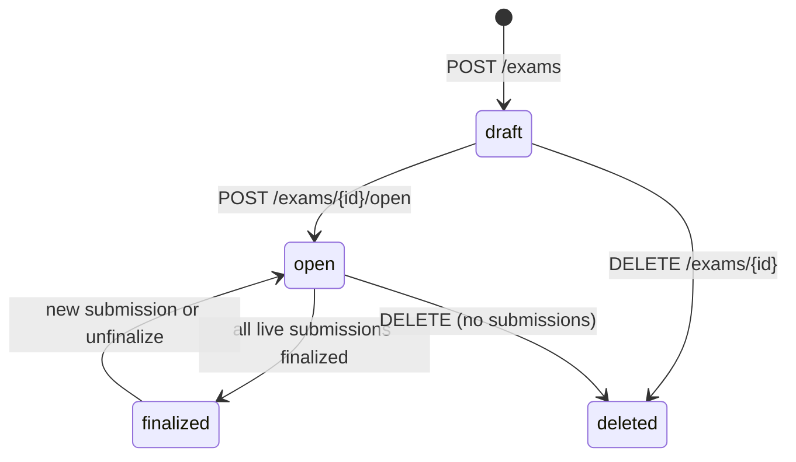

An **exam** is one question paper sat by a group of candidates: a CBSE Class X Science half-yearly, a B.Com Semester III booklet, or a single UPSC GS2 question set for today's batch. It holds the paper's questions, their marks and answer keys, and the settings the grader needs.

Every exam you create through the API also appears in the institute's Vacademy dashboard, tagged **Source: API**, so teachers can open it and review copies there. The exam's `dashboard_url` links straight to it. API keys only see exams created through the API. Exams that teachers created in the dashboard are not visible to the API.

## Lifecycle



| Status | What you can do |
|---|---|
| `draft` | Change anything: add, edit and remove questions, change the mode, sections and `blind`. No submissions yet. |
| `open` | Submit copies and answers. The marking scheme is frozen: no adding or removing questions, no changes to marks or answer keys. Question text, rubrics and model answers stay editable. |
| `finalized` | Every live submission of the exam is finalized. While the exam is in this status, changes to the exam, its questions and its candidate list are refused with `409 exam_finalized`. |
| `deleted` | Hidden from lists. `GET /exams/{id}` still returns it with `status: "deleted"`. Every other call returns `404 exam_not_found`. |

`finalized` is worked out from the exam's submissions; you don't finalize an exam directly. `POST /exams/{id}/finalize` finalizes submissions, and the exam shows `finalized` only once all of its live submissions are final. Finalizing some of them leaves the exam `open`. A new submission, or unfinalizing one, makes the exam `open` again. Finalizing changes state only: it publishes nothing and sends nothing to students. See [Finalize](/concepts/results#finalize).

<Tip>
For a one-off paper such as a daily UPSC answer-writing question, pass `"open": true` on create. The exam is checked and opened in the same call, and you can submit straight away.
</Tip>

## Create an exam

`POST /exams` (scope `evaluation:write`) creates the exam in `draft`. You can send its questions and candidates in the same call, or add them later.

<CodeGroup>

```bash curl
curl https://api.evalezy.com/v1/exams \
  -H "X-API-Key: $EVALEZY_API_KEY" \
  -H "Content-Type: application/json" \
  -H "Idempotency-Key: create-ERP-EXAM-88213" \
  -d '{
    "title": "Class X Science - Half-Yearly 2026-27",
    "mode": "handwritten",
    "external_ref": "ERP-EXAM-88213",
    "conducted_on": "2026-10-14",
    "subject": "Science",
    "level": "school",
    "board": "CBSE",
    "class": "10",
    "instructions": "CBSE marking scheme 2026-27. Award step marks. Ignore spelling except for scientific terms.",
    "sections": [{"name": "A", "order": 1}, {"name": "B", "order": 2}],
    "questions": [
      {
        "label": "1", "section": "A", "type": "mcq_single", "max_marks": 1,
        "text": "Which of the following is a balanced chemical equation?",
        "options": [
          {"label": "A", "text": "H2 + O2 -> H2O"},
          {"label": "B", "text": "2H2 + O2 -> H2O"},
          {"label": "C", "text": "2H2 + O2 -> 2H2O"},
          {"label": "D", "text": "H2 + 2O2 -> 2H2O"}
        ],
        "correct_options": ["C"]
      },
      {
        "label": "21", "section": "B", "type": "long_answer", "max_marks": 2,
        "text": "Why is respiration considered an exothermic reaction? Explain.",
        "model_answer": "Glucose is oxidised in cells to carbon dioxide and water. This releases energy, so respiration is exothermic."
      }
    ]
  }'
```

```python Python
import os
import requests

resp = requests.post(
    "https://api.evalezy.com/v1/exams",
    headers={
        "X-API-Key": os.environ["EVALEZY_API_KEY"],
        "Idempotency-Key": "create-ERP-EXAM-88213",
    },
    json={
        "title": "Class X Science - Half-Yearly 2026-27",
        "mode": "handwritten",
        "external_ref": "ERP-EXAM-88213",
        "conducted_on": "2026-10-14",
        "subject": "Science",
        "level": "school",
        "board": "CBSE",
        "class": "10",
        "instructions": "CBSE marking scheme 2026-27. Award step marks. Ignore spelling except for scientific terms.",
        "sections": [{"name": "A", "order": 1}, {"name": "B", "order": 2}],
        "questions": [
            {
                "label": "1", "section": "A", "type": "mcq_single", "max_marks": 1,
                "text": "Which of the following is a balanced chemical equation?",
                "options": [
                    {"label": "A", "text": "H2 + O2 -> H2O"},
                    {"label": "B", "text": "2H2 + O2 -> H2O"},
                    {"label": "C", "text": "2H2 + O2 -> 2H2O"},
                    {"label": "D", "text": "H2 + 2O2 -> 2H2O"},
                ],
                "correct_options": ["C"],
            },
            {
                "label": "21", "section": "B", "type": "long_answer", "max_marks": 2,
                "text": "Why is respiration considered an exothermic reaction? Explain.",
                "model_answer": "Glucose is oxidised in cells to carbon dioxide and water. "
                                "This releases energy, so respiration is exothermic.",
            },
        ],
    },
    timeout=30,
)
resp.raise_for_status()
exam = resp.json()
print(exam["id"], exam["status"], exam.get("warnings"))
```

```javascript Node
const resp = await fetch("https://api.evalezy.com/v1/exams", {
  method: "POST",
  headers: {
    "X-API-Key": process.env.EVALEZY_API_KEY,
    "Content-Type": "application/json",
    "Idempotency-Key": "create-ERP-EXAM-88213",
  },
  body: JSON.stringify({
    title: "Class X Science - Half-Yearly 2026-27",
    mode: "handwritten",
    external_ref: "ERP-EXAM-88213",
    conducted_on: "2026-10-14",
    subject: "Science",
    level: "school",
    board: "CBSE",
    class: "10",
    instructions:
      "CBSE marking scheme 2026-27. Award step marks. Ignore spelling except for scientific terms.",
    sections: [{ name: "A", order: 1 }, { name: "B", order: 2 }],
    questions: [
      {
        label: "1", section: "A", type: "mcq_single", max_marks: 1,
        text: "Which of the following is a balanced chemical equation?",
        options: [
          { label: "A", text: "H2 + O2 -> H2O" },
          { label: "B", text: "2H2 + O2 -> H2O" },
          { label: "C", text: "2H2 + O2 -> 2H2O" },
          { label: "D", text: "H2 + 2O2 -> 2H2O" },
        ],
        correct_options: ["C"],
      },
      {
        label: "21", section: "B", type: "long_answer", max_marks: 2,
        text: "Why is respiration considered an exothermic reaction? Explain.",
        model_answer:
          "Glucose is oxidised in cells to carbon dioxide and water. This releases energy, so respiration is exothermic.",
      },
    ],
  }),
});
if (!resp.ok) throw new Error(JSON.stringify(await resp.json()));
const exam = await resp.json();
console.log(exam.id, exam.status, exam.warnings);
```

</CodeGroup>

The `201` response is the exam, plus a compact list of its questions with the ids you will need later:

```json
{
  "id": "6f1c2a4e-9b7d-4c1e-8a55-0c3e2f9d1b10",
  "status": "draft",
  "mode": "handwritten",
  "title": "Class X Science - Half-Yearly 2026-27",
  "external_ref": "ERP-EXAM-88213",
  "conducted_on": "2026-10-14",
  "subject": "Science",
  "level": "school",
  "board": "CBSE",
  "class": "10",
  "answer_language": "en",
  "feedback_language": "en",
  "instructions": "CBSE marking scheme 2026-27. Award step marks. Ignore spelling except for scientific terms.",
  "blind": false,
  "total_marks": 3.0,
  "paper_max": 3.0,
  "question_count": 2,
  "dashboard_url": "https://dash.vacademy.io/assessment/assessment-list/assessment-details/6f1c2a4e-.../EXAM/PRIVATE/overview",
  "questions": [
    {"id": "b2e0...", "label": "1", "section": "A", "max_marks": 1.0,
     "options": [{"label": "A", "option_id": "c1..."}, {"label": "B", "option_id": "c2..."},
                 {"label": "C", "option_id": "c3..."}, {"label": "D", "option_id": "c4..."}]},
    {"id": "d9a4...", "label": "21", "section": "B", "max_marks": 2.0}
  ],
  "choice_groups": [],
  "rubric": {"version": 1, "locked": false, "questions_with_rubric": 0, "questions_without_rubric": 2},
  "quote": {"unit": "page", "credits_per_page": 1, "rate_source": "standard"},
  "created_at": "2026-10-02T09:12:44Z",
  "updated_at": "2026-10-02T09:12:44Z"
}
```

`quote` is the price of the exam's billing unit (a page for handwritten exams, an answer for typed ones). It is left out if the price could not be read in time. Creating the exam never fails because of it.

If you sent rubrics or model answers, `rubric.version` shows the rubric version once they are saved. If saving is delayed, `rubric` shows `"sync": "pending"` instead, and delivery is retried automatically. See [Sync status](/concepts/rubrics#sync-status).

### Exam fields

<ParamField body="title" type="string" required>
  Up to 255 characters. Cannot contain `<` or `>`.
</ParamField>

<ParamField body="mode" type="string" required>
  `handwritten` (you upload scanned answer booklets as PDFs) or `typed` (you send each candidate's answers as text). Can be changed only while the exam is a draft.
</ParamField>

<ParamField body="external_ref" type="string">
  Your own id for the exam, up to 128 characters. Unique per institute: a second exam with the same value returns `409 exam_exists` with the existing exam's id in `details.exam_id`. Deleting an exam frees its `external_ref` for reuse.
</ParamField>

<ParamField body="conducted_on" type="string" default="today">
  The date the paper was sat, as `YYYY-MM-DD`.
</ParamField>

<ParamField body="subject" type="string">
  Up to 120 characters, for example `Science` or `Financial Accounting`. Sent to the grader as context.
</ParamField>

<ParamField body="level" type="string" default="school">
  One of `school`, `ug`, `pg`, `upsc`. Sent to the grader as context.
</ParamField>

<ParamField body="board" type="string">
  Up to 64 characters, for example `CBSE`.
</ParamField>

<ParamField body="class" type="string">
  Up to 32 characters, for example `10`.
</ParamField>

<ParamField body="instructions" type="string">
  Examiner instructions for the whole paper, up to 4,000 characters. Sent to the grader as context.
</ParamField>

<ParamField body="answer_language" type="string" default="en">
  Only `en` is supported today. `hi` returns `422 language_not_supported`.
</ParamField>

<ParamField body="feedback_language" type="string" default="en">
  The language of the grader's feedback. Only `en` is supported today. `hi` returns `422 language_not_supported`.
</ParamField>

<ParamField body="blind" type="boolean" default="false">
  When `true`, candidate names are left out: candidates are registered under their `external_id`, and results return `name: null`. Can be changed only while the exam is a draft.
</ParamField>

<ParamField body="open" type="boolean" default="false">
  When `true`, the [open checks](#open-an-exam) run in the same call and the exam is created already open. If a check fails, nothing is created and you get `422 exam_not_ready`.
</ParamField>

<ParamField body="sections" type="object[]">
  Up to 20 sections, each `{"name": "A", "order": 1}`. Names are up to 64 characters, unique ignoring case, and cannot contain `<` or `>`. If you declare sections, every question must name one of them. If you don't, sections are created from the questions' `section` values in the order they first appear, or a single section `A`.
</ParamField>

<ParamField body="questions" type="object[]">
  Up to 200 questions. See [Questions](#questions).
</ParamField>

<ParamField body="candidates" type="object[]">
  Up to 2,000 candidates, created or updated and then registered on the exam. See [Candidates](/concepts/candidates).
</ParamField>

<ParamField body="choice_groups" type="object[]">
  Internal choice ("attempt any N of M"). Beta, enabled on request; see [Internal choice](#internal-choice-beta).
</ParamField>

## Questions

Each question carries its printed label, its type, its marks and, depending on the type, an answer key, a model answer or a rubric.

### Question types

| `type` | Use for | Answer key |
|---|---|---|
| `mcq_single` | Multiple choice, one correct option | `options` + exactly one `correct_options` |
| `mcq_multi` | Multiple choice, several correct options | `options` + one or more `correct_options` |
| `true_false` | True or false | `options` (two) + exactly one `correct_options` |
| `numeric` | A number, such as a calculated value | `answer`: a number, a numeric string, or a list of accepted numbers |
| `one_word` | A word or short phrase | `answer`: a string up to 255 characters |
| `long_answer` | Anything written out: short answers, long answers, essays, workings | Optional `model_answer` and `rubric` |

How each type is marked depends on the exam's mode:

- **Typed exams.** Objective questions (`mcq_single`, `mcq_multi`, `true_false`, `numeric`, `one_word`) are marked against your answer key. Only `long_answer` questions go to the AI.
- **Handwritten exams.** The AI reads the scanned booklet and marks every question, including MCQs.

### Question fields

<ParamField body="label" type="string" required>
  The number printed on the paper, up to 16 characters: `1`, `3(a)`, `Q11`, `33-OR`. Unique within the exam, ignoring case. Cannot contain `<` or `>`. Results come back keyed by both label and question id.
</ParamField>

<ParamField body="parent_label" type="string">
  The label of the parent question, for sub-parts. For example, `3` for `3(a)`. Stored and returned.
</ParamField>

<ParamField body="section" type="string">
  The section name. If left out, the question goes to the first section.
</ParamField>

<ParamField body="type" type="string" required>
  One of the [question types](#question-types). It cannot be changed later: delete the question and add it again.
</ParamField>

<ParamField body="text" type="string" required>
  The question as printed, as plain text up to 20,000 characters.
</ParamField>

<ParamField body="max_marks" type="number" required>
  Greater than 0, at most 1000, in steps of 0.5 (`1`, `2.5`, `15`).
</ParamField>

<ParamField body="negative_marks" type="number" default="0">
  Marks deducted for a wrong answer, 0 or more. Use it on objective questions in **typed** exams. Handwritten exams don't apply negative marking: the value is set to 0 and the response carries a `negative_marks_ignored` warning.
</ParamField>

<ParamField body="options" type="object[]">
  For `mcq_single`, `mcq_multi` and `true_false` only: 2 to 26 options, each `{"label": "A", "text": "..."}`. Labels are your own (`A`-`D`, `1`-`4`, `i`-`iv`), up to 16 characters, unique, and cannot contain `<` or `>`. Option text is up to 2,000 characters.
</ParamField>

<ParamField body="correct_options" type="string[]">
  The labels of the correct options. Each must match one of `options`, or the request fails with `422 unknown_option_label`.
</ParamField>

<ParamField body="answer" type="number | string | array">
  For `numeric`: a number, a numeric string, or a list of accepted numbers (for example `[0.5, 0.50]`). For `one_word`: a string. Not allowed on other types.
</ParamField>

<ParamField body="model_answer" type="string">
  For `long_answer` only. The answer an examiner would accept, up to 20,000 characters. See [Rubrics and model answers](/concepts/rubrics).
</ParamField>

<ParamField body="rubric" type="object">
  For `long_answer` only. Criteria with marks that add up to `max_marks`. See [Rubrics and model answers](/concepts/rubrics).
</ParamField>

<ParamField body="word_limit" type="integer">
  Greater than 0. Stored and returned with the question.
</ParamField>

<ParamField body="expects_diagram" type="boolean">
  Marks a question that asks for a diagram. Stored and returned with the question.
</ParamField>

<ParamField body="assess_language" type="boolean">
  Marks a language-paper question. Stored and returned with the question.
</ParamField>

<ParamField body="tags" type="object">
  Any JSON object up to 2 KB, such as `{"co": "CO2", "bloom": "apply", "topic": "Respiration"}`. Stored and returned.
</ParamField>

<ParamField body="external_id" type="string">
  Your own id for the question, up to 128 characters.
</ParamField>

<Note>
All text you send is plain text. Markup is stored and shown literally, never rendered. Short identifiers (`title`, question and option labels, section names, `one_word` answers, criterion names, candidate names and roll numbers) cannot contain `<` or `>`. Longer text (question text, option text, instructions, model answers, guidance) can. A NUL character anywhere in a request body is refused with `422 validation_failed` (field code `invalid_characters`).
</Note>

### Examples by type

<AccordionGroup>
  <Accordion title="Numeric with accepted values (B.Com)">
    ```json
    {
      "label": "4(b)",
      "parent_label": "4",
      "section": "A",
      "type": "numeric",
      "max_marks": 2,
      "text": "Calculate the current ratio if current assets are Rs 3,00,000 and current liabilities are Rs 1,50,000.",
      "answer": [2, 2.0]
    }
    ```
  </Accordion>
  <Accordion title="Multi-correct MCQ with negative marks (typed test-prep)">
    ```json
    {
      "label": "17",
      "type": "mcq_multi",
      "max_marks": 2,
      "negative_marks": 0.5,
      "text": "Which of the following are Fundamental Duties under Article 51A?",
      "options": [
        {"label": "a", "text": "To protect the natural environment"},
        {"label": "b", "text": "To vote in general elections"},
        {"label": "c", "text": "To develop the scientific temper"},
        {"label": "d", "text": "To pay income tax"}
      ],
      "correct_options": ["a", "c"]
    }
    ```
  </Accordion>
  <Accordion title="Long answer with a rubric (UPSC GS2)">
    ```json
    {
      "label": "Q1",
      "type": "long_answer",
      "max_marks": 15,
      "word_limit": 250,
      "text": "Discuss the role of the Governor in the context of Article 356 and cooperative federalism.",
      "rubric": {
        "partial_marking": true,
        "criteria": [
          {"name": "Introduction", "marks": 2, "keywords": ["Article 356", "federalism"]},
          {"name": "Dimensions covered", "marks": 6, "keywords": ["S.R. Bommai", "Sarkaria", "Punchhi"]},
          {"name": "Examples and data", "marks": 3},
          {"name": "Way forward", "marks": 2},
          {"name": "Conclusion and presentation", "marks": 2}
        ]
      }
    }
    ```
  </Accordion>
</AccordionGroup>

### Manage questions

| Call | When | Notes |
|---|---|---|
| `POST /exams/{id}/questions` | Draft only | Body `{"questions": [...]}`, 1 to 200 per call, and at most 200 per exam. A new section name creates a new section at the end. Returns `201` with the new questions. |
| `GET /exams/{id}/questions` | Any time | Full question objects in paper order. Add `?include=model_answer,rubric` to include those. |
| `PATCH /exams/{id}/questions/{question_id}` | Until finalize | Send only the fields you want to change. See below. |
| `DELETE /exams/{id}/questions/{question_id}` | Draft only | Also clears the question's rubric and model answer. |

`PATCH` merges your fields onto the question and checks the result with the same rules as create. In a draft you can change any field except `type` and `section`; to change those, delete the question and add it again. Unknown fields are refused with `422 validation_failed` (field code `unknown_field`), so a typo never looks like a successful edit.

## Open an exam

`POST /exams/{id}/open` moves a draft to `open`, which means it can accept submissions. It runs these checks first:

- The exam has at least one question.
- Every question has `max_marks`.
- Every rubric's criteria add up to its question's `max_marks`.

If any check fails, you get `422 exam_not_ready` with every problem listed:

```json
{
  "error": {
    "code": "exam_not_ready",
    "message": "The exam cannot be opened yet; see details.problems.",
    "request_id": "req_01J9X2...",
    "details": {
      "problems": [
        {"code": "rubric_marks_mismatch", "message": "Criteria for question 21 add up to 3, question max is 2.",
         "question_id": "d9a4...", "question_label": "21"}
      ]
    }
  }
}
```

Problem codes are `no_questions`, `max_marks_missing` and `rubric_marks_mismatch`. Opening an exam that is already open changes nothing and returns `200`. Opening a finalized exam returns `409 exam_finalized`.

### What is frozen after open

Copies are marked against the scheme as it stood when the exam opened, so after open:

| Can still change | Frozen (`409 exam_open`) |
|---|---|
| Question `text`, `model_answer`, `rubric`, `tags`, `word_limit`, `expects_diagram` | Adding or removing questions |
| Rubrics and model answers through the [rubric endpoints](/concepts/rubrics) | `max_marks`, `negative_marks`, `options`, `correct_options`, `answer`, `label`, `parent_label`, `assess_language`, `external_id` |
| Exam `title`, `external_ref`, `conducted_on`, `subject`, `board`, `class`, `level`, `instructions`, `feedback_language` | Exam `mode`, `sections`, `blind` |

A `409 exam_open` response lists the refused fields in `details.fields`. While the exam is `finalized`, every change to it is refused with `409 exam_finalized`; new submissions are still accepted and reopen it.

## Read, list and find exams

- `GET /exams/{id}` returns the exam. Add `?include=` with any of `questions`, `candidates` (the first 200 registrations), `choice_groups`, `stats` and `rubric`.
- `GET /exams` lists the institute's API exams, including those created by its other keys. It takes `status` (`draft`, `open`, `finalized` or `deleted`), `updated_since`, `cursor` and `limit` (1 to 200, default 50).
- `POST /exams/search` with `{"external_refs": ["ERP-EXAM-88213"]}` (1 to 500 values) finds exams by your own ids. Deleted exams are left out. The lookup takes a request body rather than a query string, so your ids stay out of URLs and access logs.

`include=stats` returns counts for the exam:

```json
"stats": {"candidates": 312, "submissions": 298, "queued": 40, "processing": 3,
          "graded": 240, "partially_graded": 6, "failed": 2, "finalized": 0}
```

## Edit an exam

`PATCH /exams/{id}` takes any of the editable fields:

- **Any time before finalize:** `title`, `external_ref`, `conducted_on`, `subject`, `board`, `class`, `level`, `instructions`, `feedback_language`.
- **Draft only:** `sections`, `blind`, `mode`.
- **Never:** `answer_language` and `status`. These return `422 validation_failed` with field code `not_editable`.

`conducted_on` cannot be cleared. Sending `sections` replaces the list: sections are matched by name, and a section you leave out is removed, unless it still has questions (field code `section_not_empty`). Switching a draft to `handwritten` sets any negative marks to 0 and returns a `negative_marks_ignored` warning.

## Delete an exam

`DELETE /exams/{id}` deletes a draft at any time. You can also delete an open exam, as long as it has no submissions; otherwise you get `409 exam_has_submissions`. Deletion frees the exam's `external_ref`. `?purge=true` (which would also erase the files) is not available yet and returns `422 feature_not_available`.

## Warnings

A successful response can carry `warnings: [{"code", "message", "field"}]` for input that was accepted but deserves a second look:

| Code | Meaning |
|---|---|
| `auto_rubric` | Some long-answer questions have neither a rubric nor a model answer. A rubric is generated from the question text on the first copy. See [Rubrics](/concepts/rubrics#without-a-rubric). |
| `negative_marks_ignored` | Negative marks were set to 0 because the exam is handwritten. |
| `internal_choice_suspected` | A label looks like an internal choice (`33-OR`, `11 OR 12`, `(or)`), but no choice group covers it. Both alternatives count towards the total. |
| `rubric_marks_not_half_step` | A criterion is worth a non-multiple of 0.5. Final marks are rounded to 0.5. |
| `rubric_check_skipped` | On open, stored rubrics could not be re-checked against max marks. |
| `rubric_not_saved` | On create, the rubrics could not be saved. Set them again with `PUT .../rubric`. |

## Internal choice (beta)

Many papers offer a choice: "attempt any 5 of 8" or "33 OR 33-OR". Choice groups tell the grader which questions count, and set `paper_max` to match:

```json
{"choice_groups": [
  {"label": "Part B - any 5 of 8", "question_labels": ["11","12","13","14","15","16","17","18"], "attempt": 5, "policy": "best"},
  {"label": "Q33 OR", "question_labels": ["33", "33-OR"], "attempt": 1, "policy": "first"}
]}
```

<Warning>
Choice groups are in **beta and enabled on request**. They are currently switched off, so `choice_groups` on `POST /exams` and `PUT /exams/{id}/choice-groups` return `422 feature_not_available`, and every alternative counts towards the total. For now, send papers without internal choice, or contact us if you need choice groups: hello@evalezy.com.
</Warning>

Once choice groups are switched on, the rules are: each group lists at least two question labels, a question can belong to only one group, `attempt` is at least 1 and fewer than the group's questions, and `policy` is `first` (the first questions attempted, in answer order) or `best` (the highest-marked). `paper_max` is the marks of every question outside a group, plus the top `attempt` maxima of each group.

## Errors

| Status and code | When |
|---|---|
| `422 validation_failed` | A field is missing, too long, out of range or in the wrong shape. `details.errors[]` lists every problem as `{field, code, message}`, for example `{"field": "questions[3].max_marks", "code": "invalid_step"}`. |
| `422 unknown_option_label` | `correct_options` names a label that is not among `options`. |
| `422 rubric_marks_mismatch`, `rubric_duplicate_criterion`, `rubric_guidance_has_marks` | See [Rubrics](/concepts/rubrics#validation-rules). |
| `422 language_not_supported` | `answer_language` or `feedback_language` is `hi`. |
| `422 exam_not_ready` | The open checks failed. |
| `422 feature_not_available` | Choice groups or `purge=true`. |
| `409 exam_exists` | `external_ref` is already used. `details.exam_id` is the existing exam. |
| `409 exam_open` | The change is only possible while the exam is a draft. |
| `409 exam_finalized` | The exam is finalized. |
| `409 exam_has_submissions` | Delete refused because the exam has submissions. |
| `404 exam_not_found`, `404 question_not_found` | The id doesn't exist in your institute, or the exam is deleted. |
