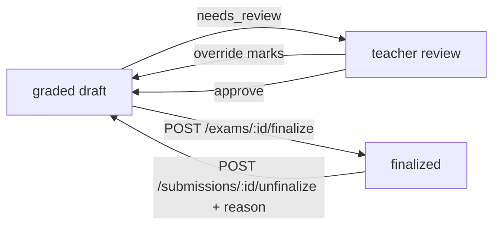

When a [submission](/concepts/submissions) is graded, its **result** gives the marks, feedback and confidence for every question, the totals, and a link to the checked copy. Results are **drafts**: the AI never publishes anything. A result becomes final only when you finalize it.



<Info>
Exams you create through the API also appear in your institute's Vacademy dashboard, tagged **Source: API**. Teachers can review and override marks there too, and their changes show in the API result.
</Info>

<Accordion title="Setup for the code samples" icon="gear">
The Python and Node samples on this page assume this setup. The Node samples use top-level `await`, so run them as ES modules (a `.mjs` file, or `"type": "module"` in `package.json`).

<CodeGroup>

```python Python
import os
import requests

API = "https://api.evalezy.com/v1"
HEADERS = {"X-API-Key": os.environ["EVALEZY_API_KEY"]}
```

```javascript Node
const API = "https://api.evalezy.com/v1";
const headers = {
  "X-API-Key": process.env.EVALEZY_API_KEY,
  "Content-Type": "application/json",
};
```

</CodeGroup>
</Accordion>

## Read a result

`GET /submissions/{submission_id}/result` (scope `evaluation:read`).

<CodeGroup>

```bash curl
curl "https://api.evalezy.com/v1/submissions/5a7e2c90-1b4d-4e8f-a3c2-7d9e0f1a2b3c/result" \
  -H "X-API-Key: $EVALEZY_API_KEY"
```

```python Python
result = requests.get(f"{API}/submissions/{submission_id}/result", headers=HEADERS).json()
for q in result["questions"]:
    print(q["label"], q["awarded"], "/", q["max"], "review" if q["needs_review"] else "")
```

```javascript Node
const result = await (
  await fetch(`${API}/submissions/${submissionId}/result`, { headers })
).json();
```

</CodeGroup>

A CBSE Class 10 Science copy, shortened to two questions:

```json
{
  "submission_id": "5a7e2c90-1b4d-4e8f-a3c2-7d9e0f1a2b3c",
  "exam_id": "6f1c8a3e-2d4b-4c9f-a1e7-3b5d7f9a1c2e",
  "candidate": {
    "id": "e7a1b2c3-d4e5-4f60-8a9b-c0d1e2f3a4b5",
    "external_id": "STU-10A-0007",
    "name": "Aarav Mehta",
    "roll_number": "10A07"
  },
  "status": "graded",
  "needs_review": true,
  "review_reasons": [],
  "finalized": false,
  "finalized_at": null,
  "rubric_version": 4,
  "rubric_stale": null,
  "totals": {
    "awarded": 61.5,
    "max": 80,
    "percentage": 76.9,
    "questions_graded": 39,
    "questions_failed": 0
  },
  "questions": [
    {
      "question_id": "b2f4a6c8-…",
      "label": "1",
      "section": "A",
      "status": "graded",
      "counted": true,
      "awarded": 1,
      "max": 1,
      "source": "ai",
      "confidence": 0.97,
      "needs_review": false,
      "review_reasons": [],
      "extracted_answer": "(c)",
      "feedback": "Correct option.",
      "criteria": [],
      "error": null
    },
    {
      "question_id": "d9e1f3a5-…",
      "label": "21",
      "section": "B",
      "status": "graded",
      "counted": true,
      "awarded": 1,
      "max": 2,
      "source": "ai",
      "confidence": 0.54,
      "needs_review": true,
      "review_reasons": ["low_confidence"],
      "extracted_answer": "In respiration glucose breaks down and gives CO2 and water.",
      "feedback": "Explains glucose breakdown but does not say energy is released.",
      "criteria": [
        { "name": "Oxidation of glucose", "awarded": 1, "max": 1, "reason": "Mentions breakdown of glucose to CO2 and water." },
        { "name": "Energy released", "awarded": 0, "max": 1, "reason": "No mention of energy release." }
      ],
      "error": null
    }
  ],
  "checked_copy": {
    "available": true,
    "download_path": "/submissions/5a7e2c90-1b4d-4e8f-a3c2-7d9e0f1a2b3c/checked-copy"
  },
  "graded_at": "2026-10-02T10:14:03Z",
  "credits_charged": 24,
  "error": null
}
```

You can read a result while grading is still running: questions not graded yet show `status: "pending"`. Results of replaced submissions stay readable; a deleted submission's result answers `404 submission_not_found`.

### The include parameter

| `include` value | Effect |
| --- | --- |
| *(default)* | `extracted_answer` is included. |
| `-extracted_answer` | Leave out `extracted_answer` (smaller responses). |
| `model_answer` | Add each question's `model_answer`. |
| `annotations` | Add each question's `annotations`: the marks the engine placed on the checked copy. |

Combine values with commas: `?include=model_answer,annotations`.

## Result fields

<ResponseField name="submission_id" type="string">The submission this result belongs to.</ResponseField>
<ResponseField name="exam_id" type="string">The exam.</ResponseField>
<ResponseField name="candidate" type="object">
  `{ "id", "external_id", "name", "roll_number" }`. `name` is `null` on exams created with `blind: true`. Results never include an email address.
</ResponseField>
<ResponseField name="status" type="string">The submission status, such as `graded` or `partially_graded`. See [Statuses](/concepts/submissions#statuses).</ResponseField>
<ResponseField name="needs_review" type="boolean">`true` when any question needs review, or the submission has its own review reason.</ResponseField>
<ResponseField name="review_reasons" type="string[]">Submission-level reasons, such as `pages_beyond_vision_limit`.</ResponseField>
<ResponseField name="finalized" type="boolean">Whether the result is final.</ResponseField>
<ResponseField name="finalized_at" type="string | null">When it was finalized.</ResponseField>
<ResponseField name="rubric_version" type="integer | null">The rubric version the copy was graded with.</ResponseField>
<ResponseField name="rubric_stale" type="boolean | null">Reserved. Currently always `null`.</ResponseField>
<ResponseField name="totals" type="object">
  <Expandable title="properties">
    <ResponseField name="awarded" type="number">Sum of marks of graded questions that count towards the total.</ResponseField>
    <ResponseField name="max" type="number">The paper's maximum marks.</ResponseField>
    <ResponseField name="percentage" type="number | null">`awarded / max × 100`, rounded to one decimal.</ResponseField>
    <ResponseField name="questions_graded" type="integer">Questions with `status: "graded"`.</ResponseField>
    <ResponseField name="questions_failed" type="integer">Questions with `status: "failed"`.</ResponseField>
  </Expandable>
</ResponseField>
<ResponseField name="questions" type="object[]">One entry per question of the paper, in paper order. See [Question fields](#question-fields).</ResponseField>
<ResponseField name="checked_copy" type="object">
  `{ "available", "download_path" }`. `download_path` is relative to the API base URL and is `null` when no checked copy exists. See [Checked copy](#download-the-checked-copy).
</ResponseField>
<ResponseField name="graded_at" type="string | null">When grading completed.</ResponseField>
<ResponseField name="credits_charged" type="number | null">What this submission was charged. See [Quotes and credits](/concepts/submissions#quotes-and-credits).</ResponseField>
<ResponseField name="error" type="object | null">`{ "code", "message" }` when the submission `failed`.</ResponseField>

### Question fields

<ResponseField name="question_id" type="string">The question id.</ResponseField>
<ResponseField name="label" type="string">The question label, such as `21` or `4(b)`.</ResponseField>
<ResponseField name="section" type="string | null">The section name, such as `B`.</ResponseField>
<ResponseField name="status" type="string">
  `graded`, `failed` (the AI could not grade this answer), `pending` (still being graded), `cancelled`, or `not_answered` (no answer found; scores 0).
</ResponseField>
<ResponseField name="counted" type="boolean">
  Whether the marks count towards the total. Always `true` unless the exam uses choice groups ("attempt any N of M"), which are in beta and enabled on request.
</ResponseField>
<ResponseField name="awarded" type="number | null">Marks awarded. `null` while pending, and for failed questions.</ResponseField>
<ResponseField name="max" type="number">The question's maximum marks.</ResponseField>
<ResponseField name="source" type="string | null">
  Who set the marks:
  - `ai`: the AI.
  - `ai_reviewed`: the AI, then a teacher overrode them (through the API or the dashboard).
  - `auto`: marked automatically against the answer key (typed objective answers).
</ResponseField>
<ResponseField name="confidence" type="number | null">The AI's confidence in its marks, from 0 to 1. `null` for automatic marks.</ResponseField>
<ResponseField name="needs_review" type="boolean">Whether a teacher should check this question. See [Needs review](#needs-review).</ResponseField>
<ResponseField name="review_reasons" type="string[]">Why the question needs review.</ResponseField>
<ResponseField name="extracted_answer" type="string | null">
  The text the grader worked from: the transcription of the handwriting, or the typed text. For typed answers, spacing and line breaks may differ from what you sent; angle brackets and markup are kept as plain text. Keep your own copy if you need it verbatim. Included unless you pass `include=-extracted_answer`.
</ResponseField>
<ResponseField name="feedback" type="string | null">Feedback on the answer, in plain text.</ResponseField>
<ResponseField name="criteria" type="object[]">
  Marks per rubric criterion: `[{ "name", "awarded", "max", "reason" }]`. Empty when the question has no criteria (for example an MCQ).
</ResponseField>
<ResponseField name="model_answer" type="string | null">Only with `include=model_answer`.</ResponseField>
<ResponseField name="annotations" type="object[]">Only with `include=annotations`.</ResponseField>
<ResponseField name="review" type="object">
  Present once a teacher has overridden or approved the question: `{ "reviewer": { "ref", "name" }, "reason", "edited", "edited_at", "approved" }`. `reviewer` and `reason` appear only when they were sent.
</ResponseField>
<ResponseField name="error" type="object | null">
  `{ "code", "message" }` for a `failed` question. Review it by hand.
</ResponseField>

## Needs review

Evalezy flags what the AI was unsure about, so teachers check a few answers instead of every copy.

A **question** needs review when one of these holds, unless a teacher has already overridden or approved it:

| Question `review_reasons` | Meaning |
| --- | --- |
| `failed` | The AI could not grade the answer. |
| `low_confidence` | The AI's confidence is below 0.60. |
| Other reasons from the engine | For example, the marks were adjusted to fit the rubric, or the answer could not be matched to a single question. Treat any reason as "please check". |

A **submission** needs review when any of its questions does, or when it has a submission-level reason (`pages_beyond_vision_limit` for copies of 41 to 80 pages).

To find work for your teachers, filter on the flag:

```bash
curl "https://api.evalezy.com/v1/exams/6f1c8a3e-2d4b-4c9f-a1e7-3b5d7f9a1c2e/submissions?needs_review=true&finalized=false" \
  -H "X-API-Key: $EVALEZY_API_KEY"
```

<Tip>
`needs_review` is a flag, not a status. It is not a block either: you can finalize a result that still needs review. Make that a deliberate choice in your product.
</Tip>

## Override marks

`PATCH /submissions/{submission_id}/questions/{question_id}` (scope `evaluation:review`) sets a question's marks and feedback, for example after a teacher's review.

<ParamField body="awarded" type="number" required>
  The new marks: from 0 to the question's maximum, in steps of 0.5. Anything else is refused with `422 invalid_marks`.
</ParamField>
<ParamField body="feedback" type="string">
  New feedback, plain text up to 4,000 characters. Leave it out to keep the current feedback.
</ParamField>
<ParamField body="reviewer" type="object">
  Your reference for the teacher: `{ "ref", "name" }`, each up to 120 characters. It is shown in the result and in the dashboard.
</ParamField>
<ParamField body="reason" type="string">
  Why the marks changed, up to 500 characters.
</ParamField>

<CodeGroup>

```bash curl
curl -X PATCH "https://api.evalezy.com/v1/submissions/5a7e2c90-1b4d-4e8f-a3c2-7d9e0f1a2b3c/questions/d9e1f3a5-…" \
  -H "X-API-Key: $EVALEZY_API_KEY" \
  -H "Content-Type: application/json" \
  -d '{
    "awarded": 1.5,
    "feedback": "Partially correct; energy release is implied.",
    "reviewer": {"ref": "T-0042", "name": "Mrs. Iyer"},
    "reason": "Teacher review"
  }'
```

```python Python
requests.patch(
    f"{API}/submissions/{submission_id}/questions/{question_id}",
    headers=HEADERS,
    json={
        "awarded": 1.5,
        "feedback": "Partially correct; energy release is implied.",
        "reviewer": {"ref": "T-0042", "name": "Mrs. Iyer"},
        "reason": "Teacher review",
    },
).raise_for_status()
```

```javascript Node
await fetch(`${API}/submissions/${submissionId}/questions/${questionId}`, {
  method: "PATCH",
  headers,
  body: JSON.stringify({
    awarded: 1.5,
    feedback: "Partially correct; energy release is implied.",
    reviewer: { ref: "T-0042", name: "Mrs. Iyer" },
    reason: "Teacher review",
  }),
});
```

</CodeGroup>

The response is `200` with the updated [question](#question-fields): `source` becomes `ai_reviewed`, `needs_review` becomes `false`, and `review.edited` is `true`. The totals are recalculated.

You can override `graded` and `failed` questions. Overriding is refused with:

- `409 evaluation_in_progress` while the question is still being graded,
- `409 submission_finalized` once the result is finalized,
- `422 validation_failed` (field code `not_ai_graded`) for a question with no AI result, such as a typed objective question that was marked automatically,
- `404 question_not_found` for a question that is not on the exam.

## Approve a result

`POST /submissions/{submission_id}/approve` (scope `evaluation:review`) records that a teacher checked the AI's marks and accepts them unchanged. Every question is marked approved, submission-level reasons are cleared, and `needs_review` becomes `false`. The body is optional:

```json
{ "reviewer": { "ref": "T-0042", "name": "Mrs. Iyer" } }
```

The response is `200` with the [submission object](/concepts/submissions#the-submission-object). Approval is refused while grading is running (`409 evaluation_in_progress`) and after finalize (`409 submission_finalized`). A [re-evaluation](/concepts/submissions#re-evaluate) clears the approval.

## Download the checked copy

For handwritten copies, Evalezy renders a **checked copy**: the candidate's PDF with the marks and comments written on it. When `checked_copy.available` is `true`, download it with `GET /submissions/{submission_id}/checked-copy` (scope `evaluation:read`).

<CodeGroup>

```bash curl
curl -o checked-10A07.pdf \
  "https://api.evalezy.com/v1/submissions/5a7e2c90-1b4d-4e8f-a3c2-7d9e0f1a2b3c/checked-copy" \
  -H "X-API-Key: $EVALEZY_API_KEY"
```

```python Python
with requests.get(f"{API}/submissions/{submission_id}/checked-copy",
                  headers=HEADERS, stream=True) as r:
    r.raise_for_status()
    with open("checked-10A07.pdf", "wb") as f:
        for chunk in r.iter_content(chunk_size=1 << 16):
            f.write(chunk)
```

```javascript Node
import { writeFile } from "node:fs/promises";

const r = await fetch(`${API}/submissions/${submissionId}/checked-copy`, { headers });
if (!r.ok) throw new Error(`HTTP ${r.status}`);
await writeFile("checked-10A07.pdf", Buffer.from(await r.arrayBuffer()));
```

</CodeGroup>

The response is the PDF itself (`Content-Type: application/pdf`, sent as an attachment named `checked-copy-{submission_id}.pdf`), authenticated by your API key. You do not need to store a copy: you can fetch it again whenever a parent or student asks for it.

| Query parameter | Description |
| --- | --- |
| `redirect` | `true` asks for a `302` redirect to a short-lived signed link instead of the PDF body. When signed links are not available, the PDF is streamed as usual, so always handle both a `302` and a `200`. |
| `expires_in` | Lifetime of the signed link in seconds, 60 to 3,600 (default 900). |

No checked copy yet (not graded, or the copy could not be rendered) answers `404 checked_copy_not_found`.

## Finalize and unfinalize

Finalizing turns draft results into final marks. Finalized results cannot change: overrides, approvals, re-evaluations, replacements and deletes are all refused with `409 submission_finalized` until the result is unfinalized.

<Note>
Finalizing only changes the result's state. Evalezy sends no emails, report cards or notifications to candidates: what you do with final marks is up to your system.
</Note>

### Finalize

`POST /exams/{exam_id}/finalize` (scope `evaluation:finalize`). Send exactly one of `submission_ids` or `all_graded`.

<ParamField body="submission_ids" type="string[]">
  Up to 500 live submissions of this exam. Any id that is not a live submission of the exam fails the whole call with `404 submission_not_found`, listing the ids in `details.submission_ids`.
</ParamField>
<ParamField body="all_graded" type="boolean">
  `true` finalizes every `graded` submission of the exam that is not finalized yet, oldest first, up to 500 per call. Submissions in any other status are left out entirely and do not appear in `skipped`. When more remain, the response has `has_more: true`: call again.
</ParamField>
<ParamField body="allow_partial" type="boolean" default="false">
  Also finalize `partially_graded` and `failed` submissions. Questions that failed score 0. Use this only after a teacher has handled them.
</ParamField>

```bash
curl -X POST https://api.evalezy.com/v1/exams/6f1c8a3e-2d4b-4c9f-a1e7-3b5d7f9a1c2e/finalize \
  -H "X-API-Key: $EVALEZY_API_KEY" \
  -H "Content-Type: application/json" \
  -d '{"submission_ids": ["5a7e2c90-1b4d-4e8f-a3c2-7d9e0f1a2b3c", "5a7f0d11-…", "5a80e7c2-…"]}'
```

```json
{
  "finalized": ["5a7e2c90-1b4d-4e8f-a3c2-7d9e0f1a2b3c"],
  "skipped": [
    { "id": "5a7f0d11-…", "reason": "not_graded" },
    { "id": "5a80e7c2-…", "reason": "partially_graded" }
  ],
  "has_more": false
}
```

`skipped` lists submissions you named in `submission_ids` that could not be finalized. With `all_graded`, only eligible submissions are selected, so `skipped` is normally empty; to find the ones left out, list `GET /exams/{exam_id}/submissions?finalized=false`.

| Skip `reason` | Meaning |
| --- | --- |
| `already_finalized` | It was finalized before. |
| `not_graded` | It is still queued or grading, or was cancelled. |
| `partially_graded` | Some questions failed. Send `allow_partial: true` to finalize anyway. |
| `failed` | The copy failed. Send `allow_partial: true` to finalize anyway. |

A draft exam answers `409 exam_not_open`. Once every live submission of an exam is finalized, the exam's status becomes `finalized`; a new submission makes it `open` again.

### Unfinalize

`POST /submissions/{submission_id}/unfinalize` (scope `evaluation:finalize`) puts one finalized result back into draft, for example for a revaluation request. A `reason` of up to 500 characters is required and is recorded in the audit log.

```json
{ "reason": "Revaluation request RV-2026-118" }
```

The response is `200` with the submission object. You can then override, re-evaluate and finalize again. Unfinalizing a result that is not finalized answers `409 submission_not_finalized`.

## All results of an exam

`GET /exams/{exam_id}/results` (scope `evaluation:read`) returns full results for the exam's live submissions, in the same shape as `GET /submissions/{submission_id}/result`, ordered by `(updated_at, id)`.

| Query parameter | Description |
| --- | --- |
| `limit` | 1 to 50, default 20. Results are large, so pages are smaller than on other lists. |
| `cursor` | `next_cursor` from the previous page. |
| `updated_since` | ISO 8601 UTC time. Only results that changed after it. |
| `finalized` | `true` or `false`. |
| `include` | Same values as on a single result. |
| `format` | `json` (the default). `csv` is not available yet and answers `422 feature_not_available`. |

<CodeGroup>

```python Python
def exam_results(exam_id):
    cursor = None
    while True:
        params = {"limit": 50, "finalized": "true"}
        if cursor:
            params["cursor"] = cursor
        page = requests.get(f"{API}/exams/{exam_id}/results",
                            headers=HEADERS, params=params).json()
        yield from page["data"]
        if not page["has_more"]:
            return
        cursor = page["next_cursor"]

for r in exam_results(exam_id):
    print(r["candidate"]["external_id"], r["totals"]["awarded"], r["totals"]["max"])
```

```javascript Node
async function* examResults(examId) {
  let cursor = null;
  do {
    const params = new URLSearchParams({ limit: "50", finalized: "true" });
    if (cursor) params.set("cursor", cursor);
    const page = await (
      await fetch(`${API}/exams/${examId}/results?${params}`, { headers })
    ).json();
    yield* page.data;
    cursor = page.has_more ? page.next_cursor : null;
  } while (cursor);
}

for await (const r of examResults(examId)) {
  console.log(r.candidate.external_id, r.totals.awarded, r.totals.max);
}
```

</CodeGroup>

<Tip>
To export a mark sheet, finalize first, then page through `GET /exams/{exam_id}/results?finalized=true` and write one row per candidate from `candidate.external_id`, `questions[].awarded` and `totals`. A CSV export is on the [roadmap](/platform/roadmap).
</Tip>
