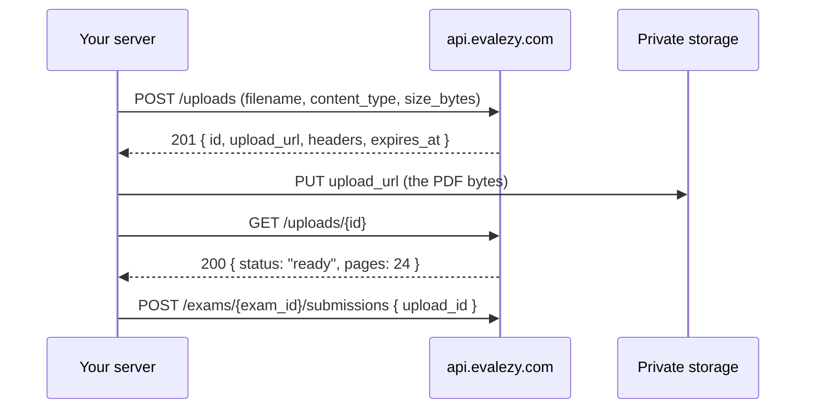

Handwritten answer sheets never pass through the API body. You ask Evalezy for a **presigned upload URL**, `PUT` the PDF straight to private storage, and then reference the upload by its `id` when you [create a submission](/concepts/submissions).



<Info>
Uploads need the `evaluation:write` scope to create and `evaluation:read` to inspect. An upload belongs to your institute: no other institute can see it or use it.
</Info>

## What you can upload

| Rule | Limit |
| --- | --- |
| File type | `application/pdf` only. One PDF per answer sheet. |
| File size | Up to 50 MB per PDF. |
| Files per request | 1 to 100. |
| Filename | 1 to 255 printable characters. |
| URL lifetime | The presigned `PUT` URL is valid for 1 hour. |
| Use | Each upload can be used by **one** submission. |

<Warning>
Phone photos (`image/jpeg`, `image/png`, `image/heic`) are not accepted yet. A request that includes an image type is refused with `422 feature_not_available`. Scan or combine the pages into a single PDF first. Image uploads are on the [roadmap](/platform/roadmap).
</Warning>

## Upload a PDF step by step

<Steps>
  <Step title="Request an upload URL">
    Send the exact size of the file in bytes. The presigned URL is bound to that size and to the content type, so storage rejects a `PUT` of any other size.

    You can send one file at the top level:

    ```json
    {
      "filename": "10A07_science.pdf",
      "content_type": "application/pdf",
      "size_bytes": 8421337
    }
    ```

    Or up to 100 files in `files[]` (a whole class at once). Do not mix the two forms in one request.

    <CodeGroup>

    ```bash curl
    curl -X POST https://api.evalezy.com/v1/uploads \
      -H "X-API-Key: $EVALEZY_API_KEY" \
      -H "Content-Type: application/json" \
      -H "Idempotency-Key: upload-10A-science-2026-10-02" \
      -d '{
        "files": [
          {"filename": "10A07_science.pdf", "content_type": "application/pdf", "size_bytes": 8421337},
          {"filename": "10A08_science.pdf", "content_type": "application/pdf", "size_bytes": 7990112}
        ]
      }'
    ```

    ```python Python
    import os
    import requests

    API = "https://api.evalezy.com/v1"
    HEADERS = {"X-API-Key": os.environ["EVALEZY_API_KEY"]}

    paths = ["scans/10A07_science.pdf", "scans/10A08_science.pdf"]
    files = [
        {
            "filename": os.path.basename(p),
            "content_type": "application/pdf",
            "size_bytes": os.path.getsize(p),
        }
        for p in paths
    ]

    resp = requests.post(f"{API}/uploads", headers=HEADERS, json={"files": files})
    resp.raise_for_status()
    uploads = resp.json()["uploads"]
    ```

    ```javascript Node
    import { stat } from "node:fs/promises";
    import path from "node:path";

    const API = "https://api.evalezy.com/v1";
    const headers = {
      "X-API-Key": process.env.EVALEZY_API_KEY,
      "Content-Type": "application/json",
    };

    const paths = ["scans/10A07_science.pdf", "scans/10A08_science.pdf"];
    const files = await Promise.all(
      paths.map(async (p) => ({
        filename: path.basename(p),
        content_type: "application/pdf",
        size_bytes: (await stat(p)).size,
      }))
    );

    const resp = await fetch(`${API}/uploads`, {
      method: "POST",
      headers,
      body: JSON.stringify({ files }),
    });
    const { uploads } = await resp.json();
    ```

    </CodeGroup>

    The response is `201 Created`, with one entry per file in the order you sent them:

    ```json
    {
      "uploads": [
        {
          "id": "0d2b6c1e-6a1f-4c55-9a43-2b1f0c9e7a10",
          "filename": "10A07_science.pdf",
          "upload_url": "https://…",
          "method": "PUT",
          "headers": { "Content-Type": "application/pdf" },
          "expires_at": "2026-10-02T10:12:44Z",
          "status": "pending"
        }
      ]
    }
    ```

    You can also send an optional `sha256` (64 hexadecimal characters) for each file. It is stored and returned on the upload for your own records.
  </Step>

  <Step title="PUT the file to upload_url">
    Use the `method` from the response (always `PUT`), send **every header** in `headers`, and send the raw PDF bytes as the body. Do not add the `X-API-Key` header to this request: the URL itself is the credential.

    <CodeGroup>

    ```bash curl
    curl -X PUT "$UPLOAD_URL" \
      -H "Content-Type: application/pdf" \
      --data-binary @scans/10A07_science.pdf
    ```

    ```python Python
    for upload, p in zip(uploads, paths):
        with open(p, "rb") as f:
            put = requests.put(upload["upload_url"], data=f, headers=upload["headers"])
        put.raise_for_status()
    ```

    ```javascript Node
    import { readFile } from "node:fs/promises";

    for (const [i, upload] of uploads.entries()) {
      const body = await readFile(paths[i]);
      const put = await fetch(upload.upload_url, {
        method: upload.method,
        headers: upload.headers,
        body,
      });
      if (!put.ok) throw new Error(`PUT failed: ${put.status}`);
    }
    ```

    </CodeGroup>

    <Warning>
    Upload URLs are bearer credentials. Keep them on your server, never log them, and never send them to a browser or mobile app. Use each URL within its hour.
    </Warning>
  </Step>

  <Step title="Check the upload">
    Read the upload once the `PUT` has finished. The first read after the `PUT` inspects the file: it confirms the object exists, checks its size and type, and counts the pages.

    ```bash
    curl https://api.evalezy.com/v1/uploads/0d2b6c1e-6a1f-4c55-9a43-2b1f0c9e7a10 \
      -H "X-API-Key: $EVALEZY_API_KEY"
    ```

    ```json
    {
      "id": "0d2b6c1e-6a1f-4c55-9a43-2b1f0c9e7a10",
      "filename": "10A07_science.pdf",
      "content_type": "application/pdf",
      "size_bytes": 8421337,
      "status": "ready",
      "pages": 24,
      "reject_reason": null,
      "submission_id": null,
      "expires_at": "2026-10-02T10:12:44Z",
      "created_at": "2026-10-02T09:12:44Z"
    }
    ```

    A `ready` upload has an exact `pages` count, and that count is what a handwritten copy is charged on. You can skip this step and submit directly: a submission runs the same check itself. Reading the upload first lets you catch a bad scan before you create a submission.
  </Step>

  <Step title="Submit it">
    Pass the `id` as `upload_id` on [`POST /exams/{exam_id}/submissions`](/concepts/submissions#handwritten-copies).
  </Step>
</Steps>

## Upload fields

<ResponseField name="id" type="string">
  The upload id. Use it as `upload_id` on a submission.
</ResponseField>
<ResponseField name="filename" type="string">
  The filename you sent.
</ResponseField>
<ResponseField name="content_type" type="string">
  Always `application/pdf`.
</ResponseField>
<ResponseField name="size_bytes" type="integer">
  The declared size, replaced by the stored size once the file has been checked.
</ResponseField>
<ResponseField name="sha256" type="string">
  The checksum you sent, if any. Omitted otherwise.
</ResponseField>
<ResponseField name="status" type="string">
  `pending`, `ready` or `rejected`. See [Upload states](#upload-states).
</ResponseField>
<ResponseField name="pages" type="integer | null">
  The page count of the PDF, set when the upload is `ready`.
</ResponseField>
<ResponseField name="reject_reason" type="string | null">
  Why the upload was rejected. See [Reject reasons](#reject-reasons).
</ResponseField>
<ResponseField name="submission_id" type="string | null">
  The submission that used this upload, once one has.
</ResponseField>
<ResponseField name="expires_at" type="string">
  When the presigned `PUT` URL stops working (ISO 8601, UTC).
</ResponseField>
<ResponseField name="created_at" type="string">
  When the upload was requested.
</ResponseField>

## Upload states

| `status` | Meaning | What to do |
| --- | --- | --- |
| `pending` | The file has not arrived yet, or has not been checked yet. | `PUT` the file, then read the upload again. |
| `ready` | The file is a readable PDF and `pages` is set. | Submit it. |
| `rejected` | The file cannot be used. `reject_reason` says why. | Fix the file and request a new upload. A rejected upload never becomes ready. |

An upload stays `pending` while its `PUT` URL is still valid and no file has arrived. Once the URL has expired with nothing uploaded, the next read rejects it with `missing_object`.

### Reject reasons

| `reject_reason` | Cause |
| --- | --- |
| `file_too_large` | The stored file is larger than 50 MB. |
| `not_a_pdf` | The file was stored with a content type other than `application/pdf`. Send the `Content-Type` header from `headers` on the `PUT`. |
| `too_many_pages` | The PDF has more than 200 pages. |
| `unparseable` | The PDF could not be opened: it is corrupt, password-protected or has no pages. |
| `missing_object` | No file was uploaded before the URL expired. |

<Note>
A `ready` upload can still be refused when you submit it. Copies of more than 80 pages are refused with `422 too_many_pages`, and copies of 41 to 80 pages are accepted but flagged for human review. See the [page policy](/concepts/submissions#page-policy).
</Note>

## Quote before you submit

To see the exact cost of a set of uploads before you submit them, quote them by id. Pending uploads are checked first, so the page counts are exact.

```bash
curl -X POST https://api.evalezy.com/v1/credits/quote \
  -H "X-API-Key: $EVALEZY_API_KEY" \
  -H "Content-Type: application/json" \
  -d '{"upload_ids": ["0d2b6c1e-6a1f-4c55-9a43-2b1f0c9e7a10"]}'
```

```json
{
  "unit": "page",
  "credits_per_page": 1,
  "pages": 24,
  "total": 24,
  "available": 1840,
  "committed": 96,
  "sufficient": true,
  "rate_source": "standard",
  "note": "Fixed price: 1 credit per page of a graded copy at the standard rate. Failed, cancelled and unreadable copies are free."
}
```

You can quote 1 to 100 uploads per call. The quote needs only the `evaluation:read` scope.

## Retries and idempotency

`POST /uploads` accepts an optional `Idempotency-Key` header. Because the upload URLs are credentials, they are never stored: a replay returns the same upload ids **without** `upload_url` and `headers`, and with `"upload_url_redacted": true`. If you no longer have the URLs, request new uploads with a new `Idempotency-Key`.

## Errors

| Status | Code | When |
| --- | --- | --- |
| `422` | `validation_failed` | A field is missing or invalid: no `size_bytes`, a type other than PDF, a file over 50 MB, more than 100 files, or both single-file and `files[]` forms. `details.errors[]` names each field, such as `files[3].size_bytes`. |
| `422` | `feature_not_available` | An image type was requested. |
| `404` | `upload_not_found` | No upload with this id in your institute. |
| `429` | `rate_limited` | Too many files presigned in a short time. Presigning is counted per file. Wait for the `Retry-After` seconds. |
| `503` | `engine_unavailable` | The file could not be checked right now. Nothing changed. Retry after `Retry-After` seconds. |

When you submit an upload, you can also get `422 upload_rejected` (with `details.reason`: a reject reason above, `not_uploaded` or `not_ready`) or `409 upload_already_used` (with `details.submission_id`).
