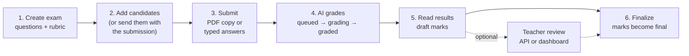

Evalezy is an AI evaluation API. You send it a question paper, a marking scheme and your candidates' answers. It sends back question-wise marks, criterion-level reasons and feedback, plus an annotated PDF of each handwritten copy. Marks stay drafts until you finalize them.

It is built for teams that already run exams and want the checking done faster:

- **School ERP vendors** grading CBSE and state-board unit tests and pre-boards
- **University exam systems** running on-screen marking of B.Com, BA and B.Sc answer booklets
- **UPSC and test-prep apps** giving mains-style feedback on GS answers within hours of the test

Evalezy is built by the team behind Vacademy. Exams you create through the API also show up in your institute's Vacademy dashboard, so teachers can review the AI's marks there without you building a review screen.

<CardGroup cols={2}>
  <Card title="Quickstart" icon="rocket" href="/quickstart">
    Create an exam, submit an answer and read the AI marks in about ten minutes.
  </Card>
  <Card title="Authentication" icon="key" href="/authentication">
    Get an API key, choose its scopes and keep it safe.
  </Card>
</CardGroup>

## How it works

Every integration follows the same six steps.



<Steps>
  <Step title="Create an exam">
    `POST /exams` with the questions, maximum marks, correct options for objective questions and, for long answers, a rubric or model answer. Send `"open": true` to accept submissions straight away.
  </Step>
  <Step title="Add candidates">
    A candidate is identified by your own `external_id` (an admission or roll number). Register them up front, or send the candidate inline with each submission and Evalezy registers them for you.
  </Step>
  <Step title="Submit answers">
    For a handwritten exam, upload one PDF per answer copy and submit its `upload_id`. For a typed exam, send the answers as plain text in `answers[]`.
  </Step>
  <Step title="Wait for grading">
    Submissions move through `queued`, `processing`, `reading` and `grading`, and end as `graded`, `partially_graded`, `failed` or `cancelled`. Poll `GET /submissions/{id}`, or poll the `GET /submissions?updated_since=` feed for many copies at once.
  </Step>
  <Step title="Read results">
    `GET /submissions/{id}/result` returns marks per question and per rubric criterion, the AI's confidence, feedback, the text it read from the copy and a `needs_review` flag. `GET /exams/{id}/results` returns the same thing for a whole exam, page by page.
  </Step>
  <Step title="Finalize">
    `POST /exams/{id}/finalize` turns the draft marks into final marks. After that, marks can't change unless you unfinalize the submission and give a reason.
  </Step>
</Steps>

<Info>
  **The AI never publishes marks on its own.** Every result is a draft until you call finalize. Your teachers, or your own rules, decide when marks are final.
</Info>

## Two modes

Each exam has one `mode`, set when you create it.

<Tabs>
  <Tab title="Handwritten">
    Candidates write on paper. You scan each answer copy into **one PDF** (up to 50 MB) and upload it. Evalezy reads the handwriting, matches answers to questions, grades them and produces a **checked copy**: the same PDF with marks and remarks on it.

    - **Price:** 1 credit per page of the uploaded PDF, blank pages included.
    - **Length:** copies of up to 40 pages are graded normally. Copies of 41 to 80 pages are accepted but flagged for human review. Copies of more than 80 pages are refused.
    - **Language:** English answers only for now. A copy written in Hindi or another regional language fails with `language_not_supported` and is not charged.
  </Tab>
  <Tab title="Typed">
    Candidates type their answers in your app, and you send the text. This suits online tests, assignments and mains answer-writing practice.

    - **Price:** 1 credit per non-blank long answer. A submission with only objective answers (MCQ, true/false, numeric, one-word) is free and graded immediately.
    - **Length:** up to 20,000 characters per answer, as plain text.
    - **Language:** English only for now. A typed answer (long answer or one-word) in which more than 20% of the letters are Devanagari is refused with `422 language_not_supported`.
  </Tab>
</Tabs>

## What you get back

For each question, a result has:

| Field | What it tells you |
| --- | --- |
| `awarded` / `max` | Marks given out of the question's maximum, in steps of 0.5 |
| `criteria[]` | Marks and a short reason for each rubric criterion |
| `feedback` | A comment for the candidate |
| `extracted_answer` | The text the grader worked from: what Evalezy read from the copy, or your typed answer (spacing and line breaks may differ). Keep your own copy if you need it verbatim. |
| `confidence` | How sure the AI is, from 0 to 1 |
| `needs_review` | `true` when a teacher should look, for example when confidence is below 0.60 or the question could not be graded |
| `source` | `ai`, `ai_reviewed` (a teacher overrode the marks) or `auto` (objective answers marked by key). Approving a copy leaves `source` as `ai` and sets `review.approved` to `true`. |

## What teachers see in the dashboard

Every exam you create through the API also appears in the institute's Vacademy dashboard, tagged **Source: API**, and the exam response includes a `dashboard_url` that opens it. There, teachers can go through each submission, check the AI's marks and feedback, and correct them where needed.

Marks a teacher changes there show up in the API results, so teachers can review in the dashboard while your system still reads the marks through the API. If you would rather build review into your own product, the API has review endpoints too (scope `evaluation:review`).

<Note>
  It works one way only. API keys see exams created through the API. Exams that teachers create directly in the dashboard are not visible to API keys.
</Note>

## Pricing in one minute

Evalezy uses a **fixed price**: you know what a copy costs before it is graded. Each submission response includes a `quote`, and `credits_charged` on the result matches it.

- Handwritten: 1 credit per PDF page, blank pages included.
- Typed: 1 credit per non-blank long answer. Objective-only submissions are free.
- Failed, cancelled and unreadable copies are free.
- Re-evaluating a copy is charged again.

Credits are bought in the Vacademy dashboard. Some institutes have a contract price; in that case the quote shows `"rate_source": "contract"`. Full details are on the [Pricing](/platform/pricing) page; for current credit packs, see [evalezy.com/pricing](https://evalezy.com/pricing).

## Good to know

<AccordionGroup>
  <Accordion title="Is there a sandbox?">
    No. Every key is a live key and every graded copy uses real credits. To try things out, use a small exam with one or two questions and a short PDF. Objective-only typed submissions are free, so you can test exam setup and the submission flow without spending credits.
  </Accordion>
  <Accordion title="Can I call the API from a browser or mobile app?">
    No. The API is server-to-server only. Anyone who has an API key can act for your institute, so it must never be shipped inside a web page or a mobile app. See [Authentication](/authentication).
  </Accordion>
  <Accordion title="Are webhooks available?">
    Not yet. For now, poll `GET /submissions?updated_since=<timestamp>` to pick up every submission that changed since your last check. Webhooks are on the [roadmap](/platform/roadmap).
  </Accordion>
  <Accordion title="Which question types are supported?">
    `long_answer`, `mcq_single`, `mcq_multi`, `true_false`, `numeric` and `one_word`. Long answers are graded by AI against your rubric. The other types are marked against the answer key.
  </Accordion>
  <Accordion title="What is not available yet?">
    Webhooks, phone photos as answer copies, creating an exam from a question-paper PDF, rubric generation on request and rubric locking, hosted review links, CSV results, Hindi and regional languages, and SDKs. See the [roadmap](/platform/roadmap).
  </Accordion>
</AccordionGroup>

## Base URL

```text
https://api.evalezy.com/v1
```

All requests and responses are JSON, except file uploads and checked-copy downloads (PDF). Field names are `snake_case`. The machine-readable OpenAPI document is public at [`https://api.evalezy.com/v1/openapi.json`](https://api.evalezy.com/v1/openapi.json).

## Next steps

<CardGroup cols={2}>
  <Card title="Handwritten exams" icon="file-pen" href="/guides/handwritten-exams">
    Scan, upload and grade answer copies end to end, including checked copies.
  </Card>
  <Card title="Typed tests" icon="keyboard" href="/guides/typed-tests">
    Grade online tests that mix MCQs with long answers.
  </Card>
  <Card title="Answer-writing practice" icon="pen-nib" href="/guides/answer-writing-practice">
    Mains-style feedback on GS answers for test-prep apps.
  </Card>
  <Card title="Syncing results" icon="arrows-rotate" href="/guides/syncing-results">
    Keep your system in step with polling, cursors and `updated_since`.
  </Card>
  <Card title="Rubrics" icon="list-check" href="/concepts/rubrics">
    Write marking schemes the AI follows closely.
  </Card>
  <Card title="Going live" icon="flag-checkered" href="/guides/going-live">
    A checklist before you grade a real exam.
  </Card>
</CardGroup>
